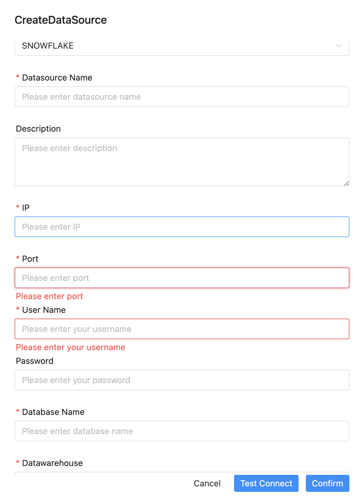

# SNOWFLAKE 数据源

## 数据源参数

- 数据源：选择 SNOWFLAKE 数据源
- 数据源名称：输入数据源的名称
- 描述：输入数据源的描述
- IP 主机名：输入连接 SNOWFLAKE 数据源 的 IP
- 端口：输入连接 SNOWFLAKE 数据源 的端口
- 用户名：设置连接 SNOWFLAKE 数据源 的用户名
- 密码：设置连接 SNOWFLAKE 数据源 的密码
- 数据库名：输入连接 SNOWFLAKE 数据源 的数据库名称
- 数据仓库： 输入数据 SNOWFLAKE 的数据仓库名称
- Jdbc 连接参数：用于 SNOWFLAKE 数据源 连接的参数设置，以 JSON 形式填写

