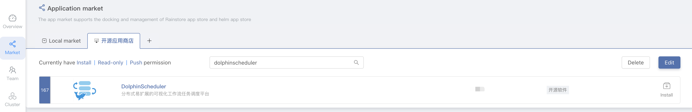
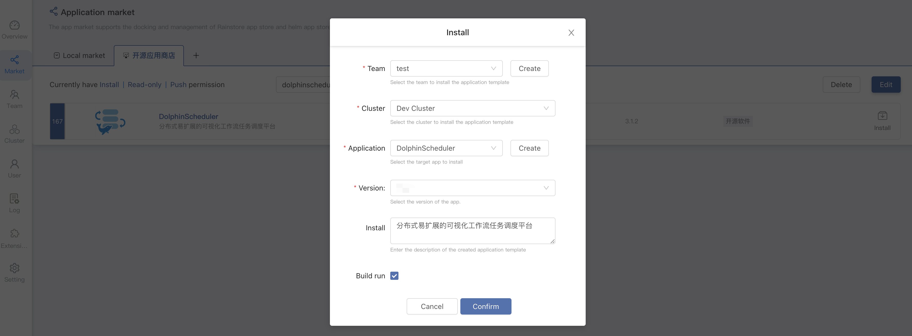
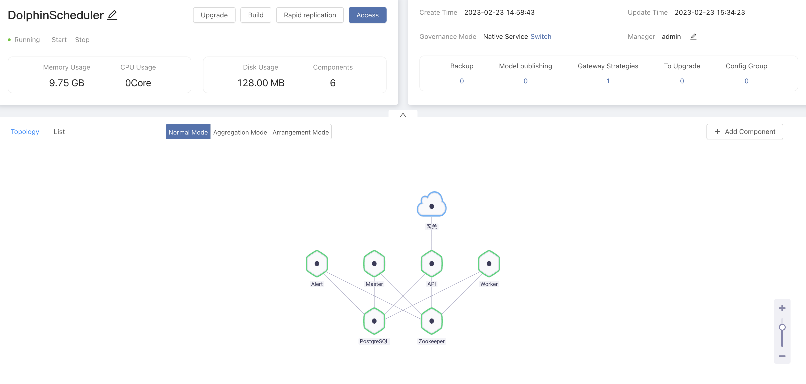
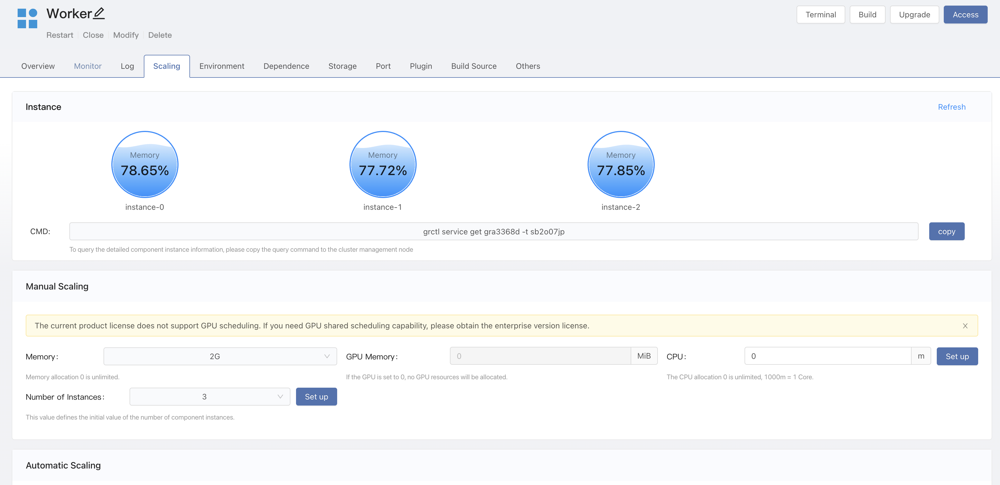
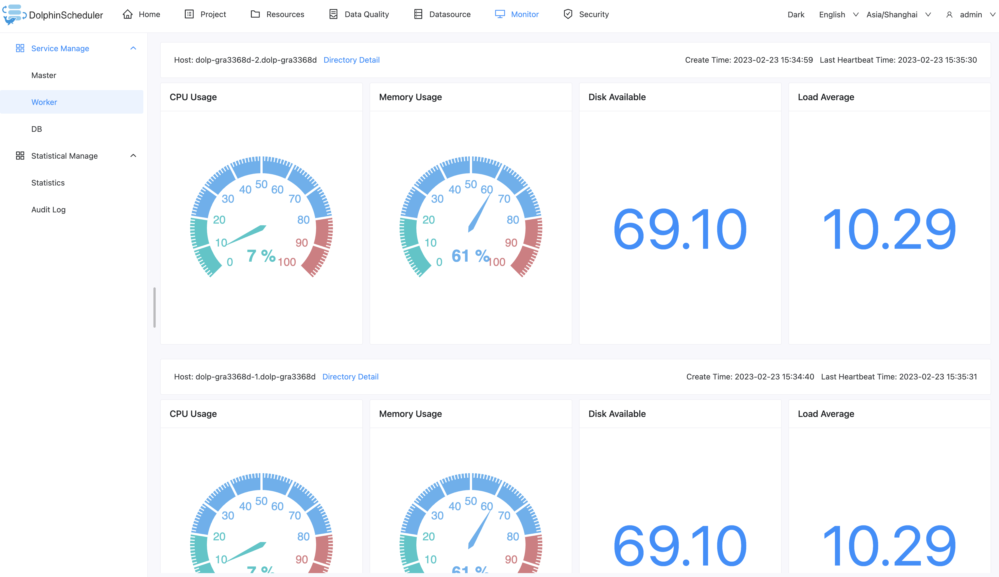

# 基于 Rainbond 部署 DolphinScheduler 高可用集群

本文描述通过 [Rainbond](https://www.rainbond.com/) 云原生应用管理平台 一键部署高可用的 DolphinScheduler 集群，这种方式适合给不太了解 Kubernetes、容器化等复杂技术的用户使用，降低了在 Kubernetes 中部署 DolphinScheduler 的门槛。

## 前提条件

* 可用的 Rainbond 云原生应用管理平台，请参阅文档 [Rainbond 快速安装](https://www.rainbond.com/docs/quick-start/quick-install)

## DolphinScheduler 集群一键部署

1. 进入 Rainbond 的**平台管理 -> 应用市场 -> 开源应用商店**中搜索 **dolphinscheduler** 即可找到 DolphinScheduler 应用。

2. 点击 DolphinScheduler 右侧的**安装**进入应用安装页面，填写对应的信息，点击确定即可开始安装，自动跳转至应用视图。

| 选择项  |                      说明                      |
|------|----------------------------------------------|
| 团队名称 | 用户自建的工作空间，以命名空间隔离                            |
| 集群名称 | 选择 DolphinScheduler 被部署到哪一个 K8s 集群           |
| 选择应用 | 选择 DolphinScheduler 被部署到哪一个应用，应用中包含有若干有关联的组件 |
| 应用版本 | 选择 DolphinScheduler 的版本                      |

3. 等待几分钟后，DolphinScheduler 集群就会安装完成，并运行起来。

4. 点击应用内的访问按钮，即可通过 Rainbond 默认提供的域名访问 DolphinScheduler-API 组件，默认的用户密码是 **admin/dolphinscheduler123**。

## API Master Worker 节点伸缩

DolphinScheduler API、Master、Worker 都支持伸缩多个实例，多个实例可以保证整个集群的高可用性。

以 Worker 为例，进入组件内 -> 伸缩，设置实例数量。

验证 Worker 节点，进入 DolphinScheduler UI -> 监控中心 -> Worker 查看节点信息。

## 配置文件

API 和 Worker 服务共用 `/opt/dolphinscheduler/conf/common.properties` ，修改配置时只需修改 API 服务的配置文件。

## 如何支持 Python 3？

Worker 服务默认安装了 Python3，使用时可以添加环境变量  `PYTHON_LAUNCHER=/usr/bin/python3`

## 如何支持 Hadoop, Spark, DataX 等？

以 Datax 为例：

1. 安装插件。Rainbond 团队视图 -> 插件 -> 从应用商店安装插件 -> 搜索 `通用数据初始化插件` 并安装。
2. 开通插件。进入 Worker 组件内 -> 插件 -> 开通  `通用数据初始化插件` ，并修改配置
   * FILE_URL：http://datax-opensource.oss-cn-hangzhou.aliyuncs.com/datax.tar.gz
   * FILE_PATH：/opt/soft
   * LOCK_PATH：/opt/soft
3. 更新组件，初始化插件会自动下载 `Datax` 并解压到 `/opt/soft`目录下。
   

---

