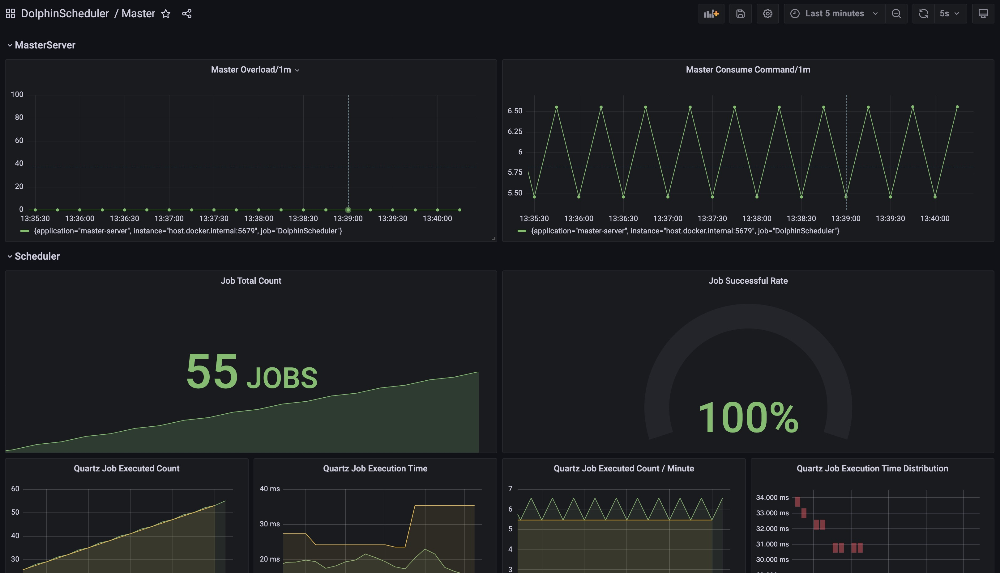
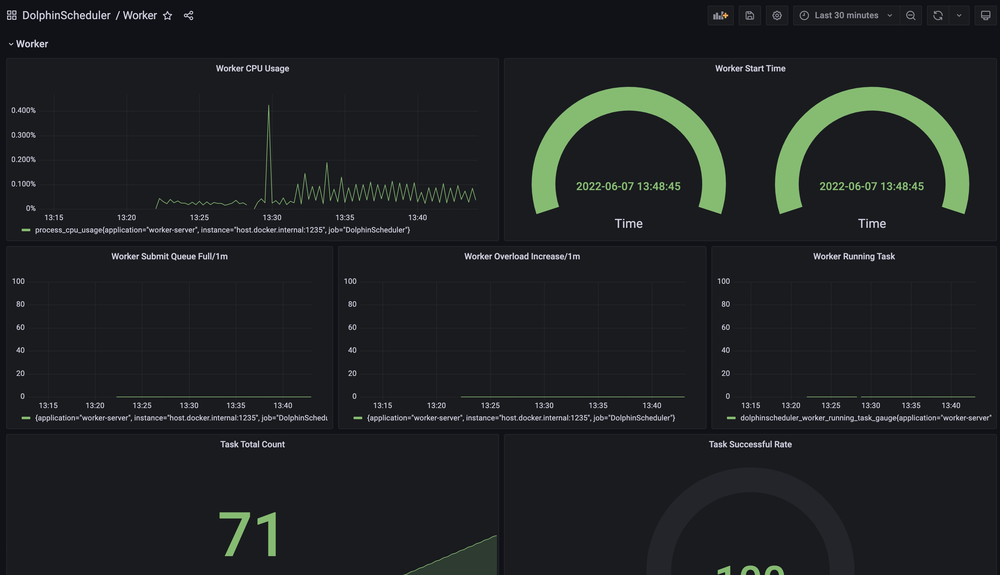
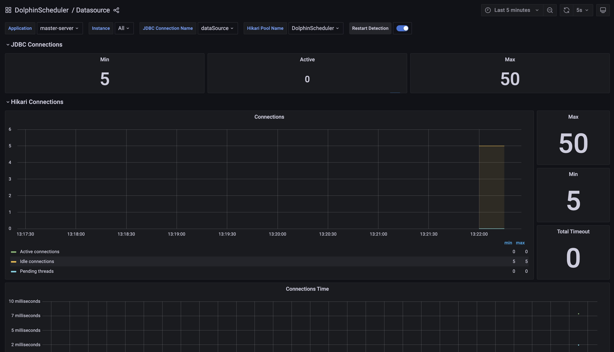

# 指标（Metrics）使用指南

Apache DolphinScheduler通过向外透出指标来提高系统的监控告警能力。 我们使用[Micrometer](https://micrometer.io/)作为指标采集和透出框架。
目前，我们只支持`Prometheus Exporter`，但是多样化的Exporter将会持续贡献给用户。

## 快速上手

- 我们提供Apache DolphinScheduler `standalone` 模式下采集并透出指标的能力，提供用户轻松快速的体验。 
- 当您在`standalone`模式下触发任务后，您可通过链接 `http://localhost:12345/dolphinscheduler/actuator/metrics` 访问生成的metrics列表。
- 当您在`standalone`模式下触发任务后，您可通过链接 `http://localhost:12345/dolphinscheduler/actuator/prometheus` 访问`prometheus格式`指标。
- 为了给您提供一个一站式的`Prometheus` + `Grafana`体验, 我们已经为您准备好了开箱即用的 `Grafana` 配置。您可在`dolphinscheduler-meter/resources/grafana`找到`Grafana`面板配置。
您可直接将这些配置导入您的`Grafana`实例中。
- 如果您想通过`docker`方式体验，可使用如下命令启动我们为您准备好的开箱即用的`Prometheus`和`Grafana`:

```shell
cd dolphinscheduler-meter/src/main/resources/grafana-demo
docker compose up
```

然后，您即可通过http://localhost/3001`链接访问`Grafana`面板。    




      
- 如果您想在`集群`模式下体验指标，请参照下面的[配置](#配置)一栏：

## 配置

- 请按照如下配置在您的 master/worker/alert/api's yaml 文件里启用metrics exporter：

```yaml
metrics:
  enabled: true
```

- 当您启用metrics exporter后，您可通过链接`http://ip:port/actuator/prometheus`获取metrics。

metrics exporter端口`server.port`是在application.yaml里定义的: master: `server.port: 5679`, worker: `server.port: 1235`, alert: `server.port: 50053`, api: `server.port: 12345`.

举例来说，您可通过访问链接获取`curl http://localhost:5679/actuator/prometheus`master metrics。

## 命名规则 & 命名映射

- Apache DolphinScheduler指标命名遵循[Micrometer](https://github.com/micrometer-metrics/micrometer-docs/blob/main/src/docs/concepts/naming.adoc#:~:text=Micrometer%20employs%20a%20naming%20convention,between%20one%20system%20and%20another)
官方推荐的命名方式。
- `Micrometer` 会根据您配置的外部指标系统自动将指标名称转化成适合您指标系统的格式。目前，我们只支持`Prometheus Exporter`，但是多样化的指标格式将会持续贡献给用户。

### Prometheus

- 指标名中的点会被映射为下划线
- 以数字开头的指标名会被加上`m_`前缀 
- COUNTER: 如果没有以`_total`结尾，会自动加上此后缀
- LONG_TASK_TIMER: 如果没有以`_timer_seconds`结尾，会自动加上此后缀
- GAUGE: 如果没有以`_baseUnit`结尾，会自动加上此后缀

## Dolphin Scheduler指标清单

- Dolphin Scheduler按照组成部分进行指标分类，如：`master server`, `worker server`, `api server` and `alert server`。
- 尽管任务 / 工作流相关指标是由 `master server` 和 `worker server` 透出的，我们将这两块指标单独罗列出来，以方便您对任务 / 工作流的监控。  

### 任务相关指标

- ds.task.timeout.count: (counter) 超时的任务数量
- ds.task.finish.count: (counter) 完成的任务数量，成功和失败的任务都算在内
- ds.task.success.count: (counter) 成功完成的任务数量
- ds.task.failure.count: (counter) 失败的任务数量
- ds.task.stop.count: (counter) 暂停的任务数量
- ds.task.retry.count: (counter) 重试的任务数量 
- ds.task.submit.count: (counter) 已提交的任务数量
- ds.task.failover.count: (counter) 容错的任务数量
- ds.task.dispatch.count: (counter) 分发到worker上的任务数量
- ds.task.dispatch.failure.count: (counter) 分发失败的任务数量，重试也包含在内
- ds.task.dispatch.error.count: (counter) 分发任务的错误数量
- ds.task.execution.count.by.type: (counter) 任务执行数量，按标签`task_type`聚类
- ds.task.running: (gauge) 正在运行的任务数量 
- ds.task.prepared: (gauge) 准备好且待提交的任务数量 
- ds.task.execution.count: (counter) 已执行的任务数量  
- ds.task.execution.duration: (histogram) 任务执行时长


### 工作流相关指标

- ds.workflow.create.command.count: (counter) 工作量创建并插入的命令数量
- ds.workflow.instance.submit.count: (counter) 已提交的工作量实例数量
- ds.workflow.instance.running: (gauge) 正在运行的工作流实例数量
- ds.workflow.instance.timeout.count: (counter) 运行超时的工作流实例数量
- ds.workflow.instance.finish.count: (counter) 已完成的工作流实例数量，包含成功和失败
- ds.workflow.instance.success.count: (counter) 运行成功的工作流实例数量
- ds.workflow.instance.failure.count: (counter) 运行失败的工作流实例数量 
- ds.workflow.instance.stop.count: (counter) 停止的工作流实例数量 
- ds.workflow.instance.failover.count: (counter) 容错的工作流实例数量

### Master Server指标

- ds.master.overload.count: (counter) master过载次数
- ds.master.consume.command.count: (counter) master消耗指令数量 
- ds.master.scheduler.failover.check.count: (counter) scheduler (master) 容错检查次数
- ds.master.scheduler.failover.check.time: (histogram) scheduler (master) 容错检查耗时
- ds.master.quartz.job.executed: 已执行quartz任务数量
- ds.master.quartz.job.execution.time: 已执行quartz任务总耗时

### Worker Server指标

- ds.worker.overload.count: (counter) worker过载次数
- ds.worker.full.submit.queue.count: (counter) worker提交队列全满次数


### Api Server指标

### Alert Server指标

在每个server中都有一些系统层面（如数据库链接、JVM）的默认指标，为了您的检阅方便，我们也将它们列在了这里：

### 数据库相关指标（默认）

- hikaricp.connections: 连接综述
- hikaricp.connections.creation: 连接创建时间 (包含最长时间，创建数量和时间总和)
- hikaricp.connections.acquire: 连接获取时间 (包含最长时间，创建数量和时间总和) 
- hikaricp.connections.usage: 连接使用时长 (包含最长时间，创建数量和时间总和)
- hikaricp.connections.max: 最大连接数量
- hikaricp.connections.min: 最小连接数量
- hikaricp.connections.active: 活跃的连接数量
- hikaricp.connections.idle: 闲置的连接数量
- hikaricp.connections.pending: 等待中的连接数量
- hikaricp.connections.timeout: 超时连接数量
- jdbc.connections.max: 可同时分配的最大活跃连接数量
- jdbc.connections.min: 连接池中最小的闲置连接数量
- jdbc.connections.idle: 已创建但闲置的连接总数
- jdbc.connections.active: 当前数据源分配的活跃连接数量

### JVM相关指标（默认）

- jvm.buffer.total.capacity: 资源池中buffer总容量估计
- jvm.buffer.count: 资源池中buffer总数估计
- jvm.buffer.memory.used: JVM因buffer资源池使用的内存估计
- jvm.memory.committed: 以bytes为单位的提供JVM使用的内存
- jvm.memory.max: 以bytes为单位的可用于内存管理的最大内存
- jvm.memory.used: 已占用的内存量
- jvm.threads.peak: JVM启动以来的峰值线程数
- jvm.threads.states: 当前拥有新状态的线程数
- jvm.gc.memory.allocated: GC时，年轻代分配的内存空间
- jvm.gc.max.data.size: GC时，老年代的最大内存空间
- jvm.gc.pause: GC耗时 (包含次数, 总时长, 最大时长)
- jvm.gc.live.data.size: FullGC时，老年代的内存空间
- jvm.gc.memory.promoted: GC时，老年代分配的内存空间
- jvm.classes.loaded: JVM当前加载的类的数量
- jvm.threads.live: JVM当前活跃线程数（包含守护和非守护线程）
- jvm.threads.daemon: JVM守护线程数
- jvm.classes.unloaded: 未加载的classes数
- process.cpu.usage: 当前JVM进程CPU使用率
- process.start.time: 应用启动时间
- process.uptime: 应用已运行时间

### 其他指标（默认）

- jetty.threads.config.max: 资源池中最大线程数
- jetty.threads.config.min: 资源池中最小线程数
- jetty.threads.current: 资源池中线程总数
- jetty.threads.idle: 资源池中闲置线程数
- jetty.threads.busy: 资源池中繁忙线程数
- jetty.threads.jobs: 队列中等待执行线程的任务数
- process.files.max: 文件描述符最大数量
- process.files.open: 打开状态的文件描述符数量
- system.cpu.usage: 整个系统当前的CPU使用率
- system.cpu.count: JVM可用处理器数量
- system.load.average.1m: 系统的平均负荷（1分钟）
- logback.events: 日志时间数量，以标签`level`聚类
- http.server.requests: http请求总数
