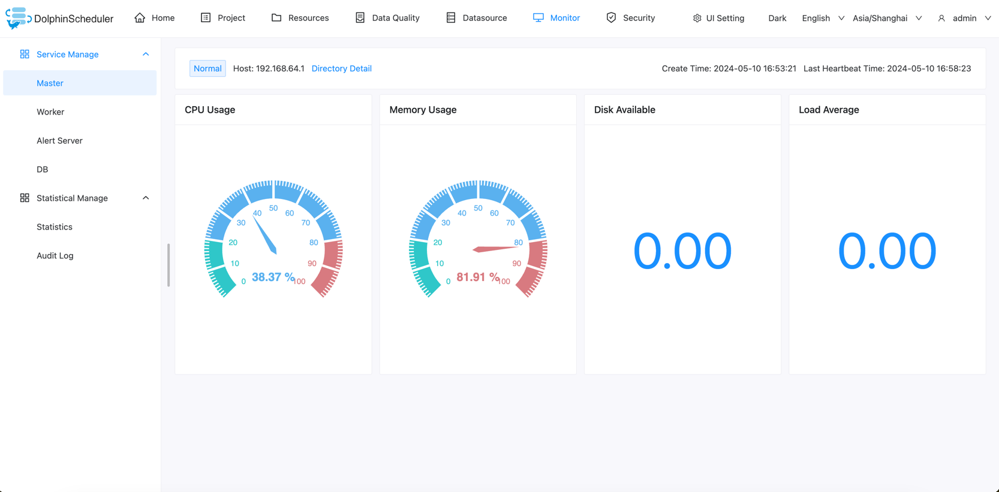
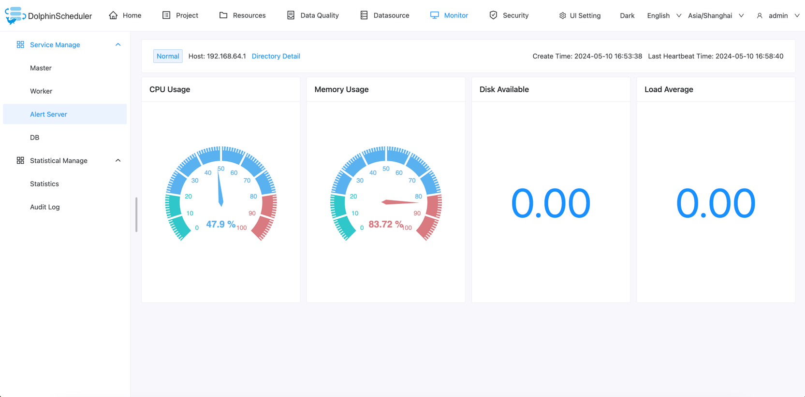
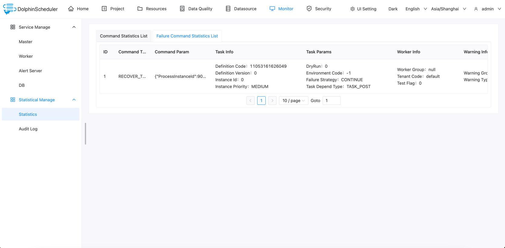

# 监控中心

## 服务管理

- 服务管理主要是对系统中的各个服务的健康状况和基本信息的监控和显示

### Master

- 主要是 master 的相关信息。

### Worker

- 主要是 worker 的相关信息。

### Alert Server

- 主要是 alert server 的相关信息。

### Database

- 主要是 DB 的健康状况

## 统计管理

### Statistics

展示系统中的命令列表，数据来自`t_ds_command`表。

展示系统中的失败命令列表，数据来自`t_ds_error_command`表。

### 审计日志

审计日志的记录提供了有关谁访问了系统，以及他或她在给定时间段内执行了哪些操作的信息，对于维护安全都很有用。

