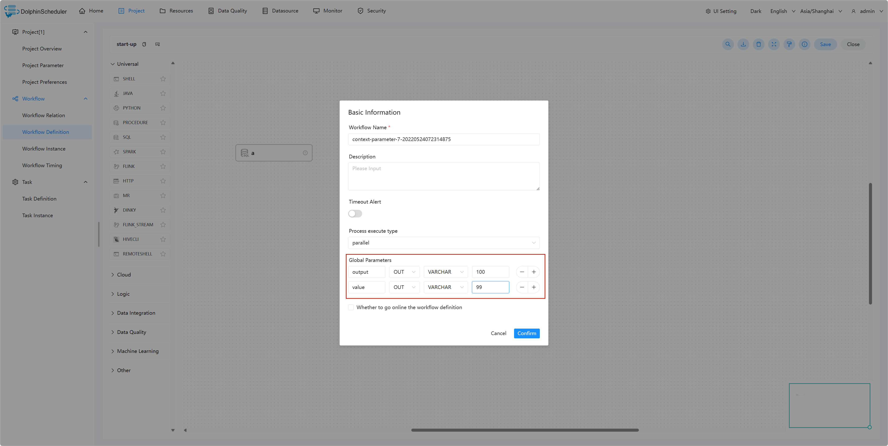
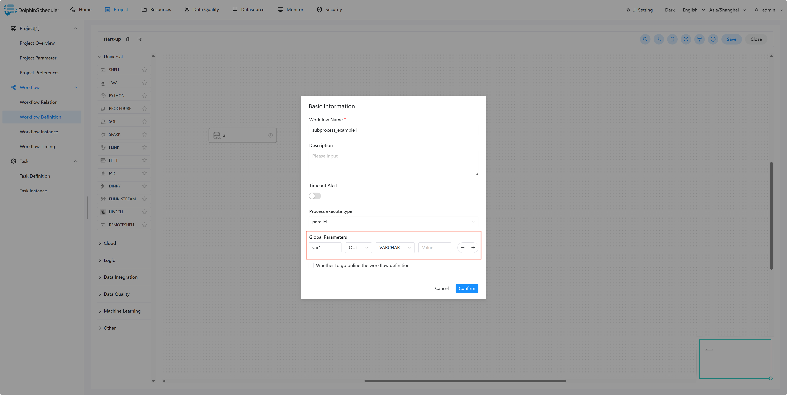

# 参数的引用

DolphinScheduler 提供参数间相互引用的能力，包括：本地参数引用全局参数、上下游参数传递。因为有引用的存在，就涉及当参数名相同时，参数的优先级问题，详见[参数优先级](priority.md)

## 本地任务引用全局参数

本地任务引用全局参数的前提是，你已经定义了[全局参数](global.md)，使用方式和[本地参数](local.md)中的使用方式类似，但是参数的值需要配置成全局参数中的 key。

## 上游任务传递给下游任务

DolphinScheduler 允许在任务间进行参数传递，目前传递方向仅支持上游单向传递给下游。目前支持这个特性的任务类型有：

* [Shell](../task/shell.md)
* [SQL](../task/sql.md)
* [Procedure](../task/stored-procedure.md)
* [Python](../task/python.md)
* [SubProcess](../task/sub-process.md)

当定义上游节点时，如果有需要将该节点的结果传递给有依赖关系的下游节点，需要在【当前节点设置】的【自定义参数】设置一个方向是 OUT 的变量。如果是 SubProcess 节点无需在【当前节点设置】中设置变量，需要在子流程的工作流定义中设置一个方向是 OUT 的变量。

上游传递的参数可以在下游节点中被更新，更新方法与[设置参数](#创建-shell-任务并设置参数)相同。

如果定义了同名的传递参数，上游节点的参数将被覆盖。

> 注：若节点之间没有依赖关系，则局部参数无法通过上游传递。

### 任务样例

本样例展示了如何使用参数传递的功能，通过 SHELL 任务来创建本地参数并赋值传递给下游，SQL 任务通过获得上游任务的参数完成查询操作。

#### 创建 SHELL 任务并设置参数

> 用户需要传递参数，在定义 SHELL 脚本时，需要输出格式为 ${setValue(key=value)} 的语句，key 为对应参数的 prop，value 为该参数的值。

创建 Node_A 任务，在自定义参数中添加 output 和 value 参数，并编写如下脚本：

参数说明：

- value：方向选择为 IN，并赋值为 66
- output：方向选择为 OUT，通过脚本 `'${setValue(output=1)}'` 赋值，并传递给下游参数

SHELL 节点定义时当日志检测到 ${setValue(output=1)} 的格式时，会将 1 赋值给 output，下游节点便可以直接使用变量 output 的值。同样，您可以在【工作流实例】页面，找到对应的节点实例，便可以查看该变量的值。

创建 Node_B 任务，主要用于测试输出上游任务 Node_A 传递的参数。

#### 创建 SQL 任务并使用参数

完成上述的 SHELL 任务之后，我们可以使用上游所传递的 output 作为 SQL 的查询对象。其中将所查询的 id 重命名为 ID，作为参数输出。

> 注：如果 SQL 节点的结果只有一行，一个或多个字段，参数的名字需要和字段名称一致。数据类型可选择为除 LIST 以外的其他类型。变量会选择 SQL 查询结果中的列名中与该变量名称相同的列对应的值。
>
> 如果 SQL 节点的结果为多行，一个或多个字段，参数的名字需要和字段名称一致。数据类型选择为 LIST。获取到 SQL 查询结果后会将对应列转化为 LIST，并将该结果转化为 JSON 后作为对应变量的值。

#### 保存工作流并设置全局参数

点击保存工作流图标，并设置全局参数 output 和 value。

#### 查看运行结果

创建完成工作流之后，上线运行该工作流，查看其运行结果。

Node_A 运行结果如下：

Node_B 运行结果如下：

Node_mysql 运行结果如下：

虽然在 Node_A 的脚本中为 output 赋值为 1，但日志中显示的值仍然为 100。但根据[参数优先级](priority.md)的原则：`启动参数 > 本地参数 > 上游任务传递的参数 > 全局参数`，在 Node_B 中输出的值为 1。则证明 output 参数参照预期的值在该工作流中传递，并在 Node_mysql 中使用该值完成查询操作。

但是 value 的值却只有在 Node_A 中输出为 66，其原因为 value 的方向选择为 IN，只有当方向为 OUT 时才会被定义为变量输出。

#### Python 任务传递参数

使用 `print('${setValue(key=%s)}' % value)`，DolphinScheduler会捕捉输出中的 `${setValue(key=value}`来进行参数捕捉，从而传递到下游

如

#### SubProcess 任务传递参数

在子流程的工作流定义中定义方向是 OUT 的变量作为输出参数，可以将这些参数传递到子流程节点的下游任务。

在子流程的工作流定义中创建 A 任务，在自定义参数中添加 var1 和 var2 参数，并编写如下脚本：

保存 subprocess_example1 工作流，设置全局参数 var1。

在新的工作流中创建 sub_process 任务，使用 subprocess_example1 工作流作为子节点。

创建一个 shell 任务作为 sub_process 任务的下游任务，并编写如下脚本：

保存该工作流并运行，下游任务运行结果如下：

虽然在 A 任务中输出 var1 和 var2 两个参数，但是工作流定义中只定义了 var1 的 OUT 变量，下游任务成功输出 var1，证明var1 参数参照预期的值在该工作流中传递。
