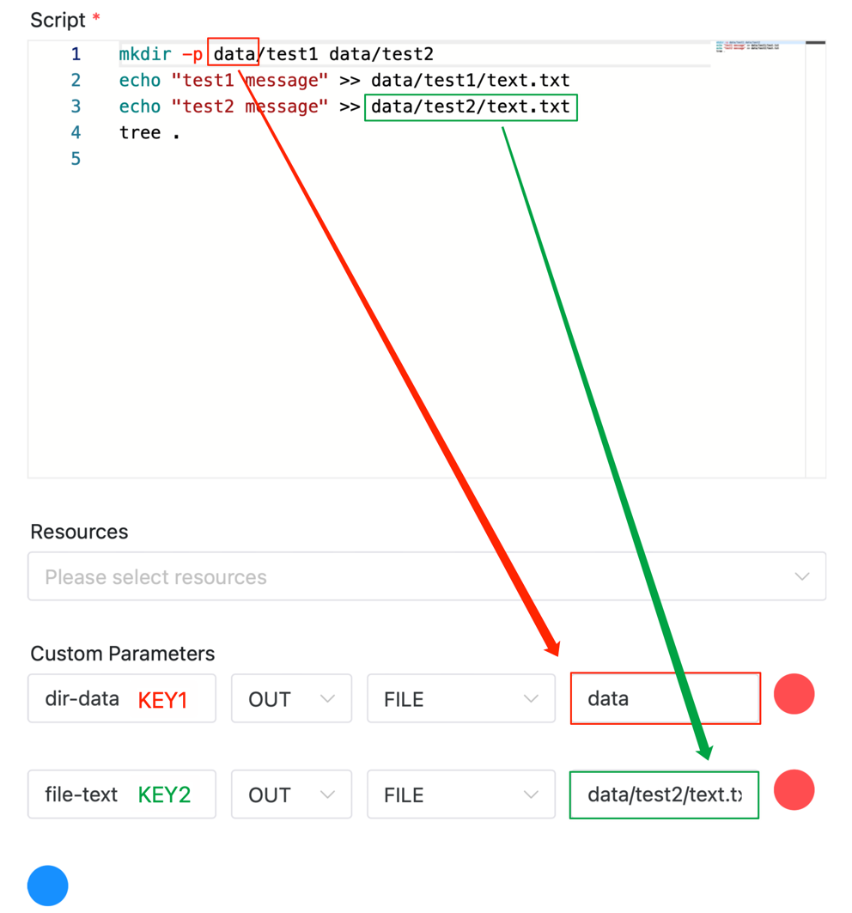
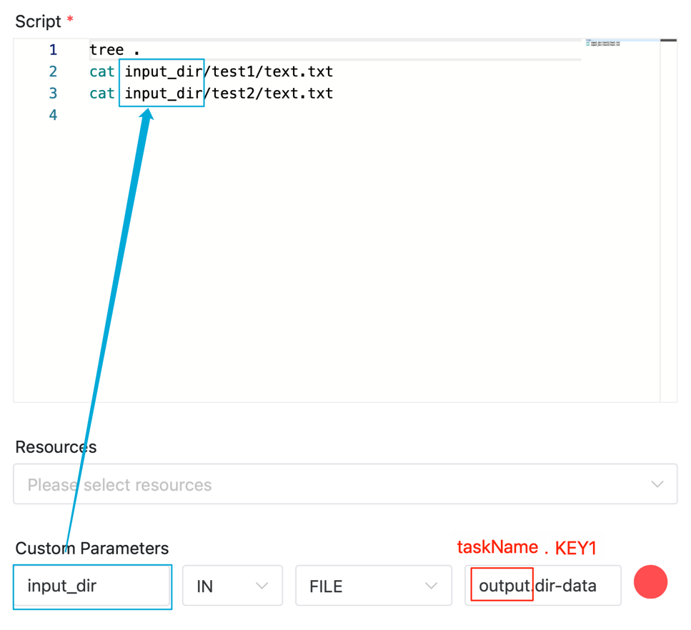
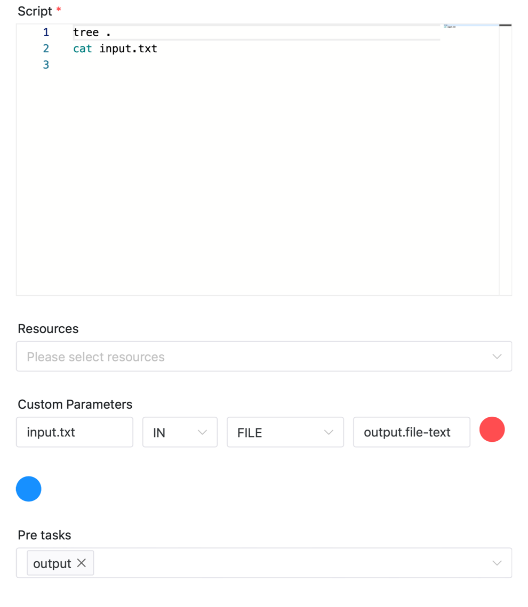

# 文件参数

通过配置文件参数，在同一工作流实例中，可以将上游任务工作目录下的文件(或文件夹，下统一以**文件**代替)传递给下游任务。 如以下场景可能使用到

- 在ETL任务中，将多个上游任务处理好的数据文件一起传递给特定的下游任务。
- 在机器学习场景中，将上游数据准备任务的数据集文件传递给下游模型训练任务。

## 使用方式

### 配置文件参数

文件参数配置方式如下：在任务定义页面，点击“自定义参数”右边的加号，即可进行配置。

### 输出文件给下游任务

**自定义参数四个选项分别为:**

- 参数名：任务间传递时使用的标识，如下图中使用的`KEY1`和`KEY2`
- 方向：OUT, 则表示输出文件给下游任务
- 参数类型：FILE, 表示文件参数
- 参数值：输出的文件路径，如下图中的`data`和`data/test2/text.txt`

下图的配置表示任务`output`向下游任务传递两个文件数据，分别为:
- 传出文件夹 `data`, 并标记为`dir-data`, 下游任务可以通过`output.dir-data`获取该文件夹
- 传出文件 `data/test2/text.txt`, 并标记为`file-text`, 下游任务可以通过`output.file-text`获取该文件夹



### 获取上游任务的文件

**自定义参数四个选项分别为:**

- 参数名：上游文件输入后保存的位置，如下图中使用的`input_dir`
- 方向：IN, 则表示从上游任务获取文件
- 参数类型：FILE, 表示文件参数
- 参数值：上游文件的标识，为 `taskName.KEY` 的格式 如下图中的`output.dir-data`, 其中`output`为上游任务的名称，`dir-data`为上游任务中输出的文件标识

下图的配置表示任务从上游任务`output`中获取标识为`dir-data`的文件夹，并保存为`input_dir`



下图的配置表示任务从上游任务`output`中获取标识为`file-text`的文件，并保存为`input.txt`



## 其他

### 备注

- 上下游任务间的文件传递基于资源中心作为中转，数据保存在资源中心`DATA_TRANSFER`的目录下, 因此**必须开启资源中心功能**，详情请参考[资源中心配置详情](../resource/configuration.md), 否则无法使用文件参数功能。
- 文件命名规则为 `DATA_TRANSFER/日期/工作流Code/工作流版本_工作流实例ID/任务名称_任务实例ID_文件名`
- 若传输的文件数据为文件夹，则会打包成后缀为`.zip`的压缩文件再上传，下游任务接到后会解压并保存在对应目录
- 若需要删除文件数据，可以在资源中心的`DATA_TRANSFER`目录下删除对应文件夹即可, 如直接按照日期子目录删除，会删除该日期下所有的文件数据. 也可以使用`resources/data-transfer`[Open API 接口](../api/open-api.md)（删除N天前的数据）删除对应文件数据。
- 如果存在任务链 task1->task2->tas3, 则最下游任务task3也能获取task1的文件数据
- 支持一对多传输以及多对一传输
- 如果频繁大量传输文件，毫无疑问会因传输的数据量影响到系统IO性能

### 样例

你可以保存以下YAML文件到本地，然后执行`pydolphinscheduler yaml -f data-transfer.yaml`即可运行Demo.

```yaml
# Define the workflow
workflow:
  name: "data-transfer"
  run: true

# Define the tasks under the workflow
tasks:
  - name: output
    task_type: Shell
    command: |
      mkdir -p data/test1 data/test2
      echo "test1 message" >> data/test1/text.txt
      echo "test2 message" >> data/test2/text.txt
      tree .
    local_params:
      - { "prop": "dir-data", "direct": "OUT", "type": "FILE", "value": "data" }
      - { "prop": "file-text", "direct": "OUT", "type": "FILE", "value": "data/test2/text.txt" }

  - name: input_dir
    task_type: Shell
    deps: [output]
    command: |
      tree .
      cat input_dir/test1/text.txt
      cat input_dir/test2/text.txt
    local_params:
      - { "prop": "input_dir", "direct": "IN", "type": "FILE", "value": "output.dir-data" }


  - name: input_file
    task_type: Shell
    deps: [output]
    command: |
      tree .
      cat input.txt
    local_params:
      - { "prop": "input.txt", "direct": "IN", "type": "FILE", "value": "output.file-text" }
```

