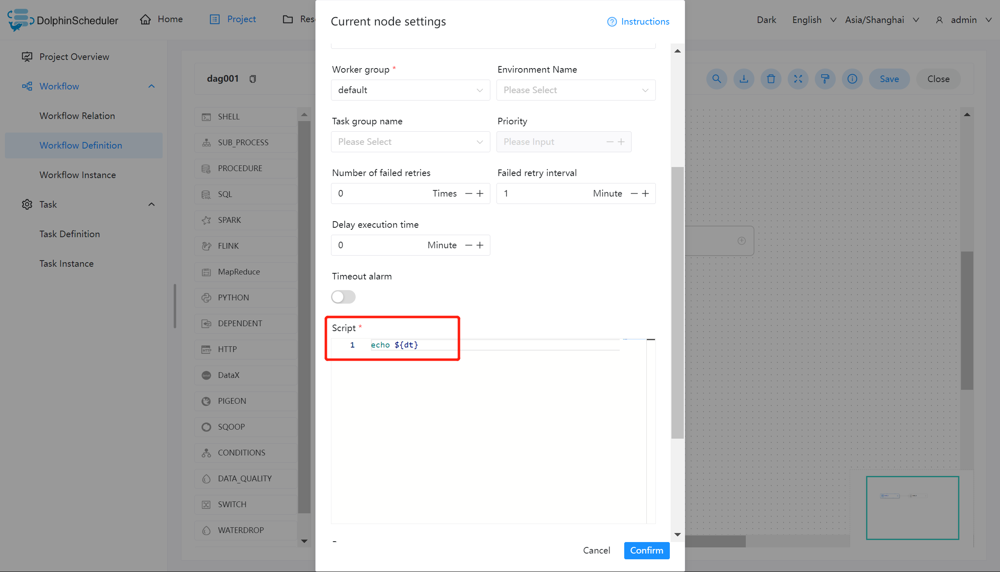
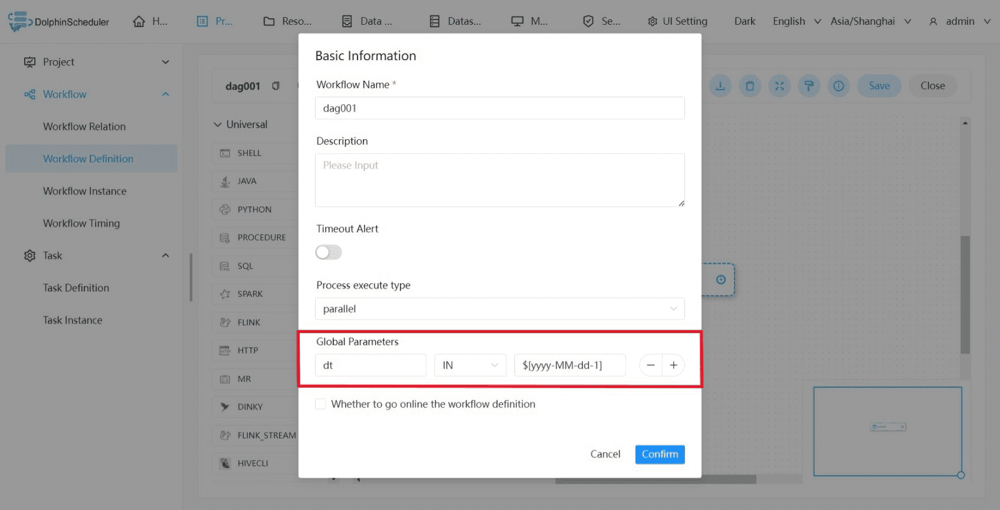
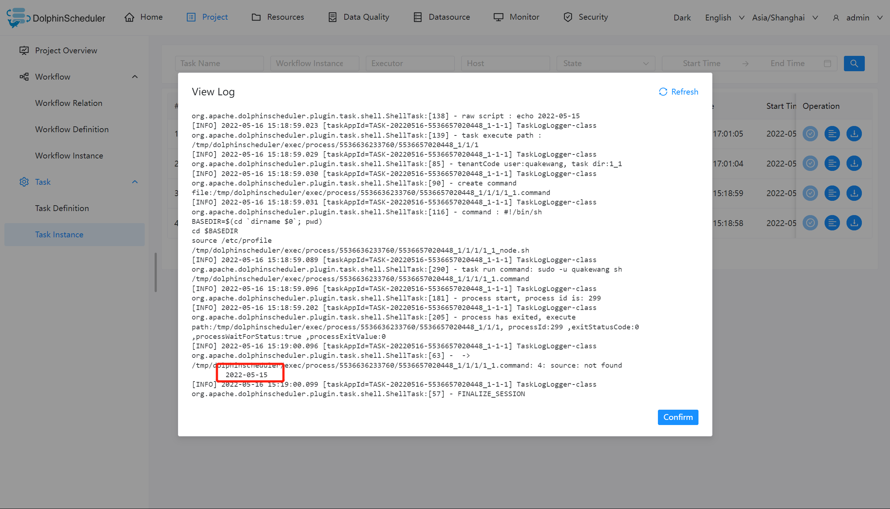

# 全局参数

## 作用域

全局参数在工作流定义页面配置。

方向是 IN 的变量是针对**整个工作流**的所有任务节点都有效的参数。

方向是 OUT 的变量作为该工作流的输出参数，传递到父工作流中对应 SubProcess 任务的下游任务。

## 使用方式

具体的使用方式可结合实际的生产情况而定，这里演示为使用 Shell 任务打印出前一天的日期。

### 创建 Shell 任务

创建一个 Shell 任务，并在脚本内容中输入 `echo ${dt}`。此时 dt 则为我们需要声明的全局参数。如下图所示：

### 保存工作流，并设置全局参数

全局参数配置方式如下：在工作流定义页面，点击“设置全局”右边的加号，填写对应的变量名称和对应的值，选择相应的参数值类型，保存即可。如下图所示：

> 注：这里定义的 dt 参数可以被其它任一节点的局部参数引用。

### 任务实例查看执行结果

进入任务实例页面，可以通过查看日志，验证任务的执行结果，判断参数是否有效。

