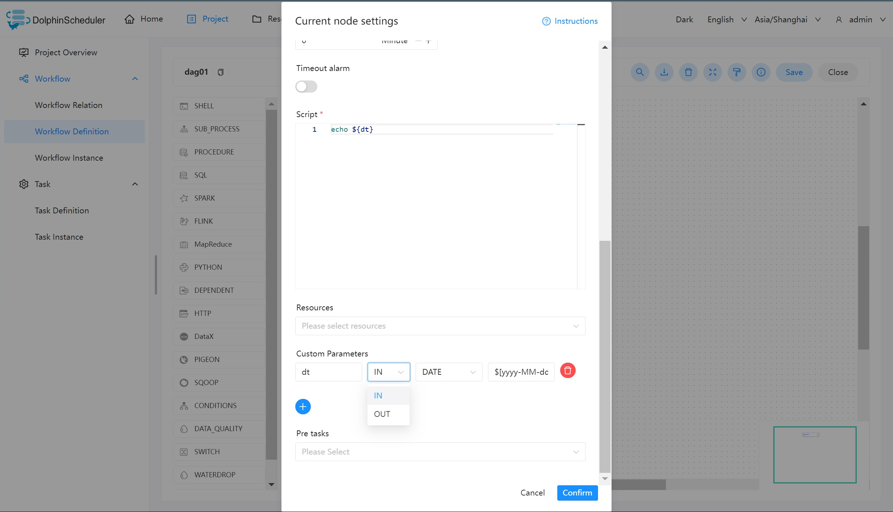
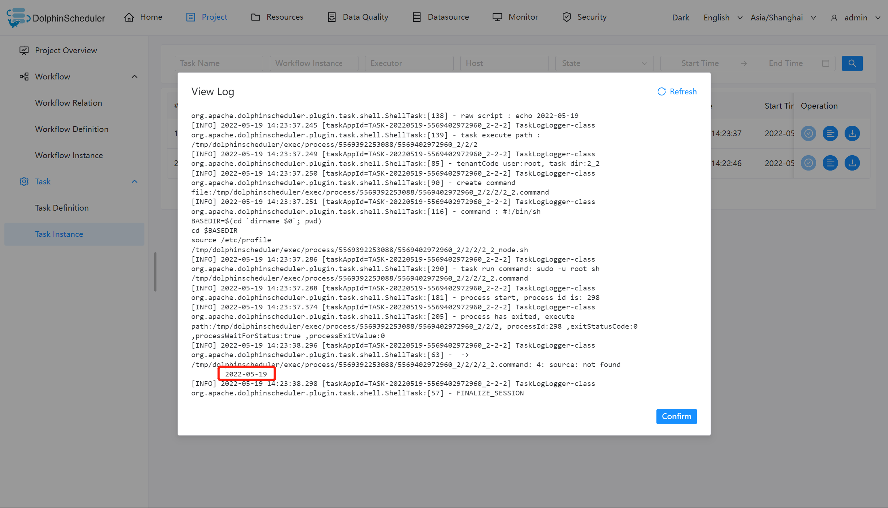

# 本地参数

## 作用域

在任务定义页面配置的参数，默认作用域仅限该任务，如果配置了[参数传递](context.md)则可将该参数作用到下游任务中。

## 使用方式

本地参数配置方式如下：在任务定义页面，点击“自定义参数”右边的加号，填写对应的变量名称和对应的值，保存即可。

* 如果要在单个任务中使用参数，请参阅通过自定义参数使用
* 如果要在任务中使用配置参数并在下游任务中使用它们：
  * 如果你只是想要简单使用，且不使用自定义参数, 请参阅 通过 `setValue` 和自定义参数 export 本地参数
  * 如果想要使用自定义参数, 请参阅 通过 `setValue` 和自定义参数 export 本地参数
  * 如果想要使用 Bash 参数, 请参阅 通过 `setValue` 和 Bash 环境变量参数 export 本地参数

## 任务样例

### 通过自定义参数使用

本样例展示了如何使用本地参数，打印输出当前日期。创建一个 Shell 任务，并编写脚本内容为 `echo ${dt}`。点击配置栏中的**自定义参数**，配置如下图所示：



参数说明：

- dt：参数名
- IN：IN 表示局部参数仅能在当前节点使用，OUT 表示局部参数可以向下游传递
- DATE：数据类型，日期
- $[yyyy-MM-dd]：自定义格式的衍生内置参数

保存工作流并运行，查看 Shell 任务输出日志。



> 注：本地参数可以在当前任务节点的工作流中，设置其为 OUT 则可以传递给下游的工作流使用，可以参考：[参数传递](context.md)

### 通过 `setValue` export 本地参数

如果你想简单 export 参数然后在下游任务中使用它们，你可以在你的任务中使用 `setValue`，你可以将参数统一在一个任务中管理。在 Shell 任务中使用语法
`echo '${setValue(set_val=123)}'`(**不要忘记单引号**) 并添加新的 `OUT` 自定义参数来 export 它。


你可以在下游任务中使用语法 `echo '${set_val}'` 在获取设定的值。

### 通过 `setValue` 和自定义参数 export 本地参数

如果你想用自定义参数而不是常量值来实现参数 export，并下游任务中使用它们，你可以在通过 `setValue` 和 自定义参数实现，当你想改变参数的值时可以直接改变
“自定义参数”模块中的值，这让程序更加容易维护。您可以在 Shell 任务中使用语法 `echo "#{setValue(set_val_param=${val})}"`（**如果你想要将任何
变量赋值给 `setValue`** 请不要忘记使用双引号）并添加新的 `IN` 自定义参数用于输入变量 `val` 和 `OUT` 自定义参数用于 export 参数 `set_val_param`。


你可以在下游任务中使用语法 `echo '${set_val_param}'` 在获取设定的值。

### 通过 `setValue` 和 Bash 环境变量参数 export 本地参数

If you want to export parameters with bash variable instead of constants value, and then use them in downstream tasks, you could use `setValue` in your task, which more flexible such as you can get variable for exists local or HTTP resource. You can use syntax like

如果你想用 bash 变量而不是常量值 export 参数，并在下游任务中使用它们，你可以在通过 `setValue` 和 Bash 变量实现，它更灵活，例如你动态获取现有的本地
或 HTTP 资源获取设定变量。 您可以使用类似的语法

```shell
lines_num=$(wget https://raw.githubusercontent.com/apache/dolphinscheduler/dev/README.md -q -O - | wc -l | xargs)
echo "#{setValue(set_val_var=${lines_num})}"
```

在 Shell 任务中（**如果你想要将任何变量赋值给 `setValue`** 请不要忘记使用双引号）和 `OUT` 自定义参数用于 export 参数 `set_val_var`。
.


你可以在下游任务中使用语法 `echo '${set_val_var}'` 在获取设定的值。
