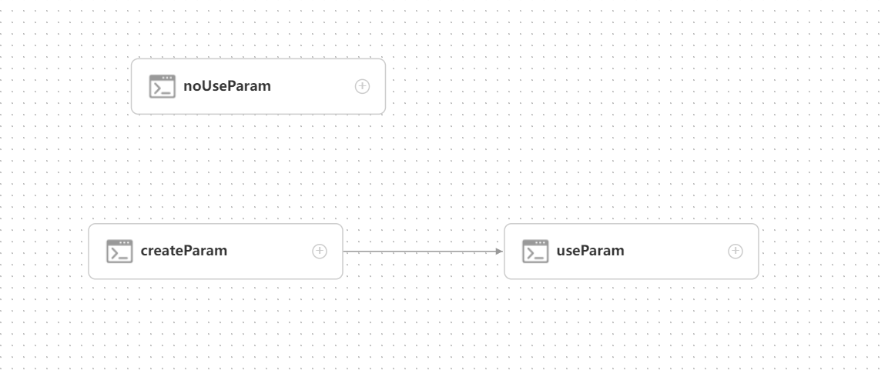
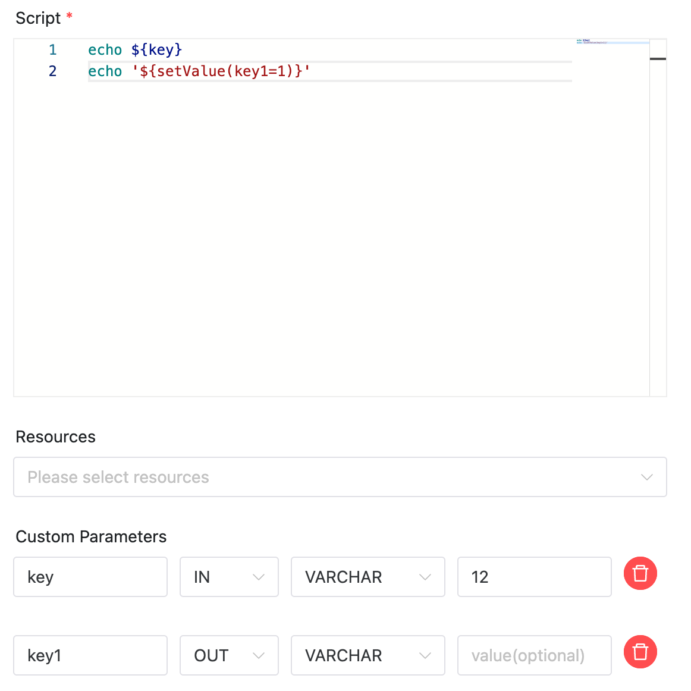
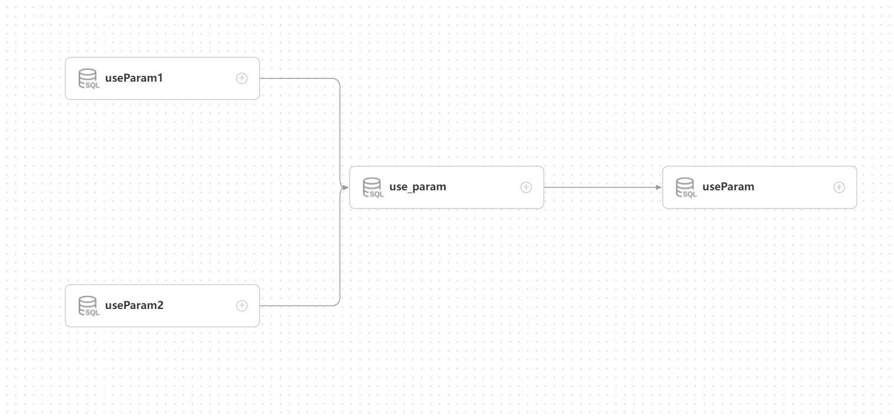
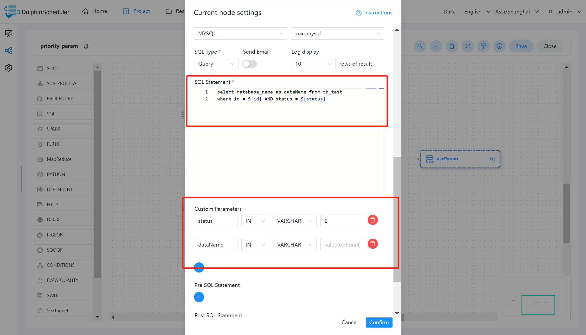

# 参数优先级

DolphinScheduler 中所涉及的参数值的定义可能来自三种类型：

* [项目级别参数](project-parameter.md)：在项目管理中定义的项目级别参数
* [全局参数](global.md)：在工作流保存页面定义时定义的变量
* [启动参数](startup-parameter.md)：在工作流启动页面定义的变量
* [上游任务传递的参数](context.md)：上游任务传递过来的参数
* [本地参数](local.md)：节点的自有变量，用户在“自定义参数”定义的变量，并且用户可以在工作流定义时定义该部分变量的值

因为参数的值存在多个来源，当参数名相同时，就需要会存在参数优先级的问题。DolphinScheduler 参数的优先级从高到低为：`启动参数 > 本地参数 > 上游任务传递的参数 > 全局参数 > 项目级别参数`

在上游任务传递的参数中，由于上游可能存在多个任务向下游传递参数，当上游传递的参数名称相同时：

* 下游节点会优先使用值为非空的参数
* 如果存在多个值为非空的参数，则按照上游任务的完成时间排序，选择完成时间最早的上游任务对应的参数

## 例子

下面例子向你展示如何使用任务参数传递的优先级问题

1：先以 shell 节点解释第一种情况

节点 【useParam】可以使用到节点【createParam】中设置的变量。而节点 【useParam】与节点【noUseParam】中并没有依赖关系，所以并不会获取到节点【noUseParam】的变量。上图中只是以 shell 节点作为例子，其他类型节点具有相同的使用规则。

其中节点【createParam】在使用变量时直接使用即可。另外该节点设置了 "key" 和 "key1" 两个变量，这里用户用定义了一个与上游节点传递的变量名相同的变量 key1，并且赋值为 "12"，但是由于我们设置的优先级的关系，这里的值 "12" 会被使用，最终上游节点设置的变量值会被抛弃。

2：我们再以 sql 节点来解释另外一种情况

节点【use_create】的定义如下：

"status" 是当前节点设置的节点的自有变量。但是用户在保存工作流时也同样设置了 "status" 变量（全局参数），并且赋值为 -1。那在该 SQL 执行时，status 的值为优先级更高的 2。抛弃了全局变量中的值。

这里的 "id" 是上游节点设置的变量，用户在节点【createParam1】、节点【createParam2】中设置了相同参数名 "id" 的参数。而节点【use_create】中使用了最先结束的【createParam1】的值。
