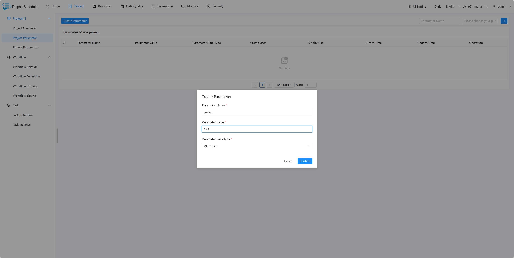

# 项目级别参数

## 作用域

项目级别参数是针对整个项目下的所有任务节点都有效的参数。

## 使用方式

### 定义项目级别参数

在项目管理页面，点击项目级别参数，点击创建项目级别参数，填写参数名称和参数值，选择相应的参数值类型。如下图所示：

### 使用项目级别参数

以shell任务为例，在脚本内容中输入`echo ${param}`，其中`param`为上一步创建的项目级别参数。

运行该shell任务，在任务实例页面，可以查看任务日志，验证参数是否有效。

