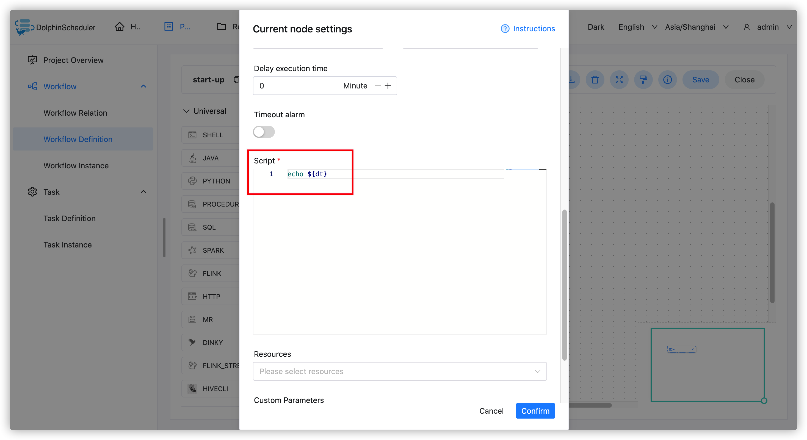
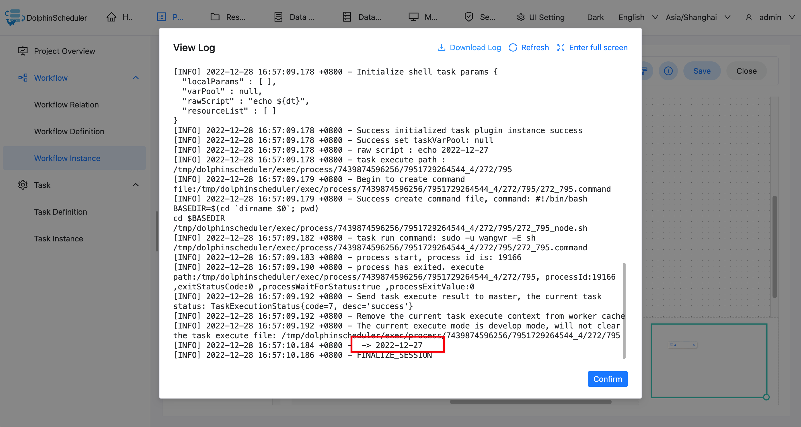

# 启动参数

## 作用域

启动参数是针对**整个工作流**的所有任务节点都有效的参数，在工作流启动页面配置。

## 使用方式

启动参数配置方式如下：在启动前参数设置界面，点击“启动参数“下面的加号，填写对应的参数名称和对应的值，选择相应的参数值类型，点击确定，工作流会将启动参数加入全局参数中。

## 任务样例

本样例展示了如何使用启动参数，打印输出不同天的日期。

### 创建 Shell 任务

创建一个 Shell 任务，并在脚本内容中输入 `echo ${dt}`。此时 dt 则为我们需要声明的启动参数。如下图所示：

### 保存工作流，上线运行并设置启动参数

启动参数配置如下图所示：

> 注：这里定义的 dt 参数可以被其它任一节点的局部参数引用。

### 任务实例查看执行结果

进入任务实例页面，可以通过查看日志，验证任务的执行结果，判断参数是否有效。

### 修改启动参数，再次执行

### 任务实例查看执行结果

验证任务执行结果，判断Shell任务是否输出了不同日期。

