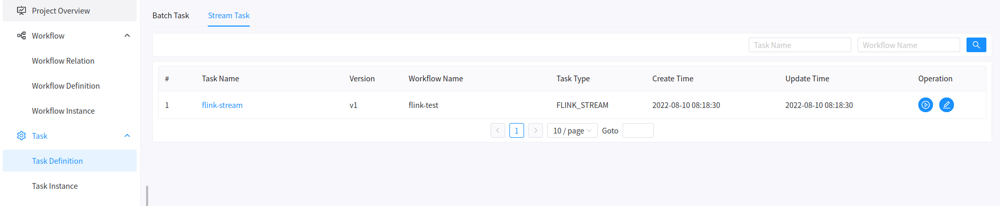
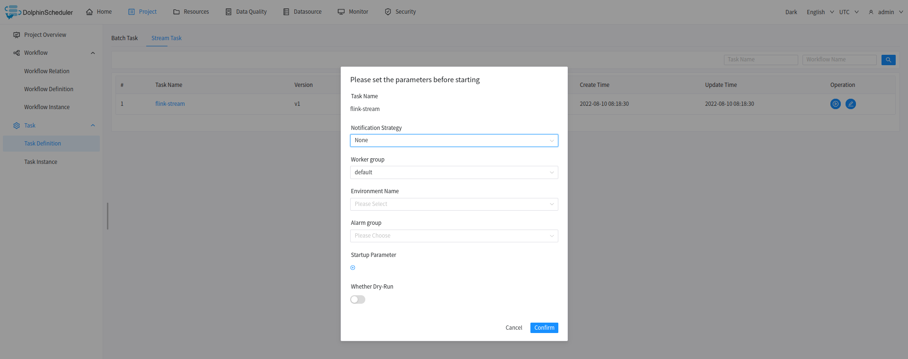

# 任务定义

## 批量任务定义

批量任务定义允许您在基于任务级别而不是在工作流中操作修改任务。再此之前，我们已经有了工作流级别的任务编辑器，你可以在[工作流定义](workflow-definition.md)
单击特定的工作流，然后编辑任务的定义。当您想编辑特定的任务定义但不记得它属于哪个工作流时，这是令人沮丧的。所以我们决定在 `任务` 菜单下添加 `任务定义` 视图。

在该视图中，您可以通过单击 `操作` 列中的相关按钮来进行创建、查询、更新、删除任务定义。最令人兴奋的是您可以通过通配符进行全部任务查询，当您只
记得任务名称但忘记它属于哪个工作流时是非常有用的。也支持通过任务名称结合使用 `任务类型` 或 `工作流程名称` 进行查询。

## 实时任务定义

实时任务定义在工作流定义中创建，在任务定义页面可以进行修改和执行。

点击实时任务执行，检查执行参数后点击确认，即可提交实时任务。

