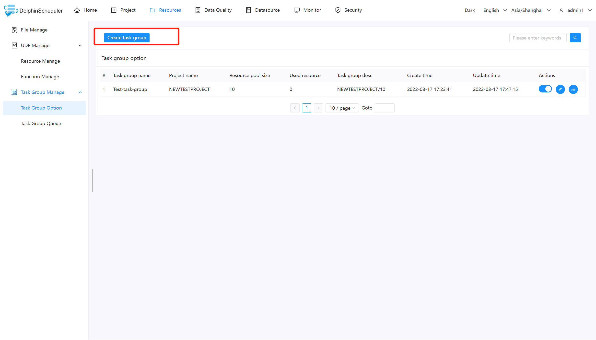
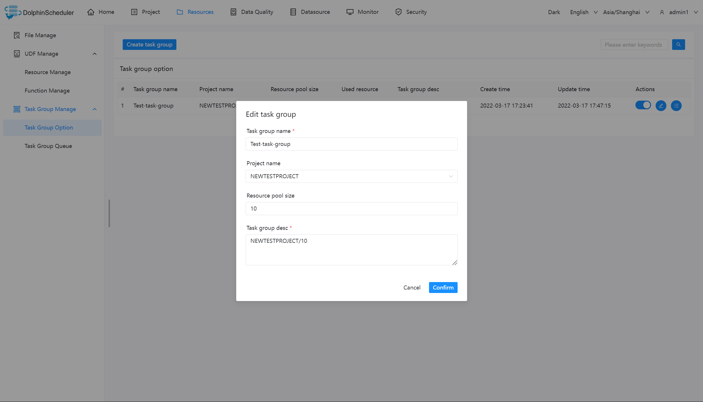
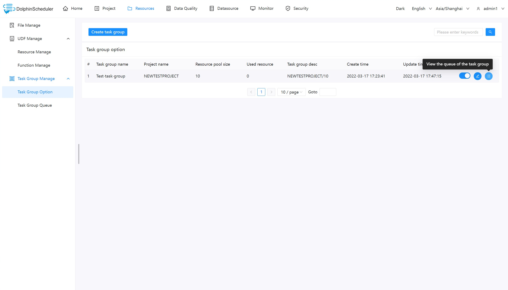
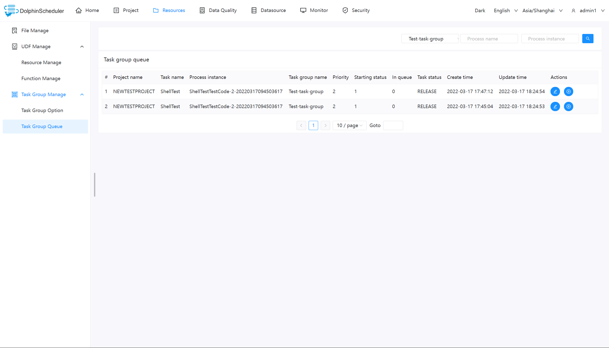
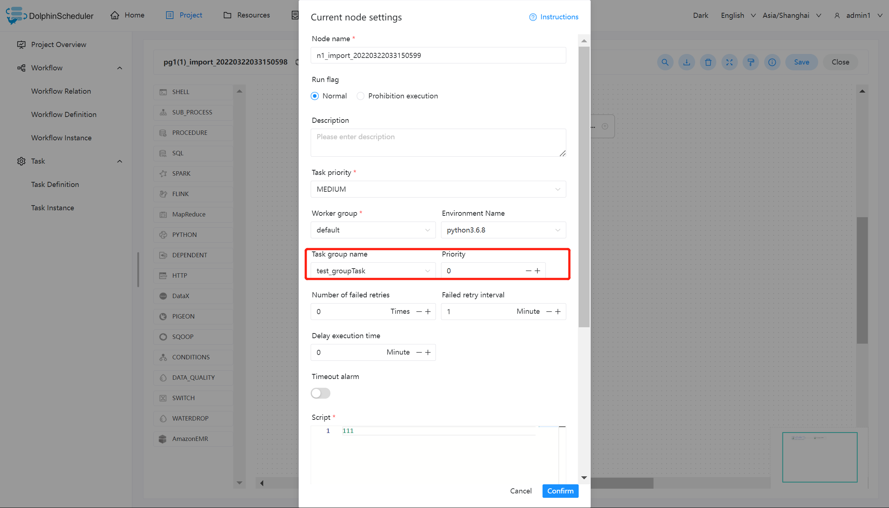
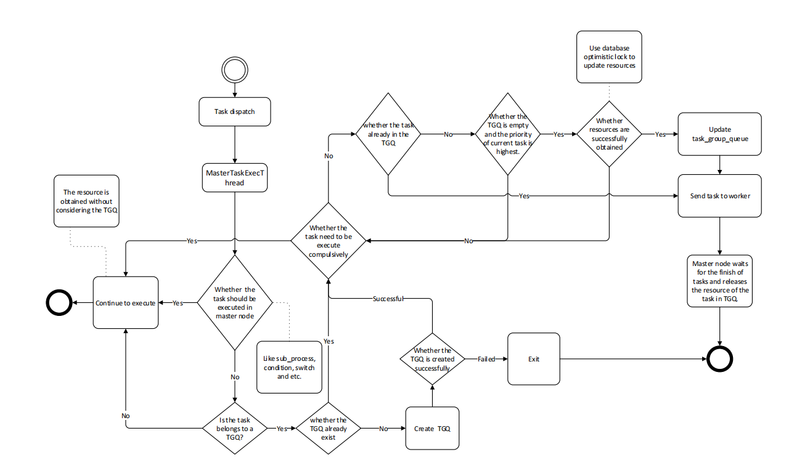

# 任务组管理

任务组主要用于控制任务实例并发，旨在控制其他资源的压力（也可以控制 Hadoop 集群压力，不过集群会有队列管控）。您可在新建任务定义时，可配置对应的任务组，并配置任务在任务组内运行的优先级。用户仅能查看有权限的项目对应的任务组，且仅能创建或修改具有写权限的项目对应的任务组。

### 任务组配置

#### 新建任务组

用户点击【资源中心】-【任务组管理】-【任务组配置】-新建任务组

您需要输入图片中信息，其中

【任务组名称】：任务组在被使用时显示的名称

【项目名称】：任务组作用的项目，该项为非必选项，如果不选择，则整个系统所有项目均可使用该任务组。

【资源容量】：允许任务实例并发的最大数量

#### 查看任务组队列

点击按钮查看任务组使用信息

#### 任务组的使用

注：任务组的使用适用于由 worker 执行的任务，例如【switch】节点、【condition】节点、【sub_process】等由 master 负责执行的节点类型不受任务组控制。

我们以 shell 节点为例：

关于任务组的配置，您需要做的只需要配置红色框内的部分，其中：

【任务组名称】：任务组配置页面显示的任务组名称，这里只能看到该项目有权限的任务组（新建任务组时选择了该项目），或作用在全局的任务组（新建任务组时没有选择项目）

【组内优先级】：在出现等待资源时，优先级高的任务会最先被 master 分发给 worker 执行，该部分数值越大，优先级越高。

### 任务组的实现逻辑

#### 获取任务组资源：

Master 在分发任务时判断该任务是否配置了任务组，如果任务没有配置，则正常抛给 worker 运行；如果配置了任务组，在抛给 worker 执行之前检查任务组资源池剩余大小是否满足当前任务运行，如果满足资源池 -1，继续运行；如果不满足则退出任务分发，等待其他任务结束唤醒。

#### 释放与唤醒：

当获取到任务组资源的任务结束运行后，会释放任务组资源，释放后会检查当前任务组是否有任务等待，如果有则标记优先级最好的任务可以运行，并新建一个可以执行的event。该event中存储着被标记可以获取资源的任务id，随后在获取任务组资源然后运行。

#### 任务组流程图

