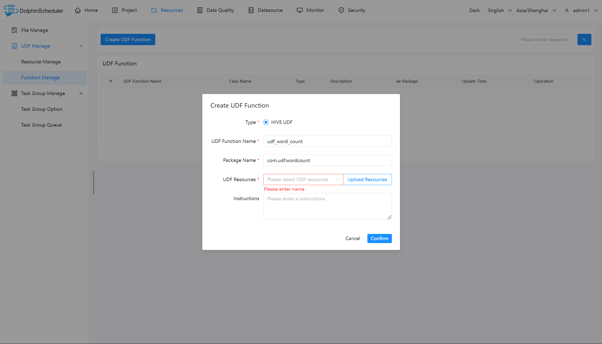
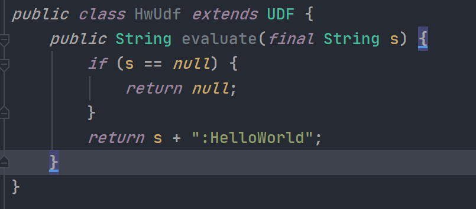
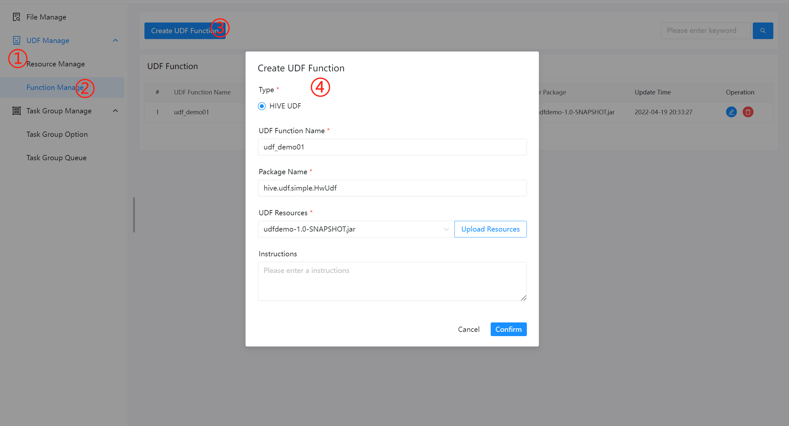
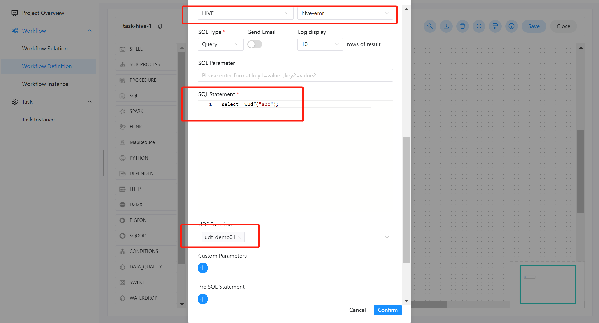

# UDF 管理

- 资源管理和文件管理功能类似，不同之处是资源管理是上传的 UDF 函数，文件管理上传的是用户程序，脚本及配置文件。
- 主要包括以下操作：重命名、下载、删除等。
* 上传 UDF 资源

> 和上传文件相同。

## 函数管理

* 创建 UDF 函数

  > 点击“创建 UDF 函数”，输入 UDF 函数参数，选择udf资源，点击“提交”，创建 UDF 函数。
  > 目前只支持 HIVE 的临时 UDF 函数

- UDF 函数名称：输入 UDF 函数时的名称
- 包名类名：输入 UDF 函数的全路径
- UDF 资源：设置创建的 UDF 对应的资源文件

## 任务样例

### 编写 UDF 函数

用户可以根据实际生产需求，自定义想要的 UDF 函数。这里编写一个在任意字符串的末尾添加 "HelloWorld" 的函数。如下图所示：

### 配置 UDF 函数

配置 UDF 函数前，需要先通过资源管理上传所需的函数 jar 包。然后进入函数管理，配置相关信息即可。如下图所示：

### 使用 UDF 函数

在使用 UDF 函数过程中，用户只需关注具体的函数编写，通过资源中心上传配置完成即可。系统会自动配置 create function 语句，参考如下：[SqlTask](https://github.com/apache/dolphinscheduler/blob/923f3f38e3271d7f1d22b3abc3497cecb6957e4a/dolphinscheduler-task-plugin/dolphinscheduler-task-sql/src/main/java/org/apache/dolphinscheduler/plugin/task/sql/SqlTask.java#L507-L531)

进入工作流定义一个 SQL 节点，数据源类型选择为 HIVE，数据源实例类型为 HIVE/IMPALA。

- SQL 语句：`select HwUdf("abc");` 该函数与内置函数使用方式一样，直接使用函数名称即可访问。
- UDF 函数：选择资源中心所配置的即可。

