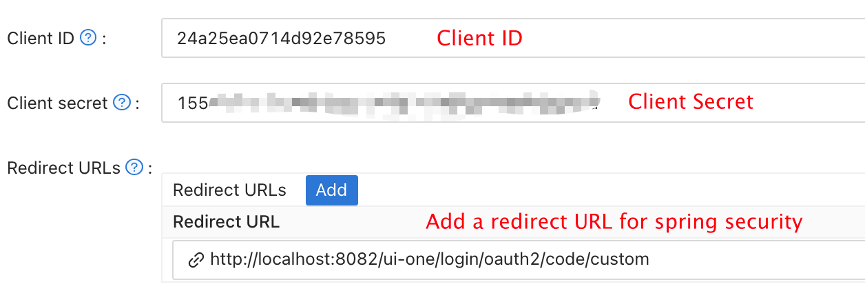

# 认证方式

* 目前我们支持四种认证方式，Apache DolphinScheduler自身账号密码登录，LDAP, 通过Casdoor实现的SSO登录和通过Oauth2授权登录，并且oauth2授权登录方式可以和其他认证方式同时使用。

## 修改认证方式

> dolphinscheduler-api/src/main/resources/application.yaml

```yaml
security:
  authentication:
    # Authentication types (supported types: PASSWORD,LDAP,CASDOOR_SSO)
    type: PASSWORD
    # IF you set type `LDAP`, below config will be effective
    ldap:
      # ldap server config
      urls: ldap://ldap.forumsys.com:389/
      base-dn: dc=example,dc=com
      username: cn=read-only-admin,dc=example,dc=com
      password: password
      user:
        # admin userId when you use LDAP login
        admin: read-only-admin
        identity-attribute: uid
        email-attribute: mail
        # action when ldap user is not exist (supported types: CREATE,DENY)
        not-exist-action: CREATE
      ssl:
        enable: false
        # jks file absolute path && password
        trust-store: "/ldapkeystore.jks"
        trust-store-password: "password"
    oauth2:
      enable: false
      provider:
        github:
          authorizationUri: ""
          redirectUri: ""
          clientId: ""
          clientSecret: ""
          tokenUri: ""
          userInfoUri: ""
          callbackUrl: ""
          iconUri: ""
          provider: github
        google:
          authorizationUri: ""
          redirectUri: ""
          clientId: ""
          clientSecret: ""
          tokenUri: ""
          userInfoUri: ""
          callbackUrl: ""
          iconUri: ""
          provider: google
```

具体字段解释详见：[Api-server相关配置](../../architecture/configuration.md)

## 开发者LDAP测试

我们提供了一个单元测试类，可以在不启动项目的情况下测试DolphinScheduler与LDAP的集成。

> dolphinscheduler-api/src/test/java/org/apache/dolphinscheduler/api/security/impl/ldap/LdapServiceTest.java

使用步骤如下：
- 修改`TestPropertySource`配置参数为你的LDAP信息;
- 修改`ldapLogin`方法中的userId和userPwd为你的账号密码;
- 修改`ldapLogin`方法中的expected email为正常登陆的返回值;
- 执行`ldapLogin`方法，判断LDAP登陆结果是否为预期;

如果你要启用ssl，请修改`TestPropertySource`配置中ssl相关参数为：

```
security.authentication.ldap.ssl.enable=false
// absolute path
security.authentication.ldap.ssl.trust-store=/ldapkeystore.jks 
security.authentication.ldap.ssl.trust-store-password=yourpassword
```

运行`ldapLoginSSL`方法，判断email是否为预期的返回值。

## 通过 Casdoor 实现 SSO 登录

Casdoor 是基于 OAuth 2.0、OIDC、SAML 和 CAS 的面向 UI 的身份访问管理（IAM）/单点登录（SSO）平台。您可以通过以下步骤通过 Casdoor 为 Dolphinscheduler 添加 SSO 功能：

### 步骤1. 部署 Casdoor

首先，需要部署 Casdoor。 您可以参考 Casdoor 官方文档进行[安装](https://casdoor.org/docs/basic/server-installation)。 成功部署后，您需要确保：

* Casdoor 服务器在 http://localhost:8000 上成功运行。
* 打开您喜欢的浏览器并访问 http://localhost:7001，您将看到 Casdoor 的登录页面。
* 输入 admin 和 123，测试登录功能是否正常工作。

然后，您可以通过以下步骤在自己的应用程序中快速实现基于 Casdoor 的登录页面。

### 步骤2. 配置 Casdoor

1. 创建或使用现有的 Casdoor 应用程序。
2. 添加您的重定向 URL（您可以在下一节中了解更多关于如何获取重定向 URL 的详细信息）
   
3. 添加您想要的提供程序并补充其他设置。

不出所料，您可以在应用程序设置页面上获得两个值：`Client ID` 和 `Client secret`，如上图所示。我们将在下一步中使用它们。

打开您喜欢的浏览器并访问：**http://`CASDOOR_HOSTNAME`/.well-known/openid-configuration**，您将看到 Casdoor 的 OIDC 配置。

### 步骤3. 配置 Dolphinscheduler

> dolphinscheduler-api/src/main/resources/application.yaml

```yaml
security:
  authentication:
    # Authentication types (supported types: PASSWORD,LDAP,CASDOOR_SSO)
    type: CASDOOR_SSO
casdoor:
  # Your Casdoor server url
  endpoint:
  client-id:
  client-secret:
  # The certificate may be multi-line, you can use `|-` for ease
  certificate: 
  # Your organization name added in Casdoor
  organization-name:
  # Your application name added in Casdoor
  application-name:
  # Doplhinscheduler login url
  redirect-url: http://localhost:5173/login 
```

## 通过OAuth2授权认证登录

dolphinscheduler可以同时支持多种OAuth2的provider，只需要在配置文件中打开Oauth2的开关并进行简单的配置即可。

### 步骤1. 获取OAuth2客户端凭据


### 步骤2. 在api的配置文件中开启oauth2登录

```yaml
security:
  authentication:
    …… # 省略
    oauth2:
      # 将enable设置为true 开启oauth2登录模式
      enable: true
      provider:
        github:
          # 设置provider的授权地址，例如https://github.com/login/oauth/authorize
          authorizationUri: ""
          # dolphinscheduler的后端重定向接口地址，例如http://127.0.0.1:12345/dolphinscheduler/redirect/login/oauth2
          redirectUri: ""
          # oauth2的 clientId
          clientId: ""
          # oauth2的 clientSecret
          clientSecret: ""
          # 设置provider的请求token的地址
          tokenUri: ""
          # 设置provider的请求用户信息的地址
          userInfoUri: ""
          # 登录成功后的重定向地址, http://{ip}:{port}/login
          callbackUrl: ""
          # 登录页跳转按钮的图片url，不填写则会展示一个文字按钮
          iconUri: ""
          provider: github
        google:
          authorizationUri: ""
          redirectUri: ""
          clientId: ""
          clientSecret: ""
          tokenUri: ""
          userInfoUri: ""
          callbackUrl: ""
          iconUri: ""
          provider: google
        gitee:
          authorizationUri: "https://gitee.com/oauth/authorize"
          redirectUri: "http://127.0.0.1:12345/dolphinscheduler/redirect/login/oauth2"
          clientId: ""
          clientSecret: ""
          tokenUri: "https://gitee.com/oauth/token?grant_type=authorization_code"
          userInfoUri: "https://gitee.com/api/v5/user"
          callbackUrl: "http://127.0.0.1:5173/login"
          iconUri: ""
          provider: gitee
```

### 步骤3.使用oauth2登录


