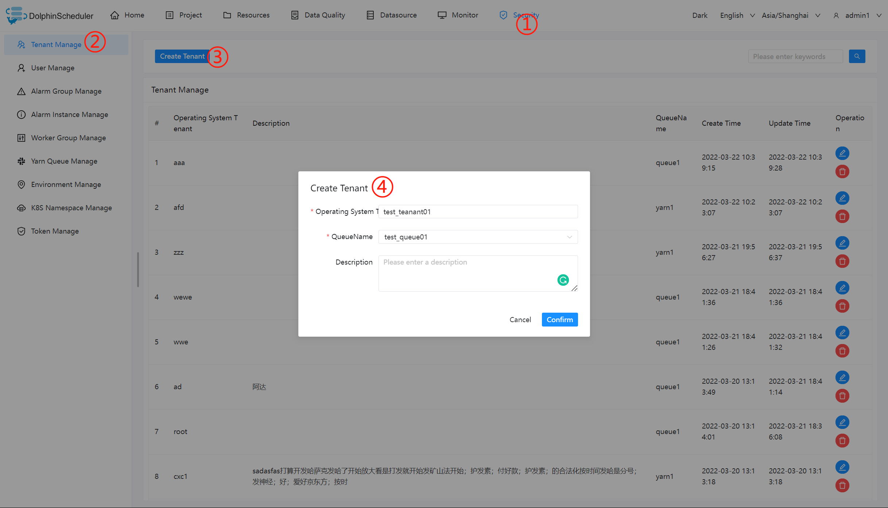

# 安全中心（权限系统）

* 安全中心只有管理员账户才有权限操作，分别有队列管理、租户管理、用户管理、告警组管理、worker分组管理、令牌管理等功能，在用户管理模块可以对资源、数据源、项目等授权
* 管理员登录，默认用户名/密码：admin/dolphinscheduler123

## 创建队列

- 队列是在执行 spark、mapreduce 等程序，需要用到“队列”参数时使用的。
- 管理员进入安全中心 -> 队列管理页面，点击“创建队列”按钮，创建队列。


## 添加租户

- 租户对应的是 Linux 的用户，用于 worker 提交作业所使用的用户。如果 linux 没有这个用户，则会导致任务运行失败。你可以通过修改 `worker.properties` 配置文件中参数 `worker.tenant.auto.create=true` 实现当 linux 用户不存在时自动创建该用户。`worker.tenant.auto.create=true` 参数会要求 worker 可以免密运行 `sudo` 命令
- 租户编码：**租户编码是 Linux上 的用户，唯一，不能重复**
- 管理员进入安全中心->租户管理页面，点击“创建租户”按钮，创建租户。



## 创建普通用户

- 用户分为**管理员用户**和**普通用户**
  * 管理员有授权和用户管理等权限，没有创建项目和工作流定义的操作的权限。
  * 普通用户可以创建项目和对工作流定义的创建，编辑，执行等操作。
  * 注意：如果该用户切换了租户，则该用户所在租户下所有资源将复制到切换的新租户下。
- 进入安全中心->用户管理页面，点击“创建用户”按钮，创建用户。


### 编辑用户信息

- 管理员进入安全中心->用户管理页面，点击"编辑"按钮，编辑用户信息。
- 普通用户登录后，点击用户名下拉框中的用户信息，进入用户信息页面，点击"编辑"按钮，编辑用户信息。

### 修改用户密码

- 管理员进入安全中心->用户管理页面，点击"编辑"按钮，编辑用户信息时，输入新密码修改用户密码。
- 普通用户登录后，点击用户名下拉框中的用户信息，进入修改密码页面，输入密码并确认密码后点击"编辑"按钮，则修改密码成功。

## 创建告警组

* 告警组是在启动时设置的参数，在流程结束以后会将流程的状态和其他信息以邮件形式发送给告警组。
* 管理员进入安全中心->告警组管理页面，点击“创建告警组”按钮，创建告警组。


## 令牌管理

> 由于后端接口有登录检查，令牌管理提供了一种可以通过调用接口的方式对系统进行各种操作。
> - 管理员进入安全中心->令牌管理页面，点击“创建令牌”按钮，选择失效时间与用户，点击"生成令牌"按钮，点击"提交"按钮，则选择用户的token创建成功。


- 普通用户登录后，点击用户名下拉框中的用户信息，进入令牌管理页面，选择失效时间，点击"生成令牌"按钮，点击"提交"按钮，则该用户创建 token 成功。

- 调用示例：

```java
    /**
     * test token
     */
    public  void doPOSTParam()throws Exception{
        // create HttpClient
        CloseableHttpClient httpclient = HttpClients.createDefault();

        // create http post request
        HttpPost httpPost = new HttpPost("http://127.0.0.1:12345/escheduler/projects/create");
        httpPost.setHeader("token", "123");
        // set parameters
        List<NameValuePair> parameters = new ArrayList<NameValuePair>();
        parameters.add(new BasicNameValuePair("projectName", "qzw"));
        parameters.add(new BasicNameValuePair("desc", "qzw"));
        UrlEncodedFormEntity formEntity = new UrlEncodedFormEntity(parameters);
        httpPost.setEntity(formEntity);
        CloseableHttpResponse response = null;
        try {
            // execute
            response = httpclient.execute(httpPost);
            // response status code 200
            if (response.getStatusLine().getStatusCode() == 200) {
                String content = EntityUtils.toString(response.getEntity(), "UTF-8");
                System.out.println(content);
            }
        } finally {
            if (response != null) {
                response.close();
            }
            httpclient.close();
        }
    }
```

## 授予权限

* 授予权限包括项目权限，资源权限，数据源权限，UDF函数权限，k8s命名空间。
* 管理员可以对普通用户进行非其创建的项目、资源、数据源、UDF函数、k8s命名空间。因为项目、资源、数据源、UDF函数、k8s命名空间授权方式都是一样的，所以以项目授权为例介绍。
* 注意：对于用户自己创建的项目，该用户默认拥有所有的权限，因此对用户自己创建的项目进行权限变更是无效的。
- 管理员进入`安全中心->用户管理页面`，点击需授权用户的“授权”按钮，如下图所示：


- 勾选单个或多个项目，再点击上方授权按钮进行项目授权。上方按钮从左至右分别对应着`撤销所有权限`，`授予读权限`和`授予所有权限`（包括读权限和写权限）。


- 如果用户对某个项目只拥有读权限而没有写权限，则在执行删除项目或更新项目等操作时，会返回错误提示，提示用户没有写权限，无法完成该操作。


- 资源、数据源、UDF 函数授权同项目授权。

## Worker 分组

每个 worker 节点都会归属于自己的 worker 分组，默认分组为 `default`。

在任务执行时,可以将任务分配给指定 worker 分组，最终由该组中的 worker 节点执行该任务。

### 新增 / 更新 worker 分组

- 打开要设置分组的 worker 节点上的 `worker-server/conf/application.yaml` 配置文件. 修改 `worker` 配置下的 `groups` 参数.
- `groups` 参数的值为 worker 节点对应的分组名称，默认为 `default`。
- 如果该 worker 节点对应多个分组，则用连字符列出，示范如下：

```conf
worker:
......
  groups:
    - default
    - group1
    - group2
......
```

- 也可以在运行中添加 worker 所属的 worker 分组而忽略 `application.yaml` 中的配置。修改步骤为 `安全中心` -> `worker分组管理` -> 点击 `创建worker分组` -> 输入`分组名称`和`worker地址` -> 点击`确定`

## 环境管理

* 在线配置 worker 运行环境，一个 worker 可以指定多个环境，每个环境等价于 dolphinscheduler_env.sh 文件.

* 默认环境为dolphinscheduler_env.sh文件.

* 在任务执行时,可以将任务分配给指定 worker 分组，根据 worker 分组选择对应的环境，最终由该组中的 worker 节点执行环境后执行该任务.

> 创建/更新 环境

- 环境配置等价于dolphinscheduler_env.sh文件内配置


> 使用环境

- 在工作流定义中创建任务节点选择 worker 分组和 worker 分组对应的环境，任务执行时 worker 会先执行环境在执行任务.


> 注意: 当无法在任务定义或工作流运行对话框中使用你想要使用的环境时，请检查您已经选择worker，并且您要使用的环境已经关联到您选择的worker中

## 集群管理

> 创建/更新 集群

- 每个工作流可以绑定零到若干个集群用来支持多集群，目前先用于k8s。

> 使用集群

- 创建和授权后，k8s命名空间和工作流会增加关联集群的功能。每一个集群会有独立的工作流和任务实例独立运行。


## 命名空间管理

> 创建/更新 k8s集群

- 先把k8s集群连接的配置录入 database 的表 `t_ds_k8s`给批次使用后续移除，namespace的创建现在通过下拉选择集群.

> 创建/更新 namespace

- 创建和授权后，在相关k8s任务选择命名空间时下拉可选，如果k8s集群名字是`ds_null_k8s`是测试模式，不会真正操作集群.


