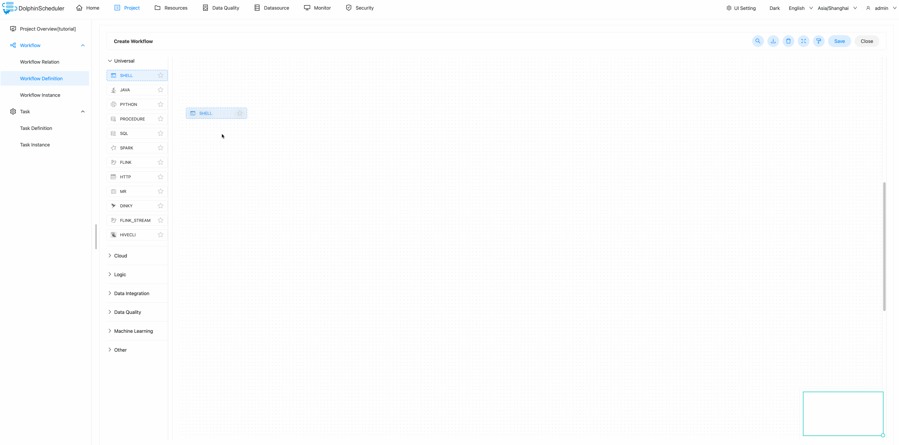

# 快速上手

在本节中，我们将使用 DolphinScheduler 逐步创建和运行一个简单的工作流。 在这段旅程中，您将学习 DolphinScheduler 的基本概念，
并了解运行工作流的最基本配置。 我们在本教程中提供了视频和文字两种方式，您可以选择您喜欢的方式

## 视频教程

## 图文教程

### 设置 Dolphinscheduler

在继续之前，您必须先安装并启动 dolphinscheduler。 对于初学者，我们建议设置 dolphionscheduler 与官方 Docker image 或 standalone server。

* [standalone server](https://dolphinscheduler.apache.org/en-us/docs/3.1.3/guide/installation/standalone)
* [docker](https://dolphinscheduler.apache.org/en-us/docs/3.1.3/guide/start/docker)

### 构建您的第一个工作流程

您可以使用默认用户名/密码 http://localhost:12345/dolphinscheduler/ui 登录 dolphinscheduler 是“admin/dolphinscheduler123”。

#### 创建租户

Tenant是使用DolphinScheduler时绕不开的一个概念，所以先简单介绍一下tenant的概念。

登录 DolphinScheduler 名为 admin 的帐户在 dolphinscheduler 中称为 user。 为了更好的控制系统资源，DolphinScheduler引入了概念租户，用于执行任务。

简述如下：

* 用户：登录web UI，在web UI中进行所有操作，包括工作流管理和租户创建。
* Tenant：任务的实际执行者，A Linux user for DolphinScheduler worker。

我们可以在 DolphinScheduler `Security -> Tenant Manage` 页面创建租户。

> 
>
> 注意：如果没有关联租户，则会使用默认租户，默认租户为default，会使用程序启动用户执行任务。

#### 将租户分配给用户

正如我们上面在创建租户中谈到的，用户只能运行任务除非用户被分配给租户。

我们可以在 DolphinScheduler 的“安全 -> 用户管理”页面中将租户分配给特定用户。

在我们创建一个租户并将其分配给一个用户之后，我们可以开始创建一个 DolphinScheduler 中的简单工作流程。

#### 创建项目

但是在 DolphinScheduler 中，所有的工作流都必须属于一个项目，所以我们需要首先创建一个项目。

我们可以通过单击在 DolphinScheduler `Project` 页面中创建一个项目 “创建项目” 按钮。

#### 创建工作流

现在我们可以为项目“tutorial”创建一个工作流程。 点击我们刚刚创建的项目，转到“工作流定义”页面，单击“创建工作流”按钮，我们将重定向到工作流详细信息页面。

#### 创建任务

我们可以使用鼠标从工作流画布的工具栏中拖动要创建的任务。 在这种情况下，我们创建一个 `Shell` 任务。 输入任务的必要信息，对于这个简单的工作流程
我们只需将属性“节点名称”填充为“脚本”即可。之后，我们可以单击“保存”按钮将任务保存到工作流中。 我们创建另一个任务使用相同的方式。

#### 设置任务依赖

因此，我们有两个具有不同名称和命令的不同任务在工作流中运行。 这当前工作流中唯一缺少的是任务依赖性。 我们可以使用添加依赖，鼠标将箭头从上游任务拖到下游
然后松开鼠标。您可以看到从上游创建了两个任务之间带有箭头的链接任务交给下游一个。 最后，我们可以点击右上角的“保存”按钮保存工作流，不要忘记填写工作流名称。

#### 运行工作流

全部完成后，我们可以通过单击“在线”然后单击“运行”按钮来运行工作流工作流列表。 如果您想查看工作流实例，只需转到 “工作流实例” 页面，可以看到工作流实例正在运行，状态为`Executing`。

#### 查看日志

如需查看任务日志，请从工作流实例中点击工作流实例列表，然后找到要查看日志的任务，右击鼠标选择`View Log` 从上下文对话框中，您可以看到任务的详细日志。

您可以在任务中打印 `Hello DolphinScheduler` 和 `Ending...` 这和我们一样定义 在创建任务中。

你刚刚完成了 DolphinScheduler 的第一个教程，你现在可以运行一些简单的工作流在 DolphinScheduler 中，恭喜！
