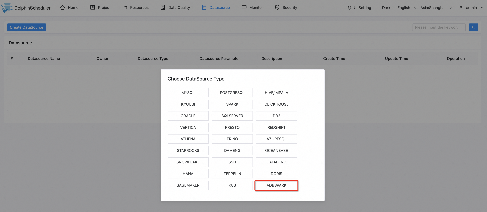
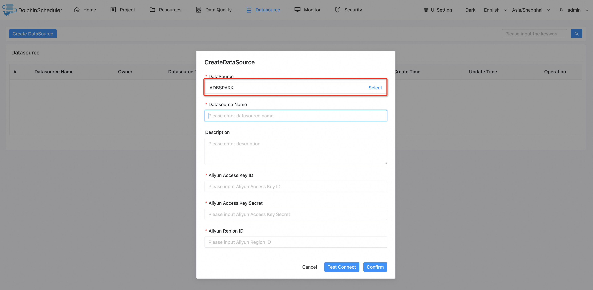
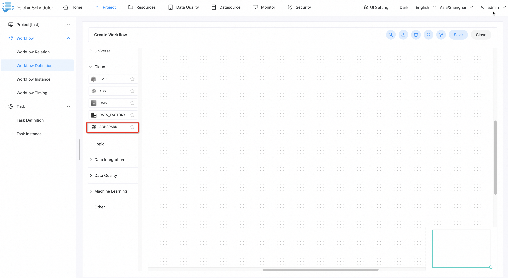
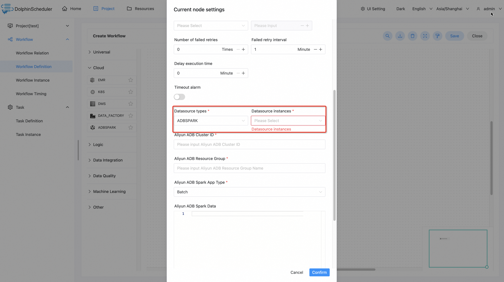

# Aliyun ADB Spark

## 简介

`阿里云 ADB Spark` 任务插件用于向 [`阿里云 ADB Spark`](https://help.aliyun.com/zh/analyticdb-for-mysql/user-guide/spark-app-development/?spm=a2c4g.11174283.0.0.ef0434f9C9JS8Z) 服务提交作业。

## 创建创建源

- 点击 `数据源 -> 创建数据源 -> ADBSPARK` 创建创建源。

- 填入 `Datasource Name`, `Aliyun Access Key Id`, `Aliyun Access Key Secret`, `Aliyun Region Id` 参数并且点击 `Confirm`。

]

## 创建任务节点

- 点击 `Porject -> Workflow Definition -> Create Workflow` 并且将 `ADBSPARK` 任务拖到画板中。

- 填入相关任务参数并且点击 `Confirm` 创建任务节点。

## 任务参数

- 默认参数说明请参考[DolphinScheduler任务参数附录](appendix.md)`默认任务参数`一栏。

| **Parameters**            | **Description**                                                                                                                                   |
|---------------------------|:--------------------------------------------------------------------------------------------------------------------------------------------------|
| Datasource types          | 数据源类型，应该选择 `ADBSPARK`.                                                                                                                            |
| Datasource instances      | `ADBSPARK` 数据源实例.                                                                                                                                 |
| Aliyun ADB Cluster ID     | AnalyticDB MySQL 湖仓版（3.0）集群 ID。                                                                                                                                |
| Aliyun ADB Resource Group | Job 型资源组名称。                                                                                                                                                     |
| Aliyun ADB App Type       | 应用类型，取值说明：Batch（默认值）, SQL。                                                                                                                                |
| Aliyun ADB Spark Data     | 应用模板数据。应用模板配置，请参见[《Spark 应用配置指南》](https://help.aliyun.com/zh/analyticdb-for-mysql/spark-application-configuration-guide?spm=a2c4g.11186623.0.i18)。  |

## 示例

### 提交 Spark 应用

#### Batch 类型应用

| **Parameters**            | **Example Values / Operations**                                                                                                                                                                                                                   |
|---------------------------|---------------------------------------------------------------------------------------------------------------------------------------------------------------------------------------------------------------------------------------------------|
| Aliyun ADB Cluster ID     | amv-example                                                                                                                                                                                                                                       |
| Aliyun ADB Resource Group | spark                                                                                                                                                                                                                                             |
| Aliyun ADB App Type       | Batch                                                                                                                                                                                                                                             |
| Aliyun ADB Spark Data     |{   &nbsp; &nbsp; &nbsp; &nbsp; "comments":&nbsp; [   &nbsp; &nbsp; &nbsp; &nbsp; &nbsp; &nbsp; &nbsp; &nbsp; "--&nbsp; Here&nbsp; is&nbsp; just&nbsp; an&nbsp; example&nbsp; of&nbsp; SparkPi.&nbsp; Modify&nbsp; the&nbsp; content&nbsp; and&nbsp; run&nbsp; your&nbsp; spark&nbsp; program."   &nbsp; &nbsp; &nbsp; &nbsp; ],   &nbsp; &nbsp; &nbsp; &nbsp; "args":&nbsp; [   &nbsp; &nbsp; &nbsp; &nbsp; &nbsp; &nbsp; &nbsp; &nbsp; "1000"   &nbsp; &nbsp; &nbsp; &nbsp; ],   &nbsp; &nbsp; &nbsp; &nbsp; "file":&nbsp; "local:///tmp/spark-examples.jar",   &nbsp; &nbsp; &nbsp; &nbsp; "name":&nbsp; "SparkPi",   &nbsp; &nbsp; &nbsp; &nbsp; "className":&nbsp; "org.apache.spark.examples.SparkPi",   &nbsp; &nbsp; &nbsp; &nbsp; "conf":&nbsp; {   &nbsp; &nbsp; &nbsp; &nbsp; &nbsp; &nbsp; &nbsp; &nbsp; "spark.driver.resourceSpec":&nbsp; "medium",   &nbsp; &nbsp; &nbsp; &nbsp; &nbsp; &nbsp; &nbsp; &nbsp; "spark.executor.instances":&nbsp; 2,   &nbsp; &nbsp; &nbsp; &nbsp; &nbsp; &nbsp; &nbsp; &nbsp; "spark.executor.resourceSpec":&nbsp; "medium"   &nbsp; &nbsp; &nbsp; &nbsp; }   }|

#### SQL 类型应用

| **Parameters**            | **Example Values / Operations**             |
|---------------------------|---------------------------------------------|
| Aliyun ADB Cluster ID     | amv-example                                 |
| Aliyun ADB Resource Group | spark                                       |
| Aliyun ADB App Type       | Batch                                       |
| Aliyun ADB Spark Data     | show databases;   select * from example; |