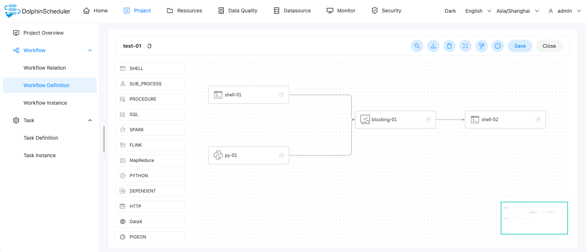
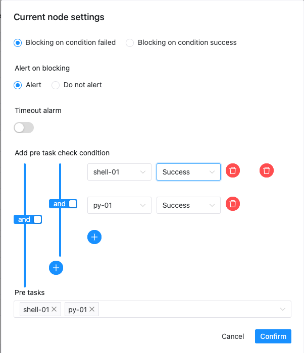
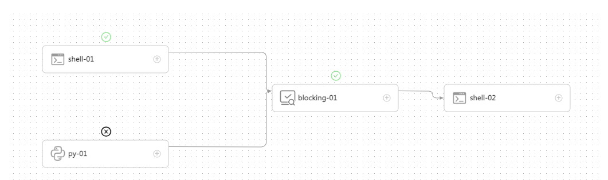
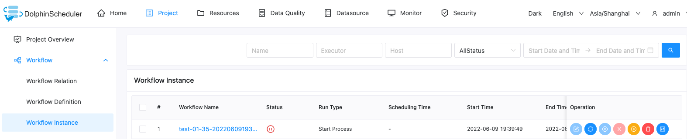

# Blocking节点

blocking节点是阻断节点，它回根据其前置任务的运行状态，并结合用户在添加节点时配置的阻断逻辑，决定是否在合适的时机暂停整个工作流的运行。同时，用户可以配置在工作流被阻断时向相关用户发出告警。当用户介入后，可以决定是否要继续执行工作流。

## 创建任务

- 点击项目管理-项目名称-工作流定义，点击“创建工作流”按钮，进入DAG编辑界面;
- 拖动工具栏中任务节点到画板中。

## 任务参数

- 节点名称：一个工作流定义中的节点名称是唯一的。
- 运行标志：标识这个节点是否能正常调度，如果不需要执行，可以打开禁止执行开关。
- 描述：描述该节点的功能。
- 任务优先级：worker线程数不足时，根据优先级从高到低依次执行，优先级一样时根据先进先出原则执行。
- worker分组：任务分配给worker组的机器执行，选择default，会随机选择一台worker机执行。
- 失败重试次数：任务失败重新提交的次数。
- 失败重试间隔：任务失败重新提交任务的时间间隔。
- 超时告警：勾选超时告警、超时失败，当任务超过“超时时长”后，会发送告警邮件并且任务执行失败。
- 阻断条件：有以下两个选项，它们定义了将工作流阻断的时机。
  - 用户自定义条件失败时阻断：即自定义参数的逻辑判断结果为**假**时阻断工作流。
  - 用户自定义条件成功时阻断：即自定义参数的逻辑判断结果为**真**时阻断工作流。
- 阻断时告警：当工作流被阻断时，是否要向用户发送告警。
- 添加前置检查条件：即**自定义参数**。它可为blocking节点选择一个或多个上游任务，构建阻断逻辑。
  - 增加上游依赖：通过选择第一个参数，选择对应的任务名称；通过第二个参数，选择该任务的期望状态。
  - 上游任务关系选择：当有多个上游任务时，可以通过`且`以及`或`操作符实现任务间执行结果的复杂关系逻辑关系判断。

## 任务样例

该样例通过[Shell](shell.md)任务和[Python](python.md)任务来演示blocking节点的操作流程

### 1、创建工作流

进入工作流定义页面，然后分别创建如下任务节点

- Shell-01：Shell任务，输出`hello word`，用于blocking节点的上游任务
- Py-01：Python任务，内容为`print('Hello Word'`，注意，这里的语法错误是故意的。用于blocking节点的上游任务
- Blocking-01：blocking节点，设置阻断逻辑为：Shell-01成功**且**Py-01成功；阻断逻辑为**真**时阻断；阻断时告警
- Shell-02：Shell任务，输出`Process end`

## 2、查看执行结果

当完成工作流创建之后，可以运行该工作流，会发现工作流最终会处在阻断状态

这时，你可以选择：**重跑**或者**继续执行**工作流

如果你有配置告警相关组件（例如email），那么将会收到一封告警邮件
