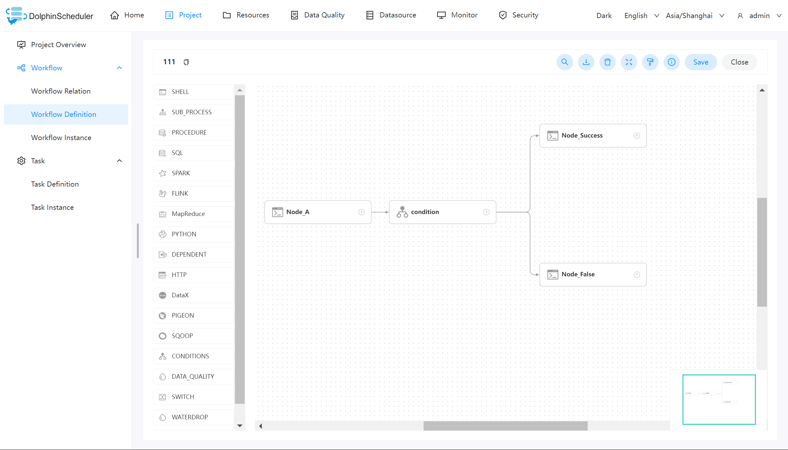
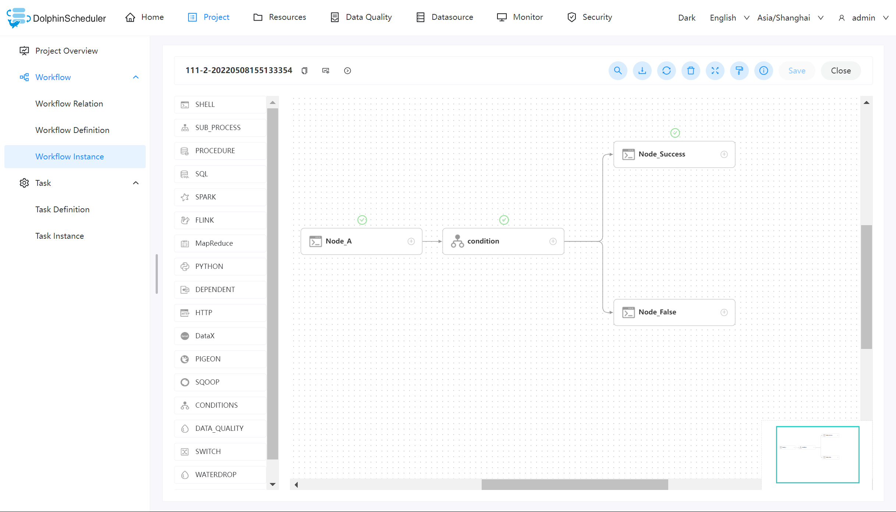
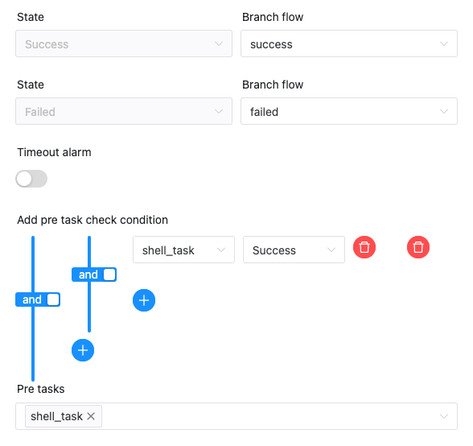

# Conditions 节点

Conditions 是一个条件节点，根据上游任务运行状态，判断应该运行哪个下游任务。截止目前 Conditions 支持多个上游任务，但只支持两个下游任务。当上游任务数超过一个时，可以通过`且`以及`或`操作符实现复杂上游依赖

## 创建任务

- 点击项目管理-项目名称-工作流定义，点击“创建工作流”按钮，进入 DAG 编辑页面；
- 拖动工具栏中的任务节点到画板中。

## 任务参数

[//]: # (TODO: use the commented anchor below once our website template supports this syntax)
[//]: # (- 默认参数说明请参考[DolphinScheduler任务参数附录]&#40;appendix.md#默认任务参数&#41;`默认任务参数`一栏。)

- 默认参数说明请参考[DolphinScheduler任务参数附录](appendix.md)`默认任务参数`一栏。

| **任务参数** |                                                                **描述**                                                                 |
|----------|---------------------------------------------------------------------------------------------------------------------------------------|
| 下游任务选择   | 根据前置任务的状态来跳转到对应的分支：成功分支 - 当上游运行成功时，运行成功选择的分支；失败分支 - 当上游运行失败时，运行失败选择的分支                                                                |
| 上游条件选择   | 可以为 Conditions 任务选择一个或多个上游任务：增加上游依赖 - 通过选择第一个参数选择对应的任务名称，通过第二个参数选择触发的 Conditions 任务的状态；上游任务关系选择 - 当有多个上游任务时，可以通过`且`以及`或`操作符实现任务的复杂关系。 |

## 相关任务

[switch](switch.md)：Condition节点主要依据上游节点的执行状态（成功、失败）执行对应分支。[Switch](switch.md)节点主要依据全局变量的值和用户所编写的表达式判断结果执行对应分支

## 任务样例

该样例通过使用 [Shell](shell.md) 任务来演示 Condition 任务的操作流程。

### 1、创建工作流

进入工作流定义页面，然后分别创建如下任务节点：

- Node_A：Shell 任务，打印输出 ”hello world“，其主要作用是 Condition 的上游分支，根据其执行是否成功来触发对应的分支节点。
- Condition：Conditions 任务，根据上游任务的执行状态，来执行对应的分支。
- Node_Success：Shell 任务，打印输出 “success”，Node_A 执行成功的分支。
- Node_False：Shell 任务，打印输出 ”false“，Node_A 执行失败的分支。

### 2、查看执行结果

当完成创建工作流之后，可以上线运行该工作流。在工作流实例页面可以查看到各个任务的执行状态。如下图所示：

上图中，任务状态标记为绿色对号的，即为成功执行的任务节点。

## 注意事项

- Conditions 任务支持多个上游任务，但只支持两个下游任务。
- Conditions 任务以及包含该任务的工作流不支持复制操作。
- Conditions 的前置任务不能连接其分支节点，会造成逻辑混乱，不符合 DAG 调度。如下图所示的情况是**错误**的。

