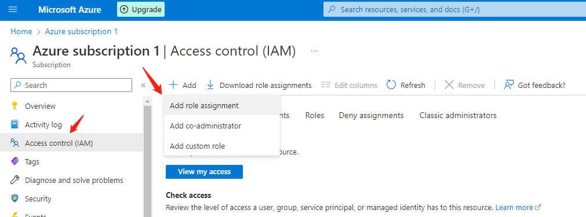
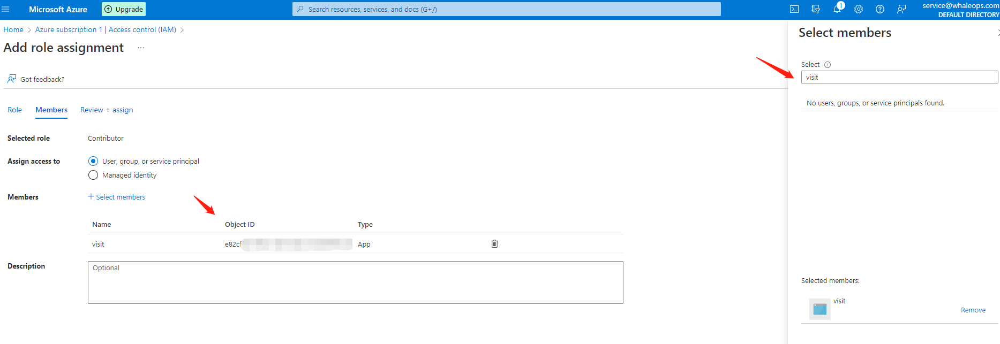
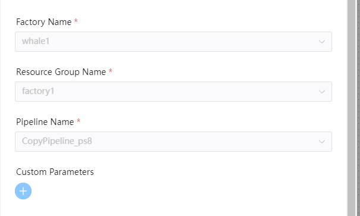

# Azure DataFactory 节点

## 综述

在大数据环境中，原始、散乱的数据通常存储在关系、非关系和其他存储系统中。[Azure DataFactory](https://learn.microsoft.com/en-us/azure/data-factory/introduction) 是为这些复杂的混合提取-转换-加载 (ETL)、提取-加载-转换 (ELT) 和数据集成项目而构建的托管云服务。

DolphinScheduler DataFactory 组件的功能:

- 创建 Azure DataFactory 任务可以调度DataFactory中的pipeline，持续获取执行状态，直至任务执行完成。

## 前置条件

- **资源组**: 拥有一个资源组
- **数据工厂**: 拥有一个资源组下的数据工厂
- **Pipeline**: 拥有前两者对应的pipeline
- **应用**: 拥有一个有数据工厂访问权限的应用，才能赋予SDK调用数据工厂
- **应用客户端密钥**: 在应用的`Certificates & secrets`申请客户端密钥
- **AZURE-CLI**: 在机器上安装了AZURE的鉴权应用AZURE-CLI，请参考[在LINUX上安装AZURE-CLI](https://learn.microsoft.com/en-us/cli/azure/install-azure-cli-linux)

### 应用权限设置

首先打开当前`Subscription`页面，点击`Access control (IAM)`，再点击`Add role assignment`进入授权页面。

首先选择`Contributor`角色足够满足调用数据工厂。然后选择`Members`页面，再选择`Select members`，检索APP名称或APP的`Object ID`并添加，从给指定APP添加权限.


## 环境配置

需要进行Azure的一些配置，修改`common.properties`中的`azure`相关配置信息
- **resource.azure.client.id**: Azure Application应用的Application (client) ID
- **resource.azure.client.secret**: Azure Application应用的`Certificates & secrets`下的客户端密钥
- **resource.azure.subId**: 数据工厂的subscription ID
- **resource.azure.tenant.id**: Azure Active Directory下的tenant ID

```yaml
# The Azure client ID (Azure Application (client) ID)
resource.azure.client.id=minioadmin
# The Azure client secret in the Azure application
resource.azure.client.secret=minioadmin
# The Azure data factory subscription ID
resource.azure.subId=minioadmin
# The Azure tenant ID in the Azure Active Directory
resource.azure.tenant.id=minioadmin

```

## 创建任务

- 点击项目管理-项目名称-工作流定义，点击“创建工作流”按钮，进入 DAG 编辑页面；
- 拖动工具栏的  任务节点到画板中。

## 任务样例

[//]: # (TODO: use the commented anchor below once our website template supports this syntax)
[//]: # (- 默认参数说明请参考[DolphinScheduler任务参数附录]&#40;appendix.md#默认任务参数&#41;`默认任务参数`一栏。)

- 默认参数说明请参考[DolphinScheduler任务参数附录](appendix.md)`默认任务参数`一栏。

### 独有参数

- **factoryName**: 数据工厂名称
- **resourceGroupName**: 与数据工厂相关的资源组名称
- **pipelineName**: 选取数据工厂以及资源组下的对应pipeline名称

组件图示如下：



