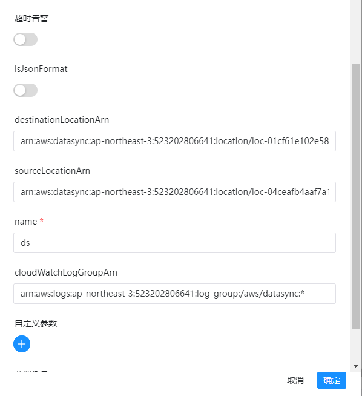

# DataSync 节点

## 综述

[AWS DataSync](https://console.aws.amazon.com/datasync/) 是一种在线数据传输服务，可简化、自动化和加速本地存储系统和 AWS Storage 服务之间，以及不同 AWS Storage 服务之间的数据移动。

DataSync 支持的组件:

- Network File System (NFS) file servers
- Server Message Block (SMB) file servers
- Hadoop Distributed File System (HDFS)
- Object storage systems
- Amazon Simple Storage Service (Amazon S3) buckets
- Amazon EFS file systems
- Amazon FSx for Windows File Server file systems
- Amazon FSx for Lustre file systems
- Amazon FSx for OpenZFS file systems
- Amazon FSx for NetApp ONTAP file systems
- AWS Snowcone devices

DolphinScheduler DataSync 组件的功能:

- 创建 AWS DataSync 任务并启动，持续获取状态，直至任务执行完成。

## 创建任务

- 点击项目管理-项目名称-工作流定义，点击“创建工作流”按钮，进入 DAG 编辑页面；
- 拖动工具栏的  任务节点到画板中。

## 任务样例

[//]: # (TODO: use the commented anchor below once our website template supports this syntax)
[//]: # (- 默认参数说明请参考[DolphinScheduler任务参数附录]&#40;appendix.md#默认任务参数&#41;`默认任务参数`一栏。)

- 默认参数说明请参考[DolphinScheduler任务参数附录](appendix.md)`默认任务参数`一栏。

### 独有参数

- **name**: 任务名称
- **destinationLocationArn**: 目标 AWS 存储资源位置的 Amazon Resource Name (ARN) ，可见 [AWS API](https://docs.aws.amazon.com/datasync/latest/userguide/API_CreateTask.html#DataSync-CreateTask-request-DestinationLocationArn)
- **sourceLocationArn**: 源 AWS 存储资源位置的 Amazon Resource Name (ARN) ，可见 [AWS API](https://docs.aws.amazon.com/datasync/latest/userguide/API_CreateTask.html#DataSync-CreateTask-request-SourceLocationArn)
- **cloudWatchLogGroupArn**: 用来监控任务的Amazon CloudWatch任务组的 Amazon Resource Name (ARN) ，可见 [AWS API](https://docs.aws.amazon.com/datasync/latest/userguide/API_CreateTask.html#DataSync-CreateTask-request-CloudWatchLogGroupArn)

或

- **json**: 创建 datasync 任务的JSON结构任务参数，可以支持options等参数，可见 [AWS CreateTask API] 的 Request Syntax (https://docs.aws.amazon.com/datasync/latest/userguide/API_CreateTask.html)

组件图示如下：



## 环境配置

需要进行AWS的一些配置，修改`common.properties`中的`xxxxx`为你的配置信息

```yaml
# Defines AWS access key and is required
resource.aws.access.key.id=<YOUR AWS ACCESS KEY>
# Defines AWS secret access key and is required
resource.aws.secret.access.key=<YOUR AWS SECRET KEY>
# Defines  AWS Region to use and is required
resource.aws.region=<AWS REGION>
```

