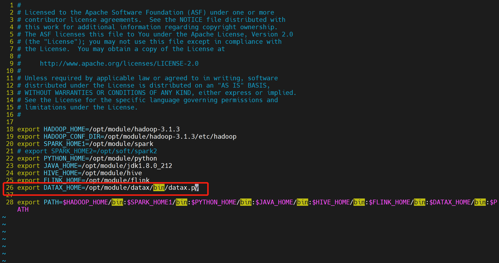
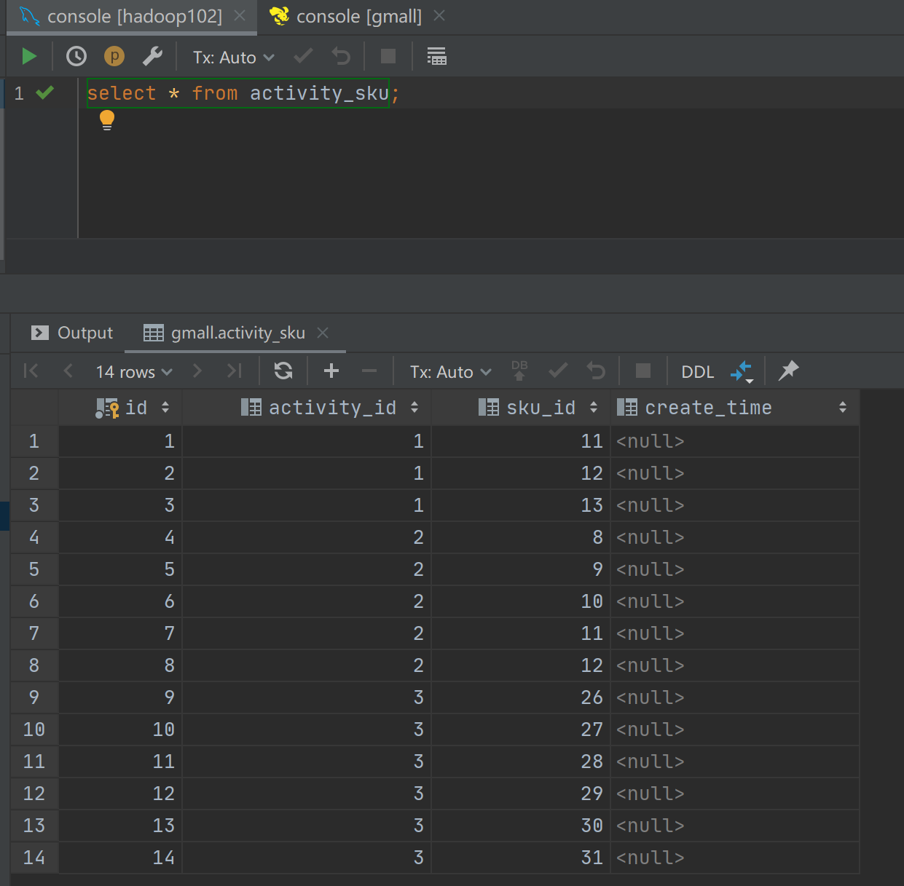

# DATAX 节点

## 综述

DataX 任务类型，用于执行 DataX 程序。对于 DataX 节点，worker 会通过执行 `${DATAX_HOME}/bin/datax.py` 来解析传入的 json 文件。

## 创建任务

- 点击项目管理 -> 项目名称 -> 工作流定义，点击“创建工作流”按钮，进入 DAG 编辑页面；
- 拖动工具栏的 任务节点到画板中。

## 任务参数

[//]: # (TODO: use the commented anchor below once our website template supports this syntax)
[//]: # (- 默认参数说明请参考[DolphinScheduler任务参数附录]&#40;appendix.md#默认任务参数&#41;`默认任务参数`一栏。)

- 默认参数说明请参考[DolphinScheduler任务参数附录](appendix.md)`默认任务参数`一栏。

| **任务参数** |                                                **描述**                                                 |
|----------|-------------------------------------------------------------------------------------------------------|
| json     | DataX 同步的 json 配置文件                                                                                   |
| 资源       | 在使用自定义json中如果集群开启了kerberos认证后，datax读取或者写入hdfs、hbase等插件时需要使用相关的keytab，xml文件等，则可使用改选项。资源中心-文件管理上传或创建的文件 |
| 自定义参数    | sql 任务类型，而存储过程是自定义参数顺序的给方法设置值自定义参数类型和数据类型同存储过程任务类型一样。区别在于SQL任务类型自定义参数会替换 sql 语句中 ${变量}                |
| 数据源      | 选择抽取数据的数据源                                                                                            |
| sql 语句   | 目标库抽取数据的 sql 语句，节点执行时自动解析 sql 查询列名，映射为目标表同步列名，源表和目标表列名不一致时，可以通过列别名（as）转换                              |
| 目标库      | 选择数据同步的目标库                                                                                            |
| 目标库前置    | 前置 sql 在 sql 语句之前执行（目标库执行）                                                                            |
| 目标库后置    | 后置 sql 在 sql 语句之后执行（目标库执行）                                                                            |
| 限流（字节数）  | 限制查询的字节数                                                                                              |
| 限流（记录数）  | 限制查询的记录数                                                                                              |

## 任务样例

该样例演示为从 Hive 数据导入到 MySQL 中。

### 在 DolphinScheduler 中配置 DataX 环境

若生产环境中要是使用到 DataX 任务类型，则需要先配置好所需的环境。配置文件如下：`/dolphinscheduler/conf/env/dolphinscheduler_env.sh`。

当环境配置完成之后，需要重启 DolphinScheduler。

### 配置 DataX 任务节点

由于默认的的数据源中并不包含从 Hive 中读取数据，所以需要自定义 json，可参考：[HDFS Writer](https://github.com/alibaba/DataX/blob/master/hdfswriter/doc/hdfswriter.md)。其中需要注意的是 HDFS 路径上存在分区目录，在实际情况导入数据时，分区建议进行传参，即使用自定义参数。

在编写好所需的 json 之后，可按照下图步骤进行配置节点内容。

### 查看运行结果

## 注意事项：

若默认提供的数据源不满足需求，可在自定义模板选项中，根据实际使用环境来配置 DataX 的 writer 和 reader，可参考：https://github.com/alibaba/DataX
