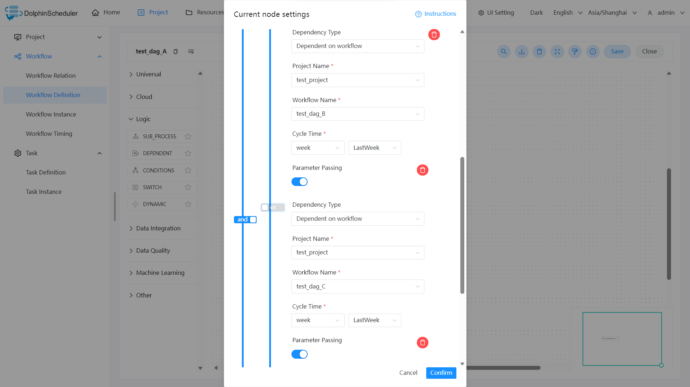
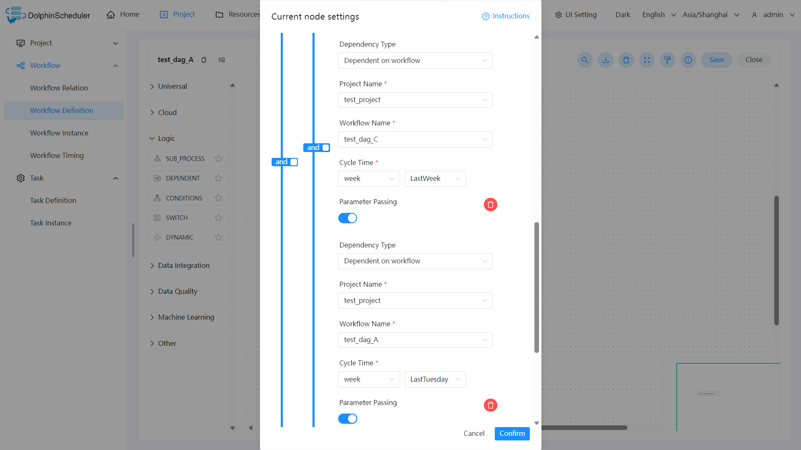

# Dependent 节点

## 综述

Dependent 节点，就是**依赖检查节点**。比如 A 流程依赖昨天的 B 流程执行成功，依赖节点会去检查 B 流程在昨天是否有执行成功的实例。

## 创建任务

- 点击项目管理 -> 项目名称 -> 工作流定义，点击“创建工作流”按钮，进入 DAG 编辑页面；
- 拖动工具栏的 任务节点到画板中。

## 任务参数

[//]: # (TODO: use the commented anchor below once our website template supports this syntax)
[//]: # (- 默认参数说明请参考[DolphinScheduler任务参数附录]&#40;appendix.md#默认任务参数&#41;`默认任务参数`一栏。)

- 默认参数说明请参考[DolphinScheduler任务参数附录](appendix.md)`默认任务参数`一栏。
- 此任务除上述链接中的默认参数外无其他参数。

## 任务样例

Dependent 节点提供了逻辑判断功能，可以按照逻辑来检测所依赖节点的执行情况。

例如，A 流程为周报任务，B、C 流程为天任务，A 任务需要 B、C 任务在上周的每一天都执行成功，如图示：

例如，A 流程为周报任务，B、C 流程为天任务，A 任务需要 B 或 C 任务在上周的每一天都执行成功，如图示：

假如，周报 A 同时还需要自身在上周二执行成功：

