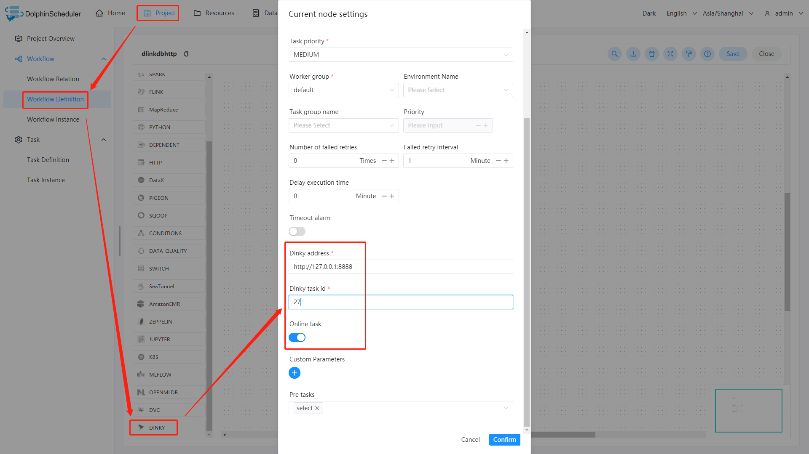

# Dinky

## Overview

`Dinky`任务类型，用于创建并执行`Dinky`类型任务以支撑一站式的开发、调试、运维 FlinkSQL、Flink Jar、SQL。worker 执行该任务的时候，会通过`Dinky API`触发`Dinky 的作业`。
点击[这里](http://www.dlink.top/) 获取更多关于`Dinky`的信息。

## Create Task

- 点击项目管理-项目名称-工作流定义，点击"创建工作流"按钮，进入DAG编辑页面。
- 工具栏中拖动  到画板中，即可完成创建。

## Task Parameter

| **参数**      | **描述**                                                             |
|-------------|--------------------------------------------------------------------|
| 任务名称        | 设置任务的名称。一个工作流定义中的节点名称是唯一的。                                         |
| 运行标志        | 标识这个节点是否可以正常调度。如果不需要执行，可以打开禁止执行开关。                                 |
| 描述          | 描述该节点的功能。                                                          |
| 任务优先级       | worker 线程数不足时，根据优先级从高到低依次执行，优先级一样时根据先进先出原则执行。                      |
| Worker 分组   | 任务分配给 worker 组的机器机执行，选择 Default，会随机选择一台 worker 机执行。                |
| 任务组名        | 资源中的组，如果未配置，将不会使用。                                                 | 
| 环境名称        | 配置运行脚本的环境。                                                         |
| 失败重试次数      | 任务失败重新提交的次数，支持下拉和手填。                                               | 
| 失败重试间隔      | 任务失败重新提交任务的时间间隔，支持下拉和手填。                                           | 
| 超时告警        | 勾选超时告警、超时失败，当任务超过"超时时长"后，会发送告警邮件并且任务执行失败.                          |
| Dinky 地址    | Dinky 服务的 url。                                                     |
| Dinky 任务 ID | Dinky 作业对应的唯一ID。                                                   |
| 上线作业        | 指定当前 Dinky 作业是否上线，如果是，则该被提交的作业只能处于已发布且当前无对应的 Flink Job 实例在运行才可提交成功。 |

## Task Example

### Dinky Task Example

这个示例展示了如何创建 Dinky 任务节点：

