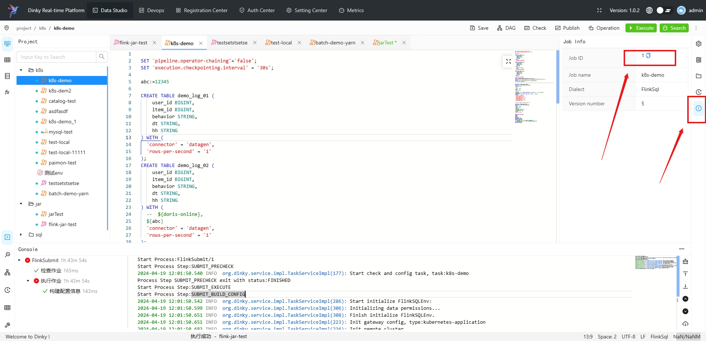

# Dinky

## Overview

`Dinky`任务类型，用于创建并执行`Dinky`类型任务以支撑一站式的开发、调试、运维 FlinkSQL、Flink Jar、SQL。worker 执行该任务的时候，会通过`Dinky API`触发`Dinky 的作业`。
点击[这里](http://www.dlink.top/) 获取更多关于`Dinky`的信息。

## Create Task

- 点击项目管理-项目名称-工作流定义，点击"创建工作流"按钮，进入DAG编辑页面。
- 工具栏中拖动  到画板中，即可完成创建。

## Task Parameter

[//]: # (TODO: use the commented anchor below once our website template supports this syntax)
[//]: # (- 默认参数说明请参考[DolphinScheduler任务参数附录]&#40;appendix.md#默认任务参数&#41;`默认任务参数`一栏。)

- 默认参数说明请参考[DolphinScheduler任务参数附录](appendix.md)`默认任务参数`一栏。

|  **任务参数**   |                               **描述**                                |
|-------------|---------------------------------------------------------------------|
| Dinky 地址    | Dinky 服务的 url。                                                      |
| Dinky 任务 ID | Dinky 作业对应的唯一ID。                                                    |
| 上线作业        | 指定当前 Dinky 作业是否上线，如果是，则该被提交的作业只能处于已发布且当前无对应的 Flink Job 实例在运行才可提交成功。 |

## Task Example

### Dinky Task Example

这个示例展示了如何创建 Dinky 任务节点：

