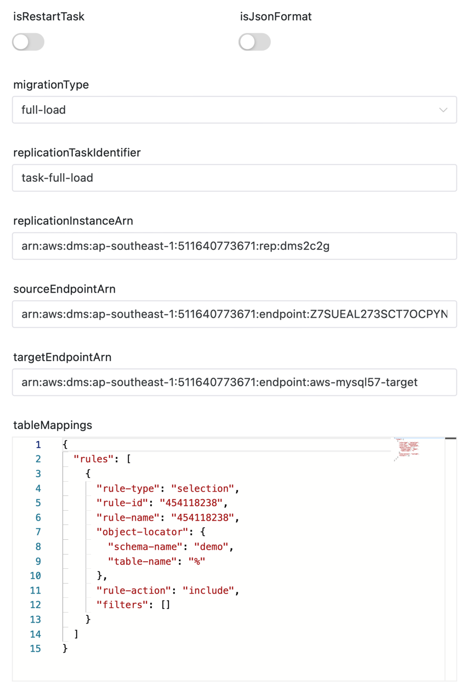
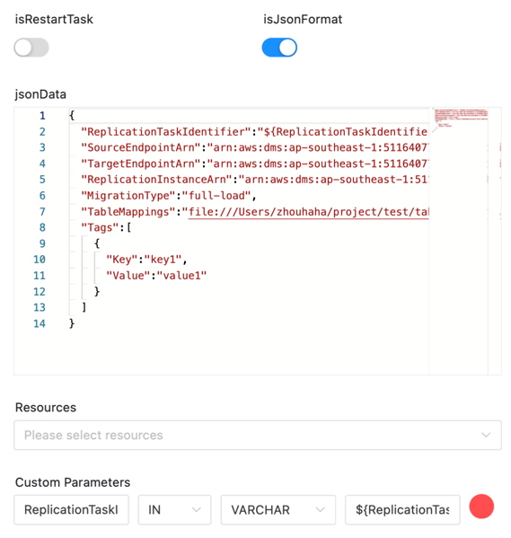

# DMS 节点

## 综述

[AWS Database Migration Service (AWS DMS)](https://aws.amazon.com/cn/dms) 可帮助您快速并安全地将数据库迁移至 AWS。
源数据库在迁移过程中可继续正常运行，从而最大程度地减少依赖该数据库的应用程序的停机时间。
AWS Database Migration Service 可以在广泛使用的开源商业数据库之间迁移您的数据。

DMS任务组件帮助用户在DolphinScheduler中创建和启动DMS任务。

组件主要包含两个功能：
- 创建并启动迁移任务
- 重启已存在的迁移任务

组件的使用方式有两种：
- 通过界面创建
- 通过Json数据创建


DolphinScheduler 在 启动DMS 任务后，会跟中DMS任务状态，直至DMS任务完成后才将任务设为成功状态。除了以下情况：

不跟踪无结束时间的CDC任务，即 当迁移类型为 `full-load-and-cdc` 或者 `cdc` 时，且没有配置 `cdcStopPosition` 参数时，DolphinScheduler 在成功启动任务后，则会将任务状态设为 成功。


## 创建任务

- 点击项目管理-项目名称-工作流定义，点击“创建工作流”按钮，进入 DAG 编辑页面；
- 拖动工具栏的  任务节点到画板中。

## 任务样例

组件图示如下：

**创建并启动迁移任务（通过界面）**



**重启已存在的迁移任务（通过界面）**


**创建并启动迁移任务（通过Json数据）**



**重启已存在的迁移任务（通过Json数据）**


### 首先介绍一些DS通用参数

- **节点名称** ：设置任务的名称。一个工作流定义中的节点名称是唯一的。
- **运行标志** ：标识这个节点是否能正常调度,如果不需要执行，可以打开禁止执行开关。
- **描述** ：描述该节点的功能。
- **任务优先级** ：worker 线程数不足时，根据优先级从高到低依次执行，优先级一样时根据先进先出原则执行。
- **Worker 分组** ：任务分配给 worker 组的机器执行，选择 Default，会随机选择一台 worker 机执行。
- **环境名称** ：配置运行脚本的环境。
- **失败重试次数** ：任务失败重新提交的次数。
- **失败重试间隔** ：任务失败重新提交任务的时间间隔，以分钟为单位。
- **延迟执行时间** ：任务延迟执行的时间，以分钟为单位。
- **资源**：是指脚本中需要调用的资源文件列表，资源中心-文件管理上传或创建的文件。
- **自定义参数**：是 SHELL 局部的用户自定义参数，会替换脚本中以 `${变量}` 的内容。
- **前置任务** ：选择当前任务的前置任务，会将被选择的前置任务设置为当前任务的上游。


### DMS组件独有的参数

- **isRestartTask**：是否重启已存在的迁移任务
- **isJsonFormat**：是否使用Json格式的数据创建任务
- **jsonData**：Json格式的数据, 是有`isJsonFormat`为true时才会生效

创建并启动迁移任务时参数

- **migrationType**：迁移类型, 可选值为：[ `full-load`, `full-load-and-cdc`, `cdc` ]
- **replicationTaskIdentifier**：迁移任务标识符, 任务名称
- **replicationInstanceArn**：迁移实例的ARN
- **sourceEndpointArn**：源端点的ARN
- **targetEndpointArn**：目标端点的ARN
- **tableMappings**：表映射

重启已存在的迁移任务时参数

- **replicationTaskArn**：迁移任务的ARN

## 环境配置

需要进行AWS的一些配置，修改`common.properties`中的以下配置信息
```yaml
# The AWS access key. if resource.storage.type=S3 or use EMR-Task, This configuration is required
resource.aws.access.key.id=<YOUR AWS ACCESS KEY>
# The AWS secret access key. if resource.storage.type=S3 or use EMR-Task, This configuration is required
resource.aws.secret.access.key=<YOUR AWS SECRET KEY>
# The AWS Region to use. if resource.storage.type=S3 or use EMR-Task, This configuration is required
resource.aws.region=<AWS REGION>
```
