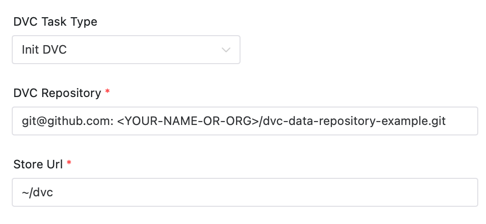
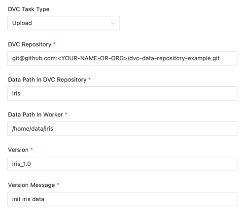
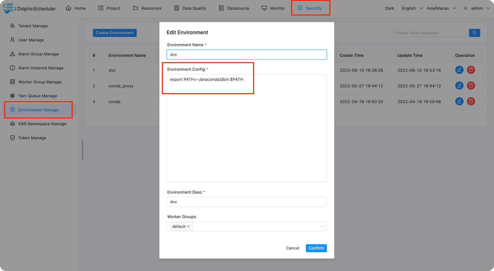

# DVC节点

## 综述

[DVC（Data Version Control）](https://dvc.org) 是一个MLops领域一个优秀的开机器学习版本管理系统。

DVC 组件用于在DS上使用DVC的数据版本管理功能，帮助用户简易地进行数据的版本管理。组件提供如下三个功能：

- Init DVC: 将git仓库初始化为DVC仓库，并绑定存储数据的地址用于存储实际的数据。
- Upload: 将特定数据添加或者更新到仓库中，并记录版本号。
- Download: 从仓库中下载特定版本的数据。

## 创建任务

- 点击项目管理-项目名称-工作流定义，点击“创建工作流”按钮，进入 DAG 编辑页面；
- 拖动工具栏的  任务节点到画板中。

## 任务样例

首先介绍一些DS通用参数

- **节点名称** ：设置任务的名称。一个工作流定义中的节点名称是唯一的。
- **运行标志** ：标识这个节点是否能正常调度,如果不需要执行，可以打开禁止执行开关。
- **描述** ：描述该节点的功能。
- **任务优先级** ：worker 线程数不足时，根据优先级从高到低依次执行，优先级一样时根据先进先出原则执行。
- **Worker 分组** ：任务分配给 worker 组的机器执行，选择 Default，会随机选择一台 worker 机执行。
- **环境名称** ：配置运行脚本的环境。
- **失败重试次数** ：任务失败重新提交的次数。
- **失败重试间隔** ：任务失败重新提交任务的时间间隔，以分钟为单位。
- **延迟执行时间** ：任务延迟执行的时间，以分钟为单位。
- **超时告警** ：勾选超时告警、超时失败，当任务超过"超时时长"后，会发送告警邮件并且任务执行失败。
- **前置任务** ：选择当前任务的前置任务，会将被选择的前置任务设置为当前任务的上游。

以下是一些DVC 组件的常用参数

- **DVC任务类型** ：可以选择 Upload、Download、Init DVC。
- **DVC仓库** ：任务执行时关联的仓库地址。

### Init DVC


将git仓库初始化为DVC仓库, 并绑定数据储存的地方。

项目初始化后，仍然为git仓库，不过添加了DVC的特性。

实际上数据并不保存在git仓库，而是存储在另外的地方，DVC会跟踪数据的版本和地址，并处理好这个关系。



**任务参数**

- **数据存储地址**
  ：实际的数据保存的地址，支持的类型可见 [DVC supported storage types](https://dvc.org/doc/command-reference/remote/add#supported-storage-types)
  。

如上述例子表示： 将仓库 `git@github.com:<YOUR-NAME-OR-ORG>/dvc-data-repository-example.git` 初始化为DVC项目，并绑定远程储存地址为 `~/dvc`

### Upload

用于上传和更新数据，并记录版本号。



**任务参数**

- **DVC仓库中的数据路径** ：上传的数据保存到仓库的地址。
- **Worker中数据路径** ：需要上传的数据的地址。
- **数据版本** ：上传数据后，为该版本数据打上的版本号，会保存到 git tag 里面。
- **数据版本信息** ：本次上传需要备注的信息。

如上述例子表示： 将数据 `/home/data/iris` 上传到仓库 `git@github.com:<YOUR-NAME-OR-ORG>/dvc-data-repository-example.git`
的根目录下，数据的文件/文件夹名字为`iris`。 然后执行 `git tag "iris_1.0" -m "init iris data"`。 记录版本号 `iris_1.0`和 版本信息 'inir iris data'

### Download

用于下载特定版本的数据。


**任务参数**

- **DVC仓库中的数据路径** ：需要下载数据在仓库中的路径。
- **Worker中数据路径** ：数据下载到本地后的保存地址。
- **数据版本** ：需要下载的数据的版本。

如上述例子表示： 将仓库 `git@github.com:xxxx/dvc-data-repository-example.git` 版本为 `iris_1.0` 的 iris 的数据下载到 `~/dvc_test/iris`

## 环境准备

### dvc 安装

确保你已经安装DVC可以使用`pip install dvc`进行安装。

获取dvc地址, 并配置环境变量

下面以 conda 上的 python pip 安装为例子，配置 conda 的环境变量，使得组件能正确找到`dvc`命令

```shell
which dvc
# >> ~/anaconda3/bin/dvc
```

你需要进入admin账户配置一个conda环境变量（请提前[安装anaconda](https://docs.continuum.io/anaconda/install/)
或者[安装miniconda](https://docs.conda.io/en/latest/miniconda.html#installing) )。



后续注意配置任务时，环境选择上面创建的conda环境，否则程序会找不到conda环境。


