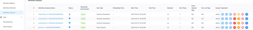

# 动态节点

## 综述

动态节点可以通过输入多个参数列表，通过笛卡尔积计算出多所有的参数组合，然后将每个参数组合作为一个子工作流节点执行。

比如我们有一个工作流，它具有两个输入参数，a, b。
我们可以通过动态节点，将这个工作流定义当做一个节点，然后输入参数列表
- 参数a：a1, a2
- 参数b：b1, b2

那么动态节点会计算出四个参数组合，分别是
- a1, b1
- a1, b2
- a2, b1
- a2, b2

然后将这四个参数组合作为子工作流节点的启动参数执行，共生成四个子工作流节点。

## 创建任务

- 点击项目管理 -> 项目名称 -> 工作流定义，点击”创建工作流”按钮，进入 DAG 编辑页面：

- 拖动工具栏的  任务节点到画板中。

任务定义如下图所示：


## 任务参数

[//]: # (TODO: use the commented anchor below once our website template supports this syntax)
[//]: # (- 默认参数说明请参考[DolphinScheduler任务参数附录]&#40;appendix.md#默认任务参数&#41;`默认任务参数`一栏。)

- 默认参数说明请参考[DolphinScheduler任务参数附录](appendix.md)`默认任务参数`一栏。

| **任务参数** |                                    **描述**                                    |
|----------|------------------------------------------------------------------------------|
| 子节点      | 是选择子工作流的工作流定义，右上角进入该子节点可以跳转到所选子工作流的工作流定义                                     |
| 动态生成实例上限 | 是指动态生成的子工作流实例的上限，超过该上限后，动态生成的子工作流实例将不再执行                                     |
| 并行度      | 是指动态生成的子工作流实例的并行度，即同时执行的子工作流实例的数量                                            |
| 取值参数     | 是指动态生成的子工作流实例的参数，支持多个参数，参数之间用分隔符分隔                                           |
| 过滤条件     | 是指动态生成的子工作流实例的过滤条件，支持多个过滤值，过滤条件之间用逗号分隔, 如 `2022,2023`， 则会过来包含2022和2023的值的参数组 |

## 任务参数输出

动态节点的输出参数，是指子工作流的输出参数，所有子工作流的输出参数都会被收集到一个列表中，作为动态节点的输出参数。

下游任务引用的时候，可以通过 `${dynamic.out(TaskName)}` 的方式引用。

值为一个json，样例如下

```Json
[
    { "dynParams":{ "a":"a1", "b":"b1" }, "outputValue":{ "p":"a1-b1" }, "mappedTimes":1 },
    { "dynParams":{ "a":"a2", "b":"b1" }, "outputValue":{ "p":"a2-b1" }, "mappedTimes":2 },
    { "dynParams":{ "a":"a3", "b":"b1" }, "outputValue":{ "p":"a3-b1" }, "mappedTimes":3 }
]
```

其中
- `dynParams` 是子工作流的输入参数
- `outputValue` 是子工作流的输出参数, 如这里的`p`为将子工作流的输出参数`a`和`b`拼接起来的字符串，以变量`p`的形式输出
- `mappedTimes` 是子工作流的执行的index，从1开始

## 运行状态

Dynamic任务启动后，会根据输入参数列表，计算出所有的参数组合，然后对每一个参数组合，创建一个子工作流实例。

Dynamic运行时，会定期检测当前所有子工作流实例的统计信息，如果并行度大于运行中的子工作流实例的数量，则会触发启动合适数量的工作流实例（工作流实例是先创建，后续再出发启动）。

如下如所示。



当且进度所有的子工作流实例全部运行成功时，dynamic任务才会运行成功。
