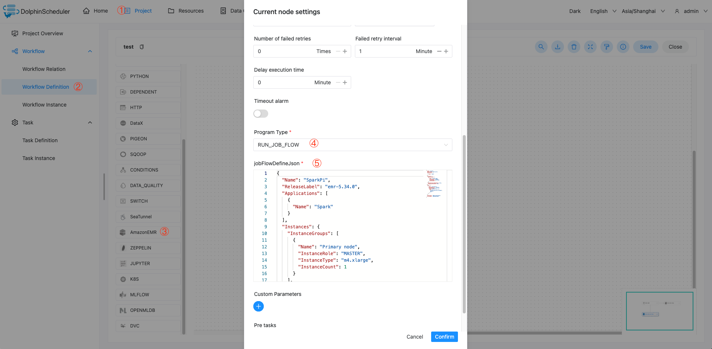
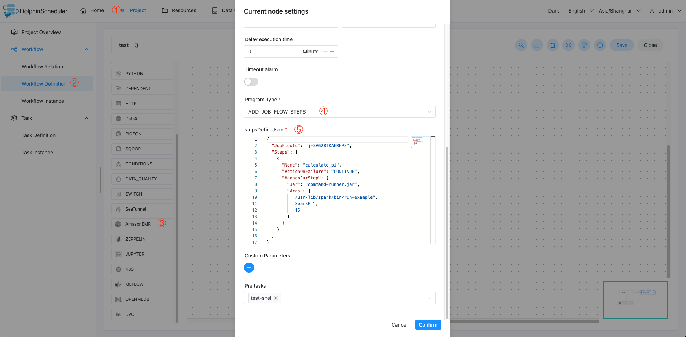
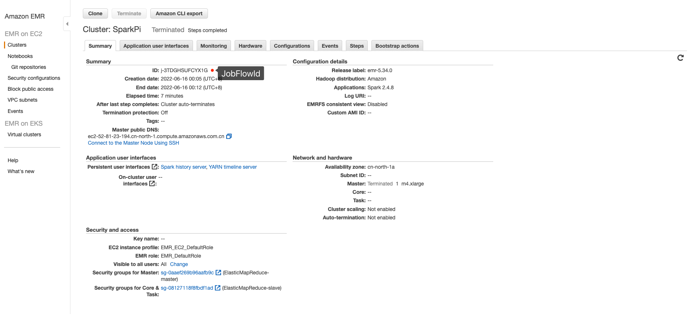

# Amazon EMR

## 综述

Amazon EMR 任务类型，用于在AWS上操作EMR集群并执行计算任务。 
后台使用 [aws-java-sdk](https://aws.amazon.com/cn/sdk-for-java/) 将JSON参数转换为任务对象，提交到AWS，目前支持两种程序类型：

* `RUN_JOB_FLOW` 使用 [API_RunJobFlow](https://docs.aws.amazon.com/emr/latest/APIReference/API_RunJobFlow.html#API_RunJobFlow_Examples) 提交 [RunJobFlowRequest](https://docs.aws.amazon.com/AWSJavaSDK/latest/javadoc/com/amazonaws/services/elasticmapreduce/model/RunJobFlowRequest.html) 对象
* `ADD_JOB_FLOW_STEPS` 使用 [API_AddJobFlowSteps](https://docs.aws.amazon.com/emr/latest/APIReference/API_AddJobFlowSteps.html#API_AddJobFlowSteps_Examples) 提交 [AddJobFlowStepsRequest](https://docs.aws.amazon.com/AWSJavaSDK/latest/javadoc/com/amazonaws/services/elasticmapreduce/model/AddJobFlowStepsRequest.html) 对象

## 任务参数
- 节点名称：一个工作流定义中的节点名称是唯一的。
- 运行标志：标识这个节点是否能正常调度,如果不需要执行，可以打开禁止执行开关。
- 描述信息：描述该节点的功能。
- 任务优先级：worker线程数不足时，根据优先级从高到低依次执行，优先级一样时根据先进先出原则执行。
- Worker分组：任务分配给worker组的机器机执行，选择Default，会随机选择一台worker机执行。
- 失败重试次数：任务失败重新提交的次数，支持下拉和手填。
- 失败重试间隔：任务失败重新提交任务的时间间隔，支持下拉和手填。
- 超时告警：勾选超时告警、超时失败，当任务超过"超时时长"后，会发送告警邮件并且任务执行失败.
- 程序类型：选择程序类型，如果是`RUN_JOB_FLOW`，则需要填写`jobFlowDefineJson`，如果是`ADD_JOB_FLOW_STEPS`，则需要填写`stepsDefineJson`。
  - jobFlowDefineJson: [RunJobFlowRequest](https://docs.aws.amazon.com/AWSJavaSDK/latest/javadoc/com/amazonaws/services/elasticmapreduce/model/RunJobFlowRequest.html) 对象对应的JSON，详细JSON定义参见 [API_RunJobFlow_Examples](https://docs.aws.amazon.com/emr/latest/APIReference/API_RunJobFlow.html#API_RunJobFlow_Examples)
  - stepsDefineJson：[AddJobFlowStepsRequest](https://docs.aws.amazon.com/AWSJavaSDK/latest/javadoc/com/amazonaws/services/elasticmapreduce/model/AddJobFlowStepsRequest.html) 对象对应的JSON，详细JSON定义参见 [API_AddJobFlowSteps_Examples](https://docs.aws.amazon.com/emr/latest/APIReference/API_AddJobFlowSteps.html#API_AddJobFlowSteps_Examples)

## 任务样例
### 创建EMR集群并运行Steps
该样例展示了如何创建`RUN_JOB_FLOW`类型`EMR`任务节点，以执行`SparkPi`为例，该任务会创建一个`EMR`集群，并且执行`SparkPi`示例程序。


jobFlowDefineJson 参数样例
```json
{
  "Name": "SparkPi",
  "ReleaseLabel": "emr-5.34.0",
  "Applications": [
    {
      "Name": "Spark"
    }
  ],
  "Instances": {
    "InstanceGroups": [
      {
        "Name": "Primary node",
        "InstanceRole": "MASTER",
        "InstanceType": "m4.xlarge",
        "InstanceCount": 1
      }
    ],
    "KeepJobFlowAliveWhenNoSteps": false,
    "TerminationProtected": false
  },
  "Steps": [
    {
      "Name": "calculate_pi",
      "ActionOnFailure": "CONTINUE",
      "HadoopJarStep": {
        "Jar": "command-runner.jar",
        "Args": [
          "/usr/lib/spark/bin/run-example",
          "SparkPi",
          "15"
        ]
      }
    }
  ],
  "JobFlowRole": "EMR_EC2_DefaultRole",
  "ServiceRole": "EMR_DefaultRole"
}
```

### 向运行中的EMR集群添加Step
该样例展示了如何创建`ADD_JOB_FLOW_STEPS`类型`EMR`任务节点，以执行`SparkPi`为例，该任务会向运行中的`EMR`集群添加一个`SparkPi`示例程序。



stepsDefineJson 参数样例
```json
{
  "JobFlowId": "j-3V628TKAERHP8",
  "Steps": [
    {
      "Name": "calculate_pi",
      "ActionOnFailure": "CONTINUE",
      "HadoopJarStep": {
        "Jar": "command-runner.jar",
        "Args": [
          "/usr/lib/spark/bin/run-example",
          "SparkPi",
          "15"
        ]
      }
    }
  ]
}
```

## 注意事项：

- EMR 任务类型的故障转移尚未实现。目前，DolphinScheduler 仅支持对 yarn task type 进行故障转移。其他任务类型，如 EMR 任务、k8s 任务尚未准备好。 
- `stepsDefineJson` 一个任务定义仅支持关联单个step，这样可以更好的保证任务状态的可靠性。