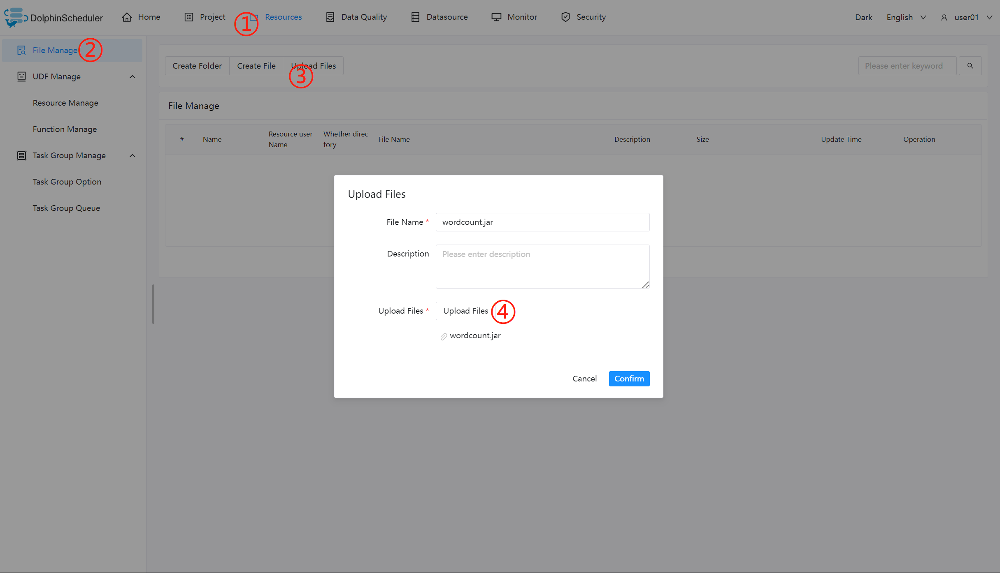

# Flink节点

## 综述

Flink 任务类型，用于执行 Flink 程序。对于 Flink 节点：

1. 当程序类型为 Java、Scala 或 Python 时，worker 使用 Flink 命令提交任务 `flink run`。更多详情查看 [flink cli](https://nightlies.apache.org/flink/flink-docs-release-1.14/docs/deployment/cli/) 。

2. 当程序类型为 SQL 时，worker 使用`sql-client.sh` 提交任务。更多详情查看 [flink sql client](https://nightlies.apache.org/flink/flink-docs-master/docs/dev/table/sqlclient/) 。

## 创建任务

- 点击项目管理-项目名称-工作流定义，点击“创建工作流”按钮，进入 DAG 编辑页面；
- 拖动工具栏的  任务节点到画板中。

## 任务参数

[//]: # (TODO: use the commented anchor below once our website template supports this syntax)
[//]: # (- 默认参数说明请参考[DolphinScheduler任务参数附录]&#40;appendix.md#默认任务参数&#41;`默认任务参数`一栏。)

- 默认参数说明请参考[DolphinScheduler任务参数附录](appendix.md)`默认任务参数`一栏。

|    **任务参数**     |                                                                                                                   **描述**                                                                                                                   |
|-----------------|--------------------------------------------------------------------------------------------------------------------------------------------------------------------------------------------------------------------------------------------|
| 程序类型            | 支持 Java、Scala、 Python 和 SQL 四种语言                                                                                                                                                                                                           |
| 主函数的 Class      | Flink 程序的入口 Main Class 的**全路径**                                                                                                                                                                                                            |
| 主程序包            | 执行 Flink 程序的 jar 包（通过资源中心上传）                                                                                                                                                                                                               |
| 部署方式            | 支持 cluster、 local 和 application （Flink 1.11和之后的版本支持，参见 [Run an application in Application Mode](https://nightlies.apache.org/flink/flink-docs-release-1.11/ops/deployment/yarn_setup.html#run-an-application-in-application-mode)） 三种模式的部署 |
| 初始化脚本           | 用于初始化会话上下文的脚本文件                                                                                                                                                                                                                            |
| 脚本              | 用户开发的应该执行的 SQL 脚本文件                                                                                                                                                                                                                        |
| Flink 版本        | 根据所需环境选择对应的版本即可                                                                                                                                                                                                                            |
| 任务名称（选填）        | Flink 程序的名称                                                                                                                                                                                                                                |
| jobManager 内存数  | 用于设置 jobManager 内存数，可根据实际生产环境设置对应的内存数                                                                                                                                                                                                      |
| Slot 数量         | 用于设置 Slot 的数量，可根据实际生产环境设置对应的数量                                                                                                                                                                                                             |
| taskManager 内存数 | 用于设置 taskManager 内存数，可根据实际生产环境设置对应的内存数                                                                                                                                                                                                     |
| taskManager 数量  | 用于设置 taskManager 的数量，可根据实际生产环境设置对应的数量                                                                                                                                                                                                      |
| 并行度             | 用于设置执行 Flink 任务的并行度                                                                                                                                                                                                                        |
| 主程序参数           | 设置 Flink 程序的输入参数，支持自定义参数变量的替换                                                                                                                                                                                                              |
| 选项参数            | 支持 `--jar`、`--files`、`--archives`、`--conf` 格式                                                                                                                                                                                              |
| 自定义参数           | 是 Flink 局部的用户自定义参数，会替换脚本中以 ${变量} 的内容                                                                                                                                                                                                       |

## 任务样例

### 执行 WordCount 程序

本案例为大数据生态中常见的入门案例，常应用于 MapReduce、Flink、Spark 等计算框架。主要为统计输入的文本中，相同的单词的数量有多少。（Flink 的 Releases 附带了此示例作业）

#### 在 DolphinScheduler 中配置 flink 环境

若生产环境中要是使用到 flink 任务类型，则需要先配置好所需的环境。配置文件如下：`bin/env/dolphinscheduler_env.sh`。

#### 上传主程序包

在使用 Flink 任务节点时，需要利用资源中心上传执行程序的 jar 包，可参考[资源中心](../resource/configuration.md)。

当配置完成资源中心之后，直接使用拖拽的方式，即可上传所需目标文件。

#### 配置 Flink 节点

根据上述参数说明，配置所需的内容即可。

### 执行 FlinkSQL 程序

根据上述参数说明，配置所需的内容即可。

## 注意事项：

- Java 和 Scala 只是用来标识，没有区别，如果是 Python 开发的 Flink 则没有主函数的 class，其余的都一样。

- 使用 SQL 执行 Flink SQL 任务，目前只支持 Flink 1.13及以上版本。

