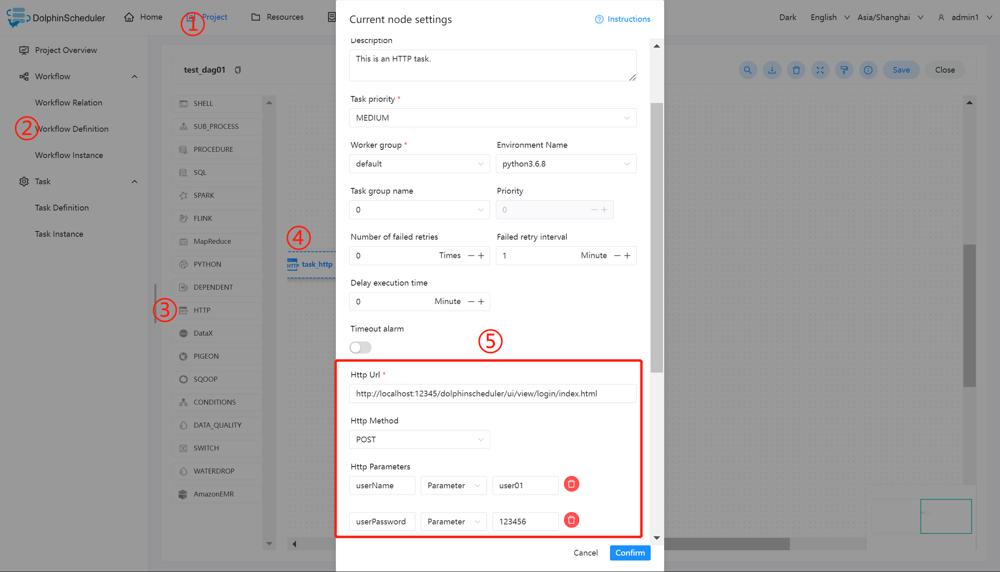

# HTTP 节点

## 综述

该节点用于执行 http 类型的任务，例如常见的 POST、GET 等请求类型，此外还支持 http 请求校验等功能。

## 创建任务

- 点击项目管理 -> 项目名称 -> 工作流定义，点击”创建工作流”按钮，进入 DAG 编辑页面：

- 拖动工具栏的  任务节点到画板中。

## 任务参数

[//]: # (TODO: use the commented anchor below once our website template supports this syntax)
[//]: # (- 默认参数说明请参考[DolphinScheduler任务参数附录]&#40;appendix.md#默认任务参数&#41;`默认任务参数`一栏。)

- 默认参数说明请参考[DolphinScheduler任务参数附录](appendix.md)`默认任务参数`一栏。

| **任务参数** |               **描述**                |
|----------|-------------------------------------|
| 请求地址     | http 请求 URL                         |
| 请求类型     | 支持 GET、POST、HEAD、PUT、DELETE         |
| 请求参数     | 支持 Parameter、Body、Headers           |
| 校验条件     | 支持默认响应码、自定义响应码、内容包含、内容不包含           |
| 校验内容     | 当校验条件选择自定义响应码、内容包含、内容不包含时，需填写校验内容   |
| 自定义参数    | 是 http 局部的用户自定义参数，会替换脚本中以 ${变量} 的内容 |

## 任务样例

HTTP 定义了与服务器交互的不同方法，最基本的方法有4种，分别是GET，POST，PUT，DELETE。这里我们使用 http 任务节点，演示使用 POST 向系统的登录页面发送请求，提交数据。

主要配置参数如下：

- URL：访问目标资源的地址，这里为系统的登录页面。
- HTTP Parameters
  - userName：用户名；
  - userPassword：用户登录密码。

## 注意事项

无。
