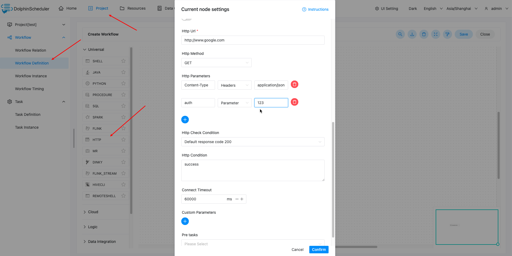
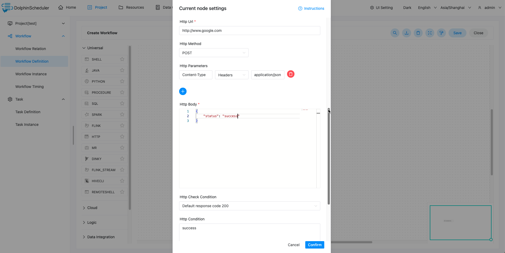

# HTTP 节点

## 综述

该节点用于执行 http 类型的任务，此外还支持 http 请求校验等功能。

## 创建任务

- 点击项目管理 -> 项目名称 -> 工作流定义，点击”创建工作流”按钮，进入 DAG 编辑页面：

- 拖动工具栏的  任务节点到画板中。

## 任务参数

[//]: # (TODO: use the commented anchor below once our website template supports this syntax)
[//]: # (- 默认参数说明请参考[DolphinScheduler任务参数附录]&#40;appendix.md#默认任务参数&#41;`默认任务参数`一栏。)

- 默认参数说明请参考[DolphinScheduler任务参数附录](appendix.md)`默认任务参数`一栏。

| **任务参数** |               **描述**                |
|----------|-------------------------------------|
| 请求地址     | http 请求 URL                         |
| 请求类型     | 支持 GET、POST、PUT、DELETE              |
| 请求参数     | 支持 Parameter、Body、Headers           |
| 校验条件     | 支持默认响应码、自定义响应码、内容包含、内容不包含           |
| 校验内容     | 当校验条件选择自定义响应码、内容包含、内容不包含时，需填写校验内容   |
| 自定义参数    | 是 http 局部的用户自定义参数，会替换脚本中以 ${变量} 的内容 |

## 任务输出参数

| **任务参数** |       **描述**        |
|----------|---------------------|
| response | VARCHAR, http请求返回结果 |

可以在下游任务中使用 ${taskName.response} 引用任务输出参数。

如，当前task1为http任务, 下游任务可以使用 `${task1.response}` 引用task1的输出参数

## 任务样例

HTTP 定义了与服务器交互的不同方法，最基本的方法有4种，分别是GET，POST, PUT, DELETE。这里我们使用 http 任务节点，演示使用 POST 向系统的登录页面发送请求，提交数据。

主要配置参数如下(以下参数均可通过内置参数替换)：

- URL：访问目标资源的地址，这里为系统的登录页面。
- 请求类型：GET、POST、PUT、DELETE
- Headers: 请求头信息，当前仅支持 application/json、application/x-www-form-urlencoded 格式，如输入其他格式默认会使用 application/json 格式。
- HTTP Parameters(GET、DELETE请求参数)
- HTTP Body(POST、PUT请求参数)
- 校验条件：默认响应码200、自定义响应码、内容包含、内容不包含
- 校验内容：校验条件为自定义响应码、内容包含、内容不包含时，需填写校验内容，校验内容为模糊匹配

