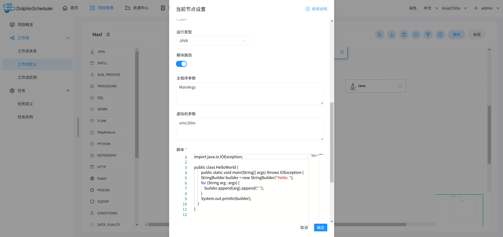

# JAVA 节点

## 综述

该节点用于执行 java 类型的任务，支持使用单文件和jar包作为程序入口。

## 创建任务

- 点击项目管理 -> 项目名称 -> 工作流定义，点击”创建工作流”按钮，进入 DAG 编辑页面：

- 拖动工具栏的JAVA任务节点到画板中。

## 任务参数

- 节点名称：设置任务的名称。一个工作流定义中的节点名称是唯一的。
- 运行标志：标识这个节点是否能正常调度,如果不需要执行，可以打开禁止执行开关。
- 描述：描述该节点的功能。
- 任务优先级：worker 线程数不足时，根据优先级从高到低依次执行，优先级一样时根据先进先出原则执行。
- Worker 分组：任务分配给 worker 组的机器机执行，选择 Default，会随机选择一台 worker 机执行。
- 环境名称：配置运行任务的环境。
- 失败重试次数：任务失败重新提交的次数，支持下拉和手填。
- 失败重试间隔：任务失败重新提交任务的时间间隔，支持下拉和手填。
- 延迟执行时间：任务延迟执行的时间，以分为单位。
- 超时告警：勾选超时告警、超时失败，当任务超过"超时时长"后，会发送告警邮件并且任务执行失败。
- 模块路劲：开启使用JAVA9+的模块化特性，把所有资源放入--module-path中，要求您的worker中的JDK版本支持模块化。
- 主程序参数：作为普通Java程序main方法入口参数。
- 虚拟机参数：配置启动虚拟机参数。
- 脚本：若使用JAVA运行类型则需要编写JAVA代码。代码中必须存在public类，不用写package语句。
- 资源：可以是外部JAR包也可以是其他资源文件，它们都会被加入到类路径或模块路径中，您可以在自己的JAVA脚本中轻松获取。
- 自定义参数：是 http 局部的用户自定义参数，会替换脚本中以 ${变量} 的内容。
- 前置任务：选择当前任务的前置任务，会将被选择的前置任务设置为当前任务的上游。

## 任务样例

HTTP 定义了与服务器交互的不同方法，最基本的方法有4种，分别是GET，POST，PUT，DELETE。这里我们使用 http 任务节点，演示使用 POST 向系统的登录页面发送请求，提交数据。

主要配置参数如下：

- 运行类型
- 模块路径
- 主程序参数
- 虚拟机参数
- 脚本文件

## 注意事项

使用JAVA运行类型时代码中必须存在public类，可以不写package语句

