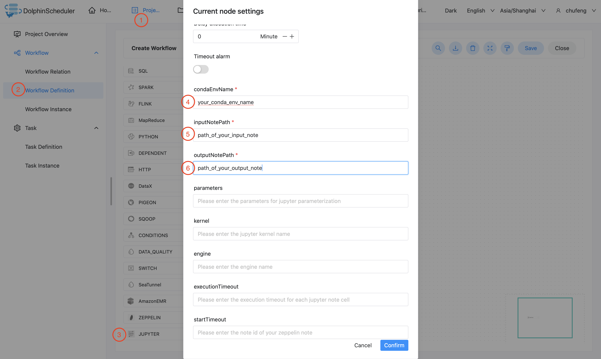

# Jupyter

## 综述

`Jupyter`任务类型，用于创建并执行`Jupyter`类型任务。worker 执行该任务的时候，会通过`papermill`执行`jupyter note`。
点击[这里](https://papermill.readthedocs.io/en/latest/) 获取更多关于`papermill`的信息。

## Conda虚拟环境配置

- 在`common.properties`配置`conda.path`，将其指向您的`conda.sh`。这里的`conda`应该是您用来管理您的 `papermill`和`jupyter`所在python环境的相同`conda`。
  点击 [这里](https://docs.conda.io/en/latest/) 获取更多关于`conda`的信息.
- `conda.path`默认设置为`/opt/anaconda3/etc/profile.d/conda.sh`。 如果您不清楚您的`conda`环境在哪里，只需要在命令行执行`conda info | grep -i 'base environment'`即可获得。

> 注意：`Jupyter任务插件`使用`source`命令激活conda环境，
> 如果您的租户没有`source`命令使用权限，`Jupyter任务插件`将无法使用。

## Python依赖管理

### 使用预装好的Conda环境

1. 手动或使用`shell任务`在您的目标机器上创建conda环境。
2. 在您的`jupyter任务`中，将`condaEnvName`设置为您在上一步创建的conda环境名。

### 使用打包的Conda环境

1. 使用 [Conda-Pack](https://conda.github.io/conda-pack/) 将您的conda环境打包成`tarball`.
2. 将您打包好的conda环境上传到`资源中心`.
3. 在您的`jupyter任务`资源设置中，添加您在上一步中上传的conda环境包，如`jupyter_env.tar.gz`.

> **_提示:_** 请您按照 [Conda-Pack](https://conda.github.io/conda-pack/) 官方指导打包conda环境，
> 正确打包出的conda环境包解压后文件目录结构应和下图完全一致：

```
.
├── bin
├── conda-meta
├── etc
├── include
├── lib
├── share
└── ssl
```

> 注意: 请严格按照上述`conda pack`指示操作，并且不要随意修改`bin/activate`。
> `Jupyter任务插件`使用`source`命令激活您打包的conda环境。
> 若您对使用`source`命令有安全性上的担忧，请使用其他方法管理您的python依赖。

### 由依赖需求文本文件临时构建

1. 在`资源中心`创建或上传`.txt`格式的python依赖需求文本文件。
2. 将`jupyter任务`中的`condaEnvName`参数设置成您的python依赖需求文本文件，如`requirements.txt`。
3. 在您`jupyter任务`的`资源`中选取您的python依赖需求文本文件，如`requirements.txt`。

如下是一个依赖需求文本文件的样例，通过该文件，`jupyter任务插件`会自动构建您的python依赖，并执行您的python代码，
执行完成后会自动释放临时构建的环境。

```text
fastjsonschema==2.15.3
fonttools==4.33.3
geojson==2.5.0
identify==2.4.11
idna==3.3
importlib-metadata==4.11.3
importlib-resources==5.7.1
ipykernel==5.5.6
ipython==8.2.0
ipython-genutils==0.2.0
jedi==0.18.1
Jinja2==3.1.1
json5==0.9.6
jsonschema==4.4.0
jupyter-client==7.3.0
jupyter-core==4.10.0
jupyter-server==1.17.0
jupyterlab==3.3.4
jupyterlab-pygments==0.2.2
jupyterlab-server==2.13.0
kiwisolver==1.4.2
MarkupSafe==2.1.1
matplotlib==3.5.2
matplotlib-inline==0.1.3
mistune==0.8.4
nbclassic==0.3.7
nbclient==0.6.0
nbconvert==6.5.0
nbformat==5.3.0
nest-asyncio==1.5.5
notebook==6.4.11
notebook-shim==0.1.0
numpy==1.22.3
packaging==21.3
pandas==1.4.2
pandocfilters==1.5.0
papermill==2.3.4
```

## 创建任务

- 点击项目管理-项目名称-工作流定义，点击"创建工作流"按钮，进入DAG编辑页面。
- 工具栏中拖动  到画板中，即可完成创建。

## 任务参数

[//]: # (TODO: use the commented anchor below once our website template supports this syntax)
[//]: # (- 默认参数说明请参考[DolphinScheduler任务参数附录]&#40;appendix.md#默认任务参数&#41;`默认任务参数`一栏。)

- 默认参数说明请参考[DolphinScheduler任务参数附录](appendix.md)`默认任务参数`一栏。

|         **任务参数**          |               **描述**               |
|---------------------------|------------------------------------|
| Conda Env Name            | Conda环境或打包的Conda环境包名称              |
| Input Note Path           | 输入的jupyter note模板路径                |
| Output Note Path          | 输出的jupyter note路径                  |
| Jupyter Parameters        | 用于对接jupyter note参数化的JSON格式参数       |
| Kernel                    | Jupyter notebook 内核                |
| Engine                    | 用于执行Jupyter note的引擎名称              |
| Jupyter Execution Timeout | 对于每个jupyter notebook cell设定的超时时间   |
| Jupyter Start Timeout     | 对于jupyter notebook kernel设定的启动超时时间 |
| Others                    | 传入papermill命令的其他参数                 |

## 任务样例

### 简单的Jupyter任务样例

这个示例展示了如何创建Jupyter任务节点：



