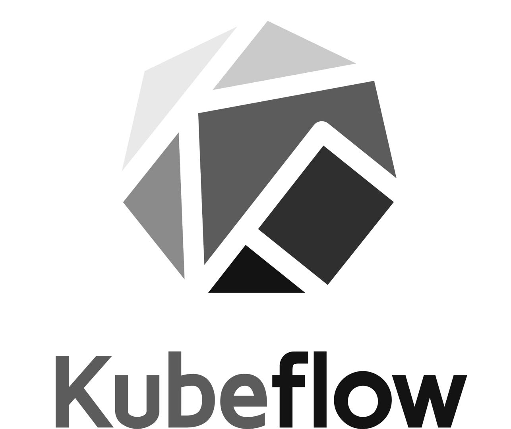
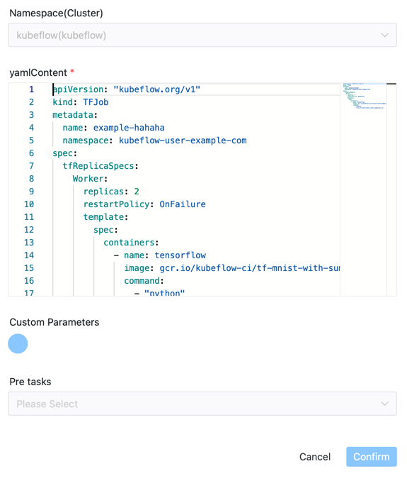

# Kubeflow

## 综述

[Kubeflow](https://www.kubeflow.org) 任务类型，用于在Kubeflow上创建任务。
后台主要使用 `kubectl` 命令来创建kubeflow任务, 并持续Kubeflow上资源状态直至任务完成。
目前主要支持通过使用yaml文件来创建kubeflow任务。 如果需要发布`kubeflow pipeline`任务可以使用[python任务类型](./python.md)。

## 创建任务

- 点击项目管理-项目名称-工作流定义，点击“创建工作流”按钮，进入 DAG 编辑页面；
- 拖动工具栏的  任务节点到画板中。

## 任务样例

组件图示如下：



### 首先介绍一些DS通用参数

- 默认参数说明请参考[DolphinScheduler任务参数附录](appendix.md)`默认任务参数`一栏。

### Kubeflow组件独有的参数

- **Namespace**：集群命名空间参数
- **yamlContent**：CRD YAML文件内容, 如：

```yaml
apiVersion: "kubeflow.org/v1"
kind: TFJob
metadata:
  name: tfjob-simple
  namespace: kubeflow-user-example-com
spec:
   tfReplicaSpecs:
     Worker:
       replicas: 2
       restartPolicy: OnFailure
       template:
         metadata:
           annotations:
             sidecar.istio.io/inject: "false"
         spec:
           containers:
             - name: tensorflow
               image: gcr.io/kubeflow-ci/tf-mnist-with-summaries:1.0
               command:
                 - "python"
                 - "/var/tf_mnist/mnist_with_summaries.py"
```

## 环境配置

**配置Kubernetes环境**

参考[集群管理和命名空间管理](../security/security.md)。

只需填写必填项即可，其他无需填写，资源管理依赖于具体Job中的YAML文件定义。

**kubectl**

安装[kubectl](https://kubernetes.io/docs/tasks/tools/install-kubectl-linux/)，并确保`kubectl`能正常提交任务到kubeflow。

