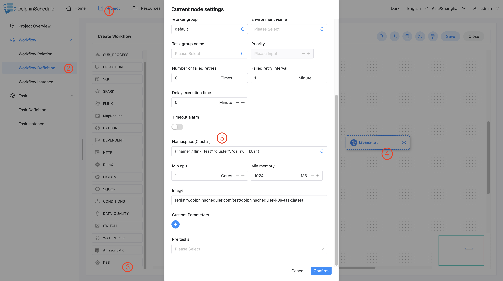

# Kubernetes

## 综述

kubernetes任务类型，用于在kubernetes上执行一个短时和批处理的任务。worker最终会通过使用kubernetes client提交任务。

## 创建任务

- 点击项目管理-项目名称-工作流定义，点击"创建工作流"按钮，进入DAG编辑页面。
- 工具栏中拖动  到画板中，选择需要连接的数据源，即可完成创建。

## 任务参数

[//]: # (TODO: use the commented anchor below once our website template supports this syntax)
[//]: # (- 默认参数说明请参考[DolphinScheduler任务参数附录]&#40;appendix.md#默认任务参数&#41;`默认任务参数`一栏。)

- 默认参数说明请参考[DolphinScheduler任务参数附录](appendix.md)`默认任务参数`一栏。

| **任务参数** |                             **描述**                              |
|----------|-----------------------------------------------------------------|
| 命名空间     | 选择kubernetes集群上存在的命名空间                                          |
| 最小CPU    | 任务在kubernetes上运行所需的最小CPU                                        |
| 最小内存     | 任务在kubernetes上运行所需的最小内存                                         |
| 镜像       | 镜像地址                                                            |
| 自定义参数    | kubernetes任务局部的用户自定义参数，自定义参数最终会通过环境变量形式存在于容器中，提供给kubernetes任务使用 |

## 任务样例

### 在 DolphinScheduler 中配置 kubernetes 集群环境

若生产环境中要是使用到 kubernetes 任务类型，则需要预先配置好所需的kubernetes集群环境

### 配置 kubernetes 任务节点

根据上述参数说明，配置所需的内容即可。

## 注意事项

任务名字限制在小写字母、数字和-这三种字符之中
