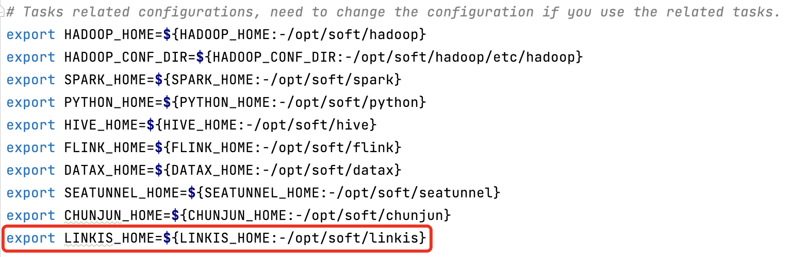
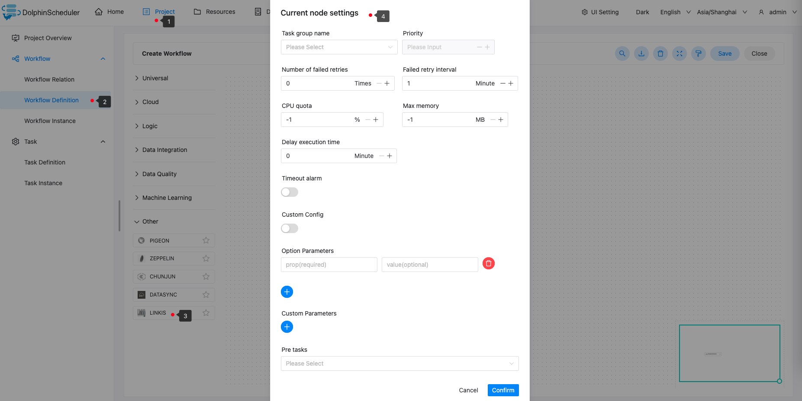

# Apache Linkis

## 综述

`Linkis` 任务类型，用于创建并执行 `Linkis` 类型任务。worker 执行该任务的时候，会通过 `linkis-cli` 执行命令行。
点击 [这里](https://linkis.apache.org/) 获取更多关于 `Apache Linkis` 的信息。

## 创建任务

- 点击项目管理 -> 项目名称 -> 工作流定义，点击“创建工作流”按钮，进入 DAG 编辑页面；
- 拖动工具栏的 任务节点到画板中。

## 任务参数

[//]: # (TODO: use the commented anchor below once our website template supports this syntax)
[//]: # (- 默认参数说明请参考[DolphinScheduler任务参数附录]&#40;appendix.md#默认任务参数&#41;`默认任务参数`一栏。)

- 默认参数说明请参考[DolphinScheduler任务参数附录](appendix.md)`默认任务参数`一栏。
- Linkis支持的参数列表请参考[linkis-cli任务参数](https://linkis.apache.org/zh-CN/docs/latest/user-guide/linkiscli-manual)`支持的参数列表`一栏。

## 任务样例

该样例演示为使用 Spark 引擎提交sql执行。

### 在 DolphinScheduler 中配置 Linkis 环境

若生产环境中要是使用到 Linkis 任务类型，则需要先配置好所需的环境，配置文件如下：`/dolphinscheduler/conf/env/dolphinscheduler_env.sh`。



### 配置 Linkis 任务节点

根据上述参数说明，配置所需的内容即可。



### Config 样例

```

sh ./bin/linkis-cli -engineType spark-2.4.3 -codeType sql -code "select count(*) from testdb.test;"  -submitUser hadoop -proxyUser hadoop 

```

### 注意事项

- 无需在配置栏里再填写`sh ./bin/linkis-cli`，已提前配置。
- 配置默认为异步提交，您无需再配置`--async`参数。

