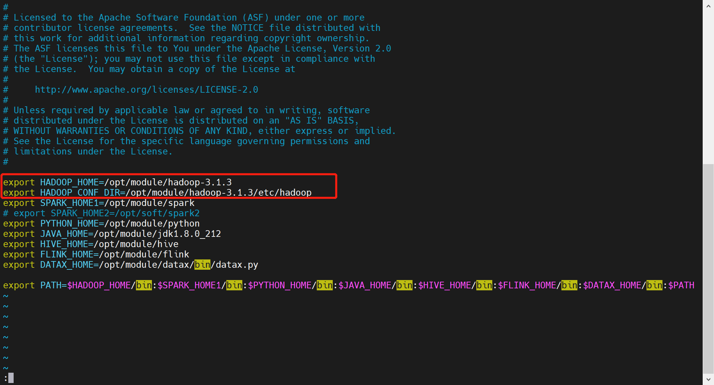
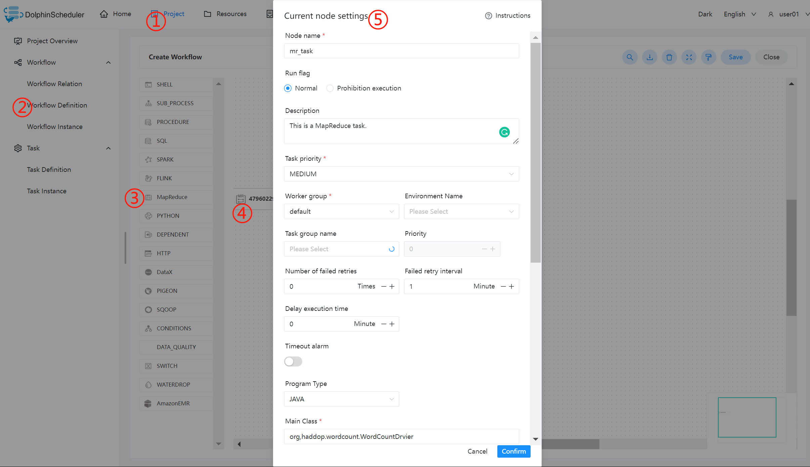

# MapReduce(MR) 节点

## 综述

MapReduce(MR) 任务类型，用于执行 MapReduce 程序。对于 MapReduce 节点，worker 会通过使用 Hadoop 命令 `hadoop jar` 的方式提交任务。更多详情查看 [Hadoop Command Manual](https://hadoop.apache.org/docs/r3.2.4/hadoop-project-dist/hadoop-common/CommandsManual.html#jar)。

## 创建任务

- 点击项目管理-项目名称-工作流定义，点击"创建工作流"按钮，进入 DAG 编辑页面。
- 拖动工具栏中的  任务节点到画板中，如下图所示：

## 任务参数

[//]: # (TODO: use the commented anchor below once our website template supports this syntax)
[//]: # (- 默认参数说明请参考[DolphinScheduler任务参数附录]&#40;appendix.md#默认任务参数&#41;`默认任务参数`一栏。)

- 默认参数说明请参考[DolphinScheduler任务参数附录](appendix.md)`默认任务参数`一栏。

### JAVA/SCALA 程序

|  **任务参数**  |                  **描述**                  |
|------------|------------------------------------------|
| 程序类型       | 选择 JAVA/SCALA 语言                         |
| 主函数的 Class | 是 MapReduce 程序的入口 Main Class 的**全路径**    |
| 主程序包       | 执行 MapReduce 程序的 jar 包                   |
| 任务名称（选填）   | MapReduce 任务名称                           |
| Yarn 队列    | 设置 Yarn 队列，默认使用 default                  |
| 命令行参数      | 是设置 MapReduce 程序的输入参数，支持自定义参数变量的替换       |
| 其他参数       | 支持 –D、-files、-libjars、-archives 格式       |
| 自定义参数      | 是 MapReduce 局部的用户自定义参数，会替换脚本中以 ${变量} 的内容 |

### Python 程序

| **任务参数** |                                                                                                                                    **描述**                                                                                                                                    |
|----------|------------------------------------------------------------------------------------------------------------------------------------------------------------------------------------------------------------------------------------------------------------------------------|
| 程序类型     | 选择 Python 语言                                                                                                                                                                                                                                                                 |
| 主 jar 包  | 是运行 MapReduce 的 Python jar 包                                                                                                                                                                                                                                                 |
| 其他参数     | 支持 –D、-mapper、-reducer、-input  -output格式，这里可以设置用户自定义参数的输入，比如：-mapper  "mapper.py 1"  -file mapper.py   -reducer reducer.py  -file reducer.py –input /journey/words.txt -output /journey/out/mr/${currentTimeMillis}，其中 -mapper 后的 mapper.py 1是两个参数，第一个参数是 mapper.py，第二个参数是 1 |
| 自定义参数    | 是 MapReduce 局部的用户自定义参数，会替换脚本中以 ${变量} 的内容                                                                                                                                                                                                                                     |

## 任务样例

### 执行 WordCount 程序

该样例为 MapReduce 应用中常见的入门类型，主要为统计输入的文本中，相同单词的数量有多少。

#### 在 DolphinScheduler 中配置 MapReduce 环境

若生产环境中要是使用到 MapReduce 任务类型，则需要先配置好所需的环境。配置文件如下：`bin/env/dolphinscheduler_env.sh`。

#### 上传主程序包

在使用 MapReduce 任务节点时，需要利用资源中心上传执行程序的 jar 包。可参考[资源中心](../resource/configuration.md)。

当配置完成资源中心之后，直接使用拖拽的方式，即可上传所需目标文件。

#### 配置 MapReduce 节点

根据上述参数说明，配置所需的内容即可。

