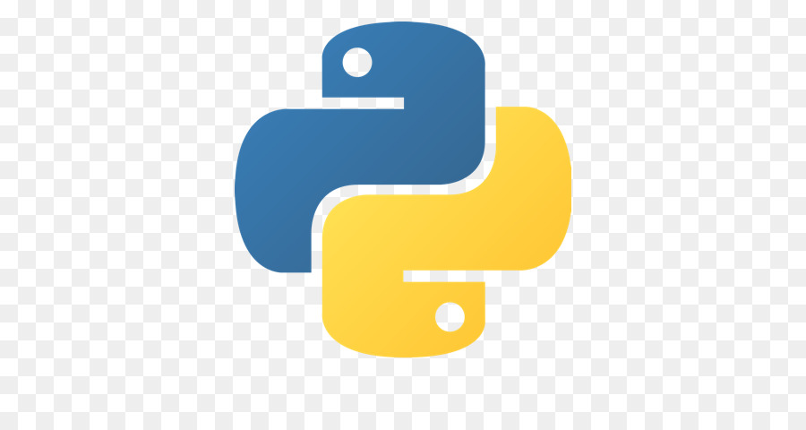
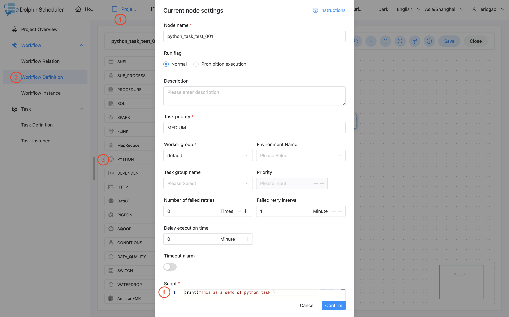
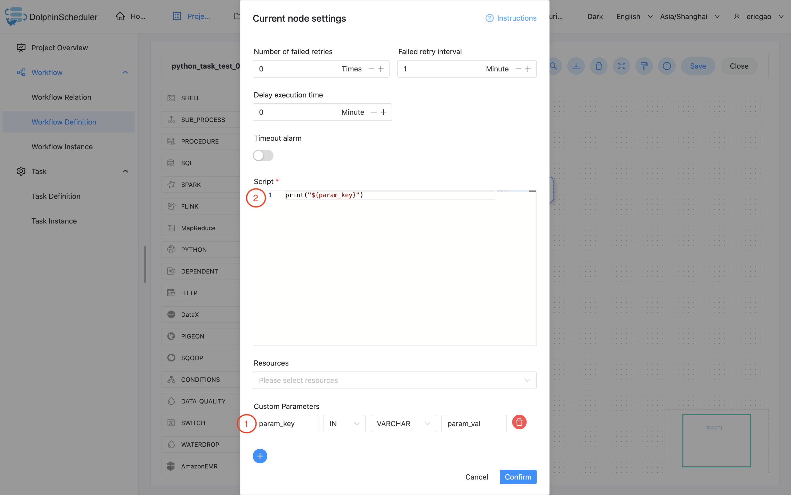

# Python 节点

## 综述

Python 任务类型，用于创建 Python 类型的任务并执行一系列的 Python 脚本。worker 执行该任务的时候，会生成一个临时python脚本，
并使用与租户同名的 linux 用户执行这个脚本。

## 创建任务

- 点击项目管理-项目名称-工作流定义，点击"创建工作流"按钮，进入DAG编辑页面。
- 工具栏中拖动  到画板中，即可完成创建。

## 任务参数

[//]: # (TODO: use the commented anchor below once our website template supports this syntax)
[//]: # (- 默认参数说明请参考[DolphinScheduler任务参数附录]&#40;appendix.md#默认任务参数&#41;`默认任务参数`一栏。)

- 默认参数说明请参考[DolphinScheduler任务参数附录](appendix.md)`默认任务参数`一栏。

| **任务参数** |              **描述**               |
|----------|-----------------------------------|
| 脚本       | 用户开发的PYTHON程序                     |
| 自定义参数    | 是PYTHON局部的用户自定义参数，会替换脚本中以${变量}的内容 |

## 任务样例

### 简单打印一行文字

该样例模拟了常见的简单任务，这些任务只需要简单的一两行命令就能运行起来。我们以打印一行日志为例，该任务仅会在日志文件中打印一行
"This is a demo of python task"



```python
print("This is a demo of python task")
```

### 使用自定义参数

该样例模拟了自定义参数任务，为了更方便的复用已有的任务，或者面对动态的需求时，我们会使用变量保证脚本的复用性。本例中，我们先在自定义脚本
中定义了参数 "param_key"，并将他的值设置为 "param_val"。接着在"脚本"中使用了 print 函数，将参数 "param_key" 打印了出来。当我们保存
并运行任务后，在日志中会看到将参数 "param_key" 对应的值 "param_val" 打印出来。



```python
print("${param_key}")
```

## 注意事项

None
