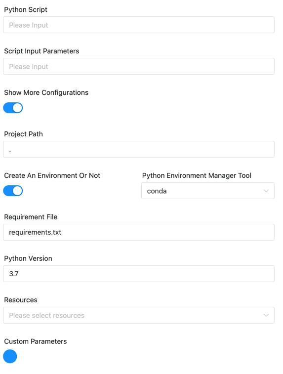
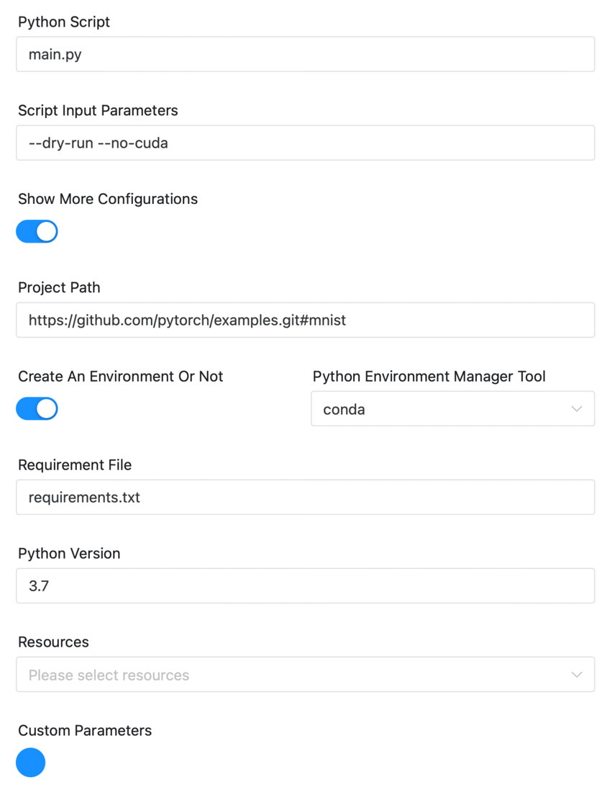

# Pytorch 节点（试验版）

## 综述

[Pytorch](https://pytorch.org) 是一个的主流Python机器学习库。

为了用户能够在DolphinScheduler中**更方便的运行Pytorch项目**，实现了Pytorch任务组件。主要提供**便捷的python环境管理**以及支持**运行python项目**。

与Python任务组件不同，该组件允许用户快速使用已有python环境或者创建新的python环境（使用virtualenv或者conda）；支持运行Python项目（本地项目或者Git项目）而非只是python脚本。

## 创建任务

- 点击项目管理-项目名称-工作流定义，点击“创建工作流”按钮，进入 DAG 编辑页面；
- 拖动工具栏的  任务节点到画板中。

## 任务样例

组件图示如下：



### Pytorch参数

[//]: # (TODO: use the commented anchor below once our website template supports this syntax)
[//]: # (- 默认参数说明请参考[DolphinScheduler任务参数附录]&#40;appendix.md#默认任务参数&#41;`默认任务参数`一栏。)

- 默认参数说明请参考[DolphinScheduler任务参数附录](appendix.md)`默认任务参数`一栏。

#### 运行参数

| **任务参数** |      **描述**       |
|----------|-------------------|
| python脚本 | 需要运行的python脚本文件入口 |
| 脚本启动参数   | 运行时的输入参数          |

以上为两个最小化配置运行的参数，另外提供其他的一些配置参数如下可选，当选择展开更多配置时，可以配置更多参数。

|  **任务参数**  |                                                                                                         **描述**                                                                                                          |
|------------|-------------------------------------------------------------------------------------------------------------------------------------------------------------------------------------------------------------------------|
| python项目地址 | 设置`PYTHONPATH`环境变量，设置后运行python脚本时可以加载该地址下的python包/项目代码。支持本地路径或者Git url。若为本地路径，作为`PYTHONPATH`环境变量，如果为Git URL （以`git@ | https:// | http:// `前缀），则会下载项目，并将下载后存放地址作为新的**python项目地址**，若需要运行子文件夹下的项目，可以添加 `#subdirectory` 来配置 |

#### python环境参数

|   **任务参数**   |                                                                            **描述**                                                                             |
|--------------|---------------------------------------------------------------------------------------------------------------------------------------------------------------|
| 是否创建新环境      | 是否创建新的python环境来运行该任务                                                                                                                                          |
| python命令路径   | 如`/usr/bin/python`，默认为DS环境配置中的`${PYTHON_LAUNCHER}`                                                                                                            |
| python环境管理工具 | 可以选择virtualenv或者conda，若选择`virtualenv`，则会用`virtualenv`创建一个新环境，使用命令 `virtualenv -p ${PYTHON_LAUNCHER} venv` 创建；若选择`conda`, 则会使用`conda` 创建一个新环境，并需要指定创建的python版本 |
| 依赖文件         | 默认为 requirements.txt                                                                                                                                          |

配置了`python项目地址`参数，那么`python脚本`和`依赖文件`参数允许输入相对路径

#### Demo

如现在需要运行 https://github.com/pytorch/examples 项目下的mnist的子项目。

可以设置



另外如果代码存放在资源中心，则可以使用`资源`参数下载代码，并将相关参数写成对应资源的路径即可。

## 环境配置

环境配置主要取决于运行时python环境的选择，需要在`安全中心`-`环境管理`中配置对应需要的环境变量即可。

### 指定python路径

适用于worker上已经有运行该项目的python环境，那么可以直接在组件中配置`pyhton命令路径`为对应的python环境即可，如果不知道该环境地址，可以使用`which python`获取。

### 使用Conda创建新环境

适用于新建环境运行该项目，需要在`安全中心`-`环境管理`中创建环境, 参考如下添加修改为实际环境即可。

```shell
# conda命令对应的目录加入PATH中
export PATH=$HOME/anaconda3/bin:$PATH
```

### 使用virtualenv创建新环境

适用于新建环境运行该项目，需要在`安全中心`-`环境管理`中创建环境, 参考如下添加修改为实际环境即可。

```shell
# virtualenv命令对应的目录加入PATH中
export PATH=/home/lucky/anaconda3/bin:$PATH
export PYTHON_LAUNCHER=/usr/local/bin/python3.7
```

## 其他

本组件也可以运行xgboost, lightgbm, sklearn, tensorflow, keras 等项目。本组件可作为python组件运行机器学习任务的升级组件。

如果有需要，后续建议可以统一涵盖为PythonML组件，来运行机器学习项目。
