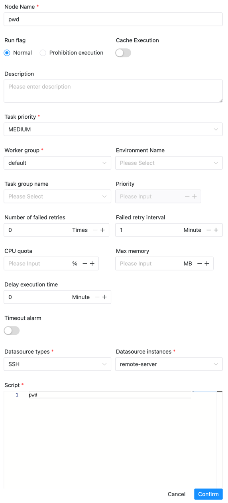

# RemoteShell

## 综述

RemoteShell 任务类型，用于在远程服务器上执行命令。

## 创建任务

- 点击项目管理-项目名称-工作流定义，点击"创建工作流"按钮，进入 DAG 编辑页面。
- 工具栏中拖动  到画板中，即可完成创建。

## 任务参数

[//]: # (TODO: use the commented anchor below once our website template supports this syntax)
[//]: # (- 默认参数说明请参考[DolphinScheduler任务参数附录]&#40;appendix.md#默认任务参数&#41;`默认任务参数`一栏。)

- 默认参数说明请参考[DolphinScheduler任务参数附录](appendix.md)`默认任务参数`一栏。
- SSH Data Source: 选择SSH 数据源。

## 任务样例

### 查看远程服务器(remote-server)的路径

## 注意事项

该任务连接服务器后，不会自动source bashrc等文件，所需的环境变量，可以通过以下方式导入
- 在安全中心-环境管理中创建环境变量，然后通过任务定义中的环境选项引入
- 在脚本中直接输入对应的环境变量
