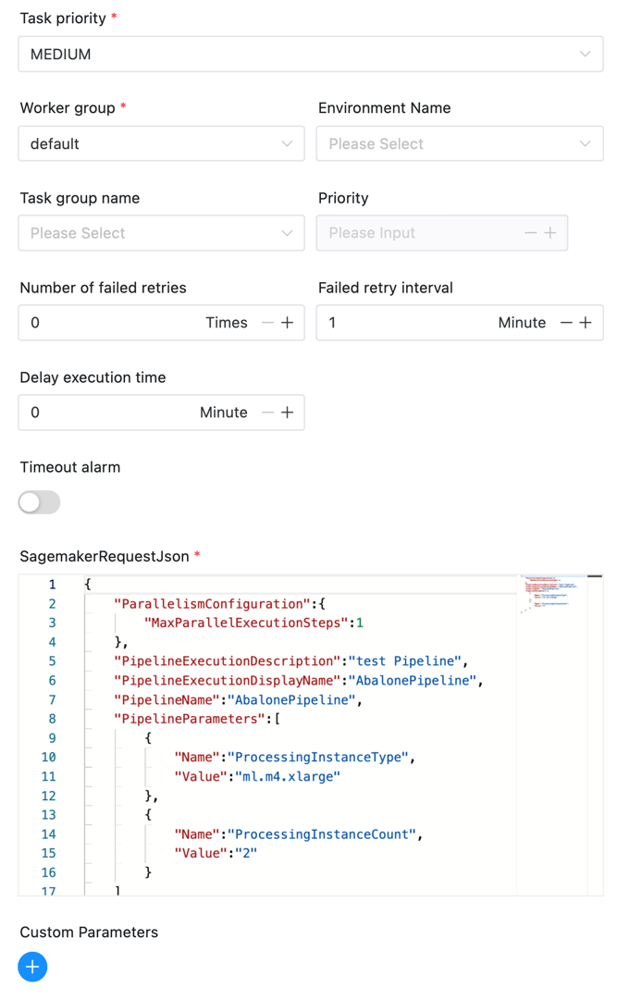

# SageMaker 节点

## 综述

[Amazon SageMaker](https://aws.amazon.com/cn/pm/sagemaker) 是一个云机器学习平台。 提供了完整的基础设施，工具和工作流来帮助用户可以创建、训练和发布机器学习模型。

[Amazon SageMaker Model Building Pipelines](https://docs.aws.amazon.com/sagemaker/latest/dg/pipelines.html) 是一个可以直接使用SageMaker各种集成的机器学习管道构建工具，用户可以使用使用 Amazon SageMaker Pipeline 来构建端到端的机器学习系统。

对于使用大数据与人工智能的用户，SageMaker 任务组件帮助用户可以串联起大数据工作流与SagaMaker的使用场景。

DolphinScheduler SageMaker 组件的功能:
- 启动 SageMaker Pipeline Execution，并持续获取状态，直至Pipeline执行完成。

## 创建任务

- 点击项目管理-项目名称-工作流定义，点击“创建工作流”按钮，进入 DAG 编辑页面；
- 拖动工具栏的  任务节点到画板中。

## 任务样例

[//]: # (TODO: use the commented anchor below once our website template supports this syntax)
[//]: # (- 默认参数说明请参考[DolphinScheduler任务参数附录]&#40;appendix.md#默认任务参数&#41;`默认任务参数`一栏。)

- 默认参数说明请参考[DolphinScheduler任务参数附录](appendix.md)`默认任务参数`一栏。

|       **任务参数**       |                                                               **描述**                                                                |
|----------------------|-------------------------------------------------------------------------------------------------------------------------------------|
| SagemakerRequestJson | 启动SageMakerPipeline的需要的请求参数，可见 [AWS API](https://docs.aws.amazon.com/sagemaker/latest/APIReference/API_StartPipelineExecution.html) |

组件图示如下：



## 环境配置

需要进行AWS的一些配置，修改`aws.yml`中的以下配置信息

```yaml
sagemaker:
  # The AWS credentials provider type. support: AWSStaticCredentialsProvider, InstanceProfileCredentialsProvider
  # AWSStaticCredentialsProvider: use the access key and secret key to authenticate
  # InstanceProfileCredentialsProvider: use the IAM role to authenticate
  credentials.provider.type: AWSStaticCredentialsProvider
  access.key.id: <access.key.id>
  access.key.secret: <access.key.secret>
  region: <region>
  endpoint: <endpoint>
```

