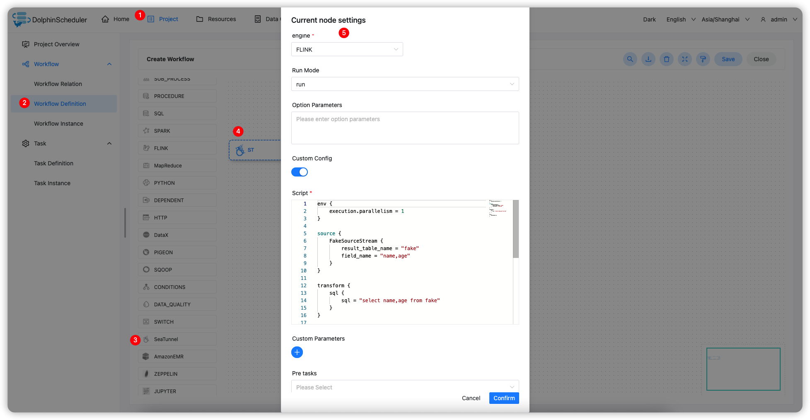

# Apache SeaTunnel

## 综述

`SeaTunnel` 任务类型，用于创建并执行 `SeaTunnel` 类型任务。worker 执行该任务的时候，会通过 `start-seatunnel-spark.sh` 或 `start-seatunnel-flink.sh` 命令解析 config 文件。
点击 [这里](https://seatunnel.apache.org/) 获取更多关于 `Apache SeaTunnel` 的信息。

## 创建任务

- 点击项目管理 -> 项目名称 -> 工作流定义，点击“创建工作流”按钮，进入 DAG 编辑页面；
- 拖动工具栏的 任务节点到画板中。

## 任务参数

[//]: # (TODO: use the commented anchor below once our website template supports this syntax)
[//]: # (- 默认参数说明请参考[DolphinScheduler任务参数附录]&#40;appendix.md#默认任务参数&#41;`默认任务参数`一栏。)

- 默认参数说明请参考[DolphinScheduler任务参数附录](appendix.md)`默认任务参数`一栏。
- 引擎：支持 FLINK 和 SPARK
- FLINK
- 运行模型：支持 `run` 和 `run-application` 两种模式
- 选项参数：用于添加 Flink 引擎本身参数，例如 `-m yarn-cluster -ynm seatunnel`
- SPARK
- 部署方式：指定部署模式，`cluster` `client` `local`
- Master：指定 `Master` 模型，`yarn` `local` `spark` `mesos`，其中 `spark` 和 `mesos` 需要指定 `Master` 服务地址，例如：127.0.0.1:7077

          > 点击 [这里](https://seatunnel.apache.org/docs/2.1.2/command/usage) 获取更多关于`Apache SeaTunnel command` 使用的信息

- 自定义配置：支持自定义配置或从资源中心选择配置文件

  > 点击 [这里](https://seatunnel.apache.org/docs/2.1.2/concept/config) 获取更多关于`Apache SeaTunnel config` 文件介绍

- 脚本：在任务节点那自定义配置信息，包括四部分：`env` `source` `transform` `sink`

## 任务样例

该样例演示为使用 Flink 引擎从 Fake 源读取数据打印到控制台。

### 在 DolphinScheduler 中配置 SeaTunnel 环境

若生产环境中要是使用到 SeaTunnel 任务类型，则需要先配置好所需的环境，配置文件如下：`/dolphinscheduler/conf/env/dolphinscheduler_env.sh`。


### 配置 SeaTunnel 任务节点

根据上述参数说明，配置所需的内容即可。



### Config 样例

```Config

env {
  execution.parallelism = 1
}

source {
  FakeSource {
    result_table_name = "fake"
    field_name = "name,age"
  }
}

transform {
  sql {
    sql = "select name,age from fake"
  }
}

sink {
  ConsoleSink {}
}

```

