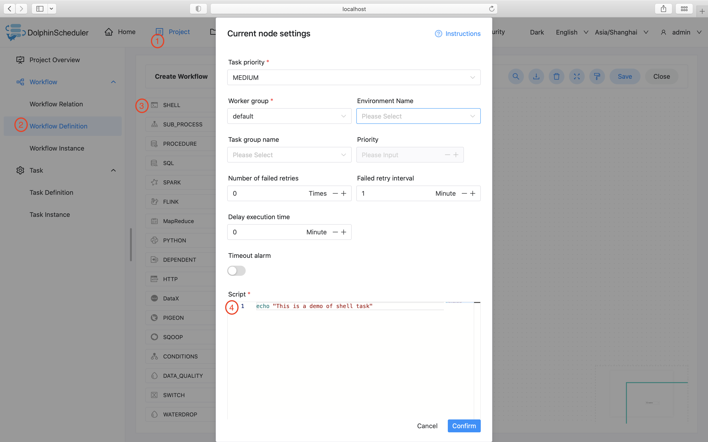

# Shell

## 综述

Shell 任务类型，用于创建 Shell 类型的任务并执行一系列的 Shell 脚本。worker 执行该任务的时候，会生成一个临时 shell 脚本，并使用与租户同名的 linux 用户执行这个脚本。

## 创建任务

- 点击项目管理-项目名称-工作流定义，点击"创建工作流"按钮，进入 DAG 编辑页面。
- 工具栏中拖动  到画板中，即可完成创建。

## 任务参数

[//]: # (TODO: use the commented anchor below once our website template supports this syntax)
[//]: # (- 默认参数说明请参考[DolphinScheduler任务参数附录]&#40;appendix.md#默认任务参数&#41;`默认任务参数`一栏。)

- 默认参数说明请参考[DolphinScheduler任务参数附录](appendix.md)`默认任务参数`一栏。
- 除上述默认参数，此任务没有其他参数

## 任务样例

### 简单打印一行文字

该样例模拟了常见的简单任务，这些任务只需要简单的一两行命令就能运行起来。我们以打印一行日志为例，该任务仅会在日志文件中打印一行
"This is a demo of shell task"



### 使用自定义参数

该样例模拟了自定义参数任务，为了更方便的复用已有的任务，或者面对动态的需求时，我们会使用变量保证脚本的复用性。本例中，我们先在自定义脚本
中定义了参数 "param_key"，并将他的值设置为 "param_val"。接着在"脚本"中声明了 echo 命令，将参数 "param_key" 打印了出来。当我们保存
并运行任务后，在日志中会看到将参数 "param_key" 对应的值 "param_val" 打印出来。


## 注意事项

Shell 任务类型通过解析任务日志是否包含 ```application_xxx_xxx``` 的内容来判断是否 Yarn 任务，如果是则会将相应的 ```application_id``` 的状态作为当前 Shell 节点的运行状态判断，此时如果操作停止工作流则会 Kill 相应的 ```application_id```

如果 Shell 任务中需要使用到用户自定义的脚本，可通过资源中心来上传对应的文件然后在 Shell 任务中引用他们，可参考：[文件管理](../resource/file-manage.md)。
