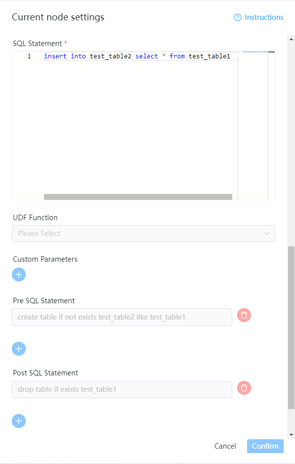

# SQL

## 综述

SQL任务类型，用于连接数据库并执行相应SQL。

## 创建数据源

可参考 [数据源配置](../howto/datasource-setting.md) `数据源中心`。

## 创建任务

- 点击项目管理-项目名称-工作流定义，点击"创建工作流"按钮，进入DAG编辑页面。
- 工具栏中拖动  到画板中，选择需要连接的数据源，即可完成创建。

## 任务参数

[//]: # (TODO: use the commented anchor below once our website template supports this syntax)
[//]: # (- 默认参数说明请参考[DolphinScheduler任务参数附录]&#40;appendix.md#默认任务参数&#41;`默认任务参数`一栏。)

- 默认参数说明请参考[DolphinScheduler任务参数附录](appendix.md)`默认任务参数`一栏。
- 数据源：选择对应的数据源
- sql类型：支持查询和非查询两种。
- 查询：支持 `DML select` 类型的命令，是有结果集返回的，可以指定邮件通知为表格、附件或表格附件三种模板；
- 非查询：支持 `DDL`全部命令 和 `DML update、delete、insert` 三种类型的命令；
- 默认采用`;\n`作为SQL分隔符,拆分成多段SQL语句执行。Hive支持一次执行多段SQL语句,故不会拆分。
- sql参数：输入参数格式为key1=value1;key2=value2…
- sql语句：SQL语句
- UDF函数：对于HIVE类型的数据源，可以引用资源中心中创建的UDF函数，其他类型的数据源暂不支持UDF函数。
- 自定义参数：SQL任务类型，而存储过程是自定义参数顺序，给方法设置值自定义参数类型和数据类型，同存储过程任务类型一样。区别在于SQL任务类型自定义参数会替换sql语句中${变量}。
- 前置sql:前置sql在sql语句之前执行。
- 后置sql:后置sql在sql语句之后执行。

## 任务样例

### Hive表创建示例

#### 在hive中创建临时表并写入数据

该样例向hive中创建临时表`tmp_hello_world`并写入一行数据。选择SQL类型为非查询，在创建临时表之前需要确保该表不存在，所以我们使用自定义参数，在每次运行时获取当天时间作为表名后缀，这样这个任务就可以每天运行。创建的表名格式为：`tmp_hello_world_{yyyyMMdd}`。

#### 运行该任务成功之后在hive中查询结果

登录集群使用`hive`命令或使用`beeline`、`JDBC`等方式连接`apache hive`进行查询，查询SQL为`select * from tmp_hello_world_{yyyyMMdd}`，请将`{yyyyMMdd}`替换为运行当天的日期，查询截图如下：

### 使用前置sql和后置sql示例

在前置sql中执行建表操作，在sql语句中执行操作，在后置sql中执行清理操作

## 注意事项

* 注意SQL类型的选择，如果是INSERT等操作需要选择非查询类型。
* 为了兼容长会话情况,UDF函数的创建是通过CREATE OR REPLACE语句

