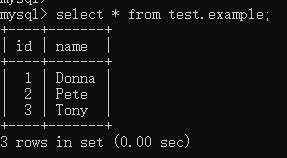
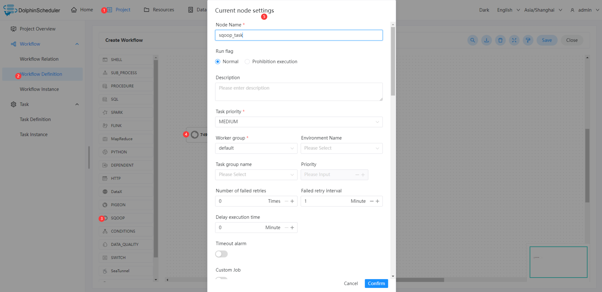

# SQOOP 节点

## 综述

SQOOP 任务类型，用于执行 SQOOP 程序。对于 SQOOP 节点，worker 会通过执行 `sqoop` 命令来执行 SQOOP 任务。

## 创建任务

- 点击项目管理 -> 项目名称 -> 工作流定义，点击“创建工作流”按钮，进入 DAG 编辑页面；
- 拖动工具栏的  任务节点到画板中。

## 任务参数

[//]: # (TODO: use the commented anchor below once our website template supports this syntax)
[//]: # (- 默认参数说明请参考[DolphinScheduler任务参数附录]&#40;appendix.md#默认任务参数&#41;`默认任务参数`一栏。)

- 默认参数说明请参考[DolphinScheduler任务参数附录](appendix.md)`默认任务参数`一栏。

|     **任务参数**     |                                **描述**                                |
|------------------|----------------------------------------------------------------------|
| 任务名称             | map-reduce 任务名称                                                      |
| 流向               | (1) import：从 RDBMS 导入 HDFS 或Hive  (2) export：从 HDFS 或 Hive 导出到 RDBMS |
| Hadoop 参数        | 添加自定义 Hadoop 参数                                                      |
| Sqoop 参数         | 添加自定义 Sqoop 参数                                                       |
| 数据来源 - 类型        | 选择数据源类型                                                              |
| 数据来源 - 数据源       | 选择数据源                                                                |
| 数据来源 - 模式        | (1) 单表：同步单张表的数据，需填写`表名`和`列类型`  (2) SQL：同步 SQL 查询的结果，需填写`SQL语句`       |
| 数据来源 - 表名        | 设置需要导入 hive 的表名                                                      |
| 数据来源 - 列类型       | (1) 全表导入：导入表中的所有字段  (2) 选择列：导入表中的指定列，需填写`列`信息                        |
| 数据来源 - 列         | 填写字段名称，多个字段之间使用英文逗号分割                                                |
| 数据来源 - SQL 语句    | 填写 SQL 查询语句                                                          |
| 数据来源 - Hive 类型映射 | 自定义 SQL 与 Hive 类型映射                                                  |
| 数据来源 - Java 类型映射 | 自定义 SQL 与 Java 类型映射                                                  |
| 数据目的 - 类型        | 选择数据目的类型                                                             |
| 数据目的 - 数据库       | 填写 Hive 数据库名称                                                        |
| 数据目的 - 表名        | 填写 Hive 表名                                                           |
| 数据目的 - 是否创建新表    | 选择是否自动根据导入数据类型创建数据目的表，如果目标表已经存在了，那么创建任务会失败                           |
| 数据目的 - 是否删除分隔符   | 自动删除字符串中的`\n`、`\r`和`\01`字符                                           |
| 数据目的 - 是否覆盖数据源   | 覆盖 Hive 表中的现有数据                                                      |
| 数据目的 - Hive 目标路径 | 自定义 Hive 目标路径                                                        |
| 数据目的 - 替换分隔符     | 替换字符串中的`\n`、`\r`和`\01`字符                                             |
| 数据目的 - Hive 分区键  | 填写 Hive 分区键，多个分区键之间使用英文逗号分割                                          |
| 数据目的 - Hive 分区值  | 填写 Hive 分区值，多个分区值之间使用英文逗号分割                                          |
| 数据目的 - 目标路径      | 填写 HDFS 的目标路径                                                        |
| 数据目的 - 是否删除目录    | 如果目录已经存在，则删除目录                                                       |
| 数据目的 - 压缩类型      | 选择 HDFS 文件压缩类型                                                       |
| 数据目的 - 保存格式      | 选择文件保存格式                                                             |
| 数据目的 - 列分隔符      | 自定义列分隔符                                                              |
| 数据目的 - 行分隔符      | 自定义行分隔符                                                              |

## 任务样例

该样例演示为从 MySQL 数据导入到 Hive 中。 其中 MySQL 数据库名称为：`test`，表名称为`example`。下图为样例数据。

### 配置 Sqoop 环境

若生产环境中要是使用到 Sqoop 任务类型，则需要先配置好所需的环境。确保任务节点可以执行`sqoop`命令。

### 配置 Sqoop 任务节点

可按照下图步骤进行配置节点内容。

本样例中的关键配置如下表。

|     **任务参数**     |                    **参数值**                     |
|------------------|------------------------------------------------|
| 任务名称             | sqoop_mysql_to_hive_test                       |
| 流向               | import                                         |
| 数据来源 - 类型        | MYSQL                                          |
| 数据来源 - 数据源       | MYSQL MyTestMySQL（您可以将MyTestMySQL改成您自己取的数据源名称） |
| 数据来源 - 模式        | 表单                                             |
| 数据来源 - 表名        | example                                        |
| 数据来源 - 列类型       | 全表导入                                           |
| 数据目的 - 类型        | HIVE                                           |
| 数据目的 - 数据库       | tmp                                            |
| 数据目的 - 表名        | example                                        |
| 数据目的 - 是否创建新表    | true                                           |
| 数据目的 - 是否删除分隔符   | false                                          |
| 数据目的 - 是否覆盖数据源   | true                                           |
| 数据目的 - Hive 目标路径 | （无需填写）                                         |
| 数据目的 - 替换分隔符     | ,                                              |
| 数据目的 - Hive 分区键  | （无需填写）                                         |
| 数据目的 - Hive 分区值  | （无需填写）                                         |

### 查看运行结果

