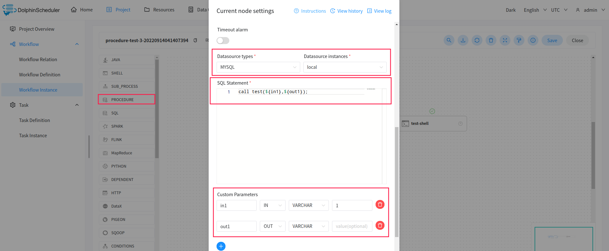

# 存储过程节点

- 根据选择的数据源，执行存储过程。

> 拖动工具栏中的`PROCEDURE`任务节点到画板中，如下图所示：

<p align="center">
   
 </p>

- 前提：在该数据库里面创建存储过程，如：

```
CREATE PROCEDURE dolphinscheduler.test(in in1 INT, out out1 INT)
begin
	set out1=in1;
END
```

## 任务参数

[//]: # (TODO: use the commented anchor below once our website template supports this syntax)
[//]: # (- 默认参数说明请参考[DolphinScheduler任务参数附录]&#40;appendix.md#默认任务参数&#41;`默认任务参数`一栏。)

- 默认参数说明请参考[DolphinScheduler任务参数附录](appendix.md)`默认任务参数`一栏。

|   **任务参数**    |                                              **描述**                                              |
|---------------|--------------------------------------------------------------------------------------------------|
| 数据源           | 存储过程的数据源类型支持MySQL、POSTGRESQL、ORACLE，选择对应的数据源                                                     |
| SQL Statement | 调用存储过程，如 `call test(${in1},${out1});`                                                            |
| 自定义参数         | 存储过程的自定义参数类型支持IN、OUT两种，数据类型支持VARCHAR、INTEGER、LONG、FLOAT、DOUBLE、DATE、TIME、TIMESTAMP、BOOLEAN九种数据类型 |

