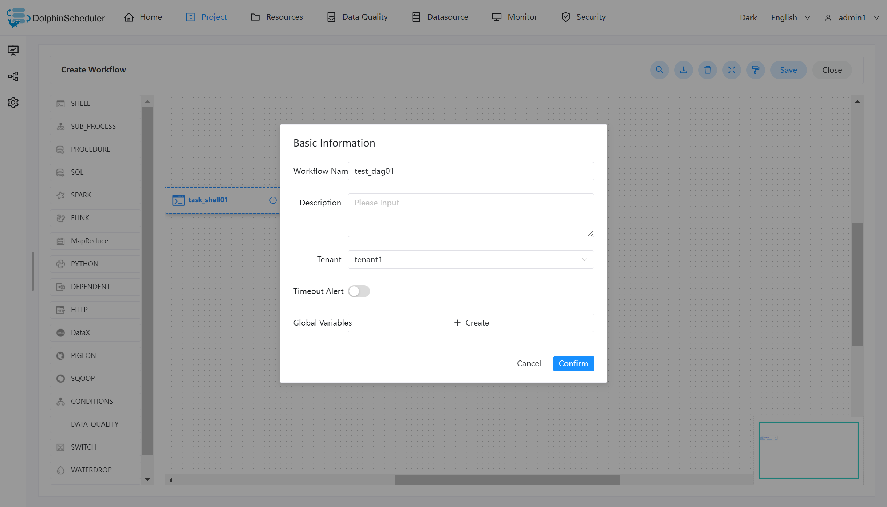
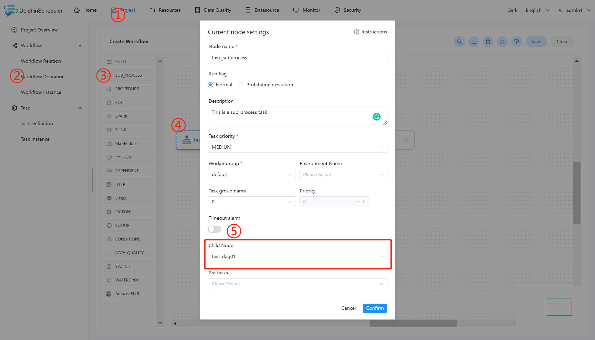
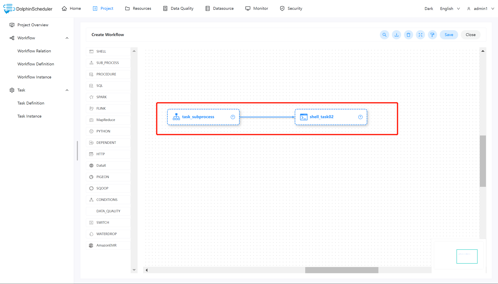

# 子流程节点

## 综述

子流程节点，就是把外部的某个工作流定义当做一个节点去执行。

## 创建任务

- 点击项目管理 -> 项目名称 -> 工作流定义，点击”创建工作流”按钮，进入 DAG 编辑页面：

- 拖动工具栏的  任务节点到画板中。

## 任务参数

[//]: # (TODO: use the commented anchor below once our website template supports this syntax)
[//]: # (- 默认参数说明请参考[DolphinScheduler任务参数附录]&#40;appendix.md#默认任务参数&#41;`默认任务参数`一栏。)

- 默认参数说明请参考[DolphinScheduler任务参数附录](appendix.md)`默认任务参数`一栏。

| **任务参数** |                 **描述**                 |
|----------|----------------------------------------|
| 子节点      | 是选择子流程的工作流定义，右上角进入该子节点可以跳转到所选子流程的工作流定义 |

## 任务样例

该样例模拟了常见的任务类型，这里我们使用子结点任务调用 [Shell](shell.md) 打印出 ”hello world“。即将一个 shell 任务当作子结点来执行。

### 创建 shell 任务

创建一个 shell 任务，用于打印 “hello”。并为该工作流定义为 test_dag01。

### 创建 sub_process 任务

在使用 sub_process 的过程中，需要创建所需的子结点任务，也就是我们第一步所创建的 test_dag01 工作流。然后如下图所示，在 ⑤ 的位置选择对应的子结点即可。

创建 sub_process 完成之后，再创建一个对应的 shell 任务，用于打印 “world”，并将二者连接起来。保存当前工作流，并上线运行，即可得到想要的结果。

## 注意事项

在使用 sub_process 调用子结点任务的时候，需要保证定义的子结点为上线状态，否则 sub_process 的工作流无法正常运行。
