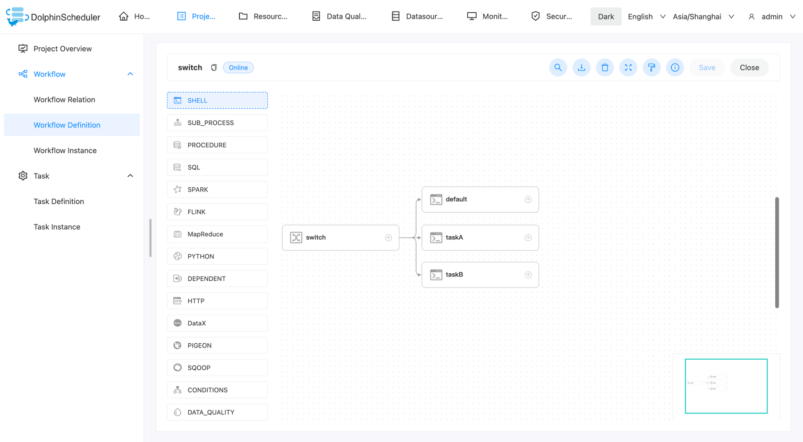
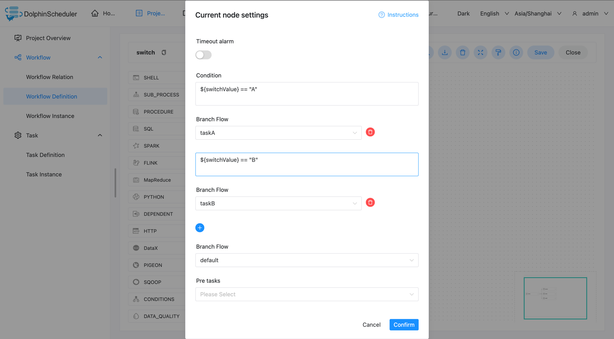
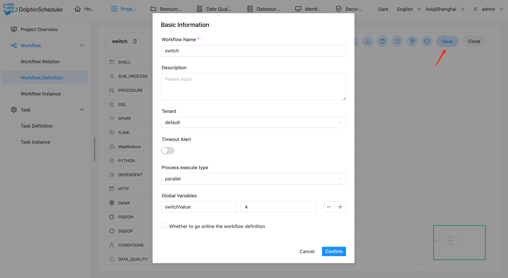

# Switch

Switch 是一个条件判断节点，依据[全局变量](../parameter/global.md)的值和用户所编写的表达式判断结果执行对应分支。
**注意**使用 javax.script.ScriptEngine.eval 执行表达式。

## 创建任务

点击项目管理 -> 项目名称 -> 工作流定义，点击"创建工作流"按钮，进入 DAG 编辑页面。
拖动工具栏中的  任务节点到画板中即能完成任务创建。
**注意** switch 任务创建后，要先配置上下游，才能配置任务分支的参数。

## 任务参数

- 节点名称：一个工作流定义中的节点名称是唯一的。
- 运行标志：标识这个节点是否能正常调度,如果不需要执行，可以打开禁止执行开关。
- 描述信息：描述该节点的功能。
- 任务优先级：worker 线程数不足时，根据优先级从高到低依次执行，优先级一样时根据先进先出原则执行。
- Worker 分组：任务分配给 worker 组的机器机执行，选择 Default，会随机选择一台 worker 机执行。
- 环境名称：安全中心中配置的环境，不配置则不使用。
- 任务组名称：资源中心中配置的任务组，不配置则不使用。
- 失败重试次数：任务失败重新提交的次数，支持下拉和手填。
- 失败重试间隔：任务失败重新提交任务的时间间隔，支持下拉和手填。
- 延时执行时间：任务延迟执行的时间。
- 超时告警：勾选超时告警、超时失败，当任务超过"超时时长"后，会发送告警邮件并且任务执行失败。
- 条件：可以为 switch 任务配置多个条件，当条件满足时，就会执行指定的分支，可以配置多个不同的条件来满足不同的业务，使用字符串判断时需要使用""。
- 分支流转：默认的流转内容，当**条件**中的内容为全部不符合要求时，则运行**分支流转**中指定的分支。

## 任务样例

这里使用一个 switch 任务以及三个 shell 任务来演示。

### 创建工作流

新建 switch 任务，以及下游的三个 shell 任务。shell 任务没有要求。
switch 任务需要和下游任务连线配置关系后，才可以进行下游任务的选择。

### 设置条件

配置条件和默认分支，满足条件会走指定分支，都不满足则走默认分支。
图中如果变量的值为 "A" 则执行分支 taskA，如果变量的值为 "B" 则执行分支 taskB ，都不满足则执行 default。

条件使用了全局变量，请参考[全局变量](../parameter/global.md)。
这里配置全局变量的值为 A。

如果执行正确，那么 taskA 会被正确执行。

### 执行

执行，并且查看是否符合预期。可以看到符合预期，执行了指定的下游任务 taskA。

